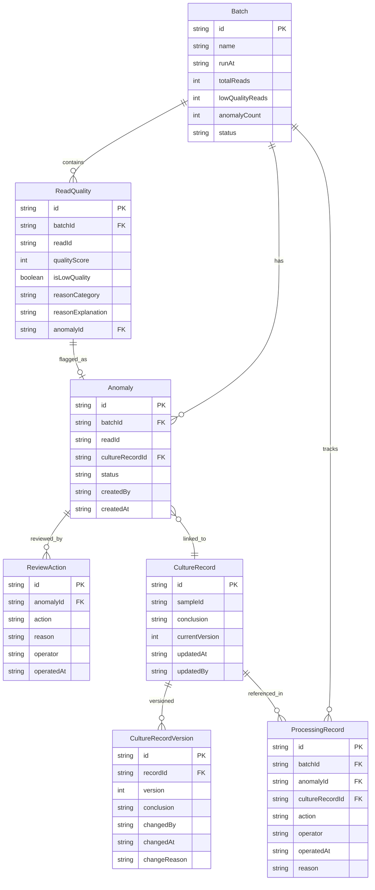

## 1. 架构设计

```mermaid
graph TB
    subgraph "前端层"
        "React SPA"
    end
    subgraph "后端层"
        "Express API Server"
    end
    subgraph "数据层"
        "SQLite Database"
    end
    subgraph "本地资源"
        "本地参考数据库"
    end
    "React SPA" --> "Express API Server"
    "Express API Server" --> "SQLite Database"
    "Express API Server" --> "本地参考数据库"
```

## 2. 技术说明

- **前端**：React@18 + tailwindcss@3 + vite + zustand + react-router-dom
- **初始化工具**：vite-init
- **后端**：Express@4 + TypeScript（ESM）
- **数据库**：SQLite（通过 better-sqlite3），单文件部署，无需额外数据库服务
- **本地参考数据库**：内置示例 FASTA 文件与质量阈值配置，开箱即用

## 3. 路由定义

| 路由 | 用途 |
|------|------|
| `/` | 筛查总览页：运行批次列表与快速筛选 |
| `/screening/:batchId` | 筛查详情页：读段质量明细与原因解释 |
| `/review` | 异常复核页：待复核列表与复核操作 |
| `/review/:anomalyId` | 异常详情页：单条异常的复核历史与操作 |
| `/cultures` | 培养记录页：记录CRUD与变更对比 |
| `/cultures/:recordId` | 培养记录详情页：含历史版本对比与审计日志 |
| `/reports` | 报告导出页：批次选择、预览与下载 |

## 4. API 定义

### 4.1 运行批次

```typescript
interface Batch {
  id: string;
  name: string;
  runAt: string;
  totalReads: number;
  lowQualityReads: number;
  anomalyCount: number;
  status: "pending" | "in_review" | "closed";
}

// GET /api/batches - 获取批次列表
// GET /api/batches/:id - 获取批次详情
// POST /api/batches - 创建新运行批次（触发筛查）
```

### 4.2 读段质量

```typescript
interface ReadQuality {
  id: string;
  batchId: string;
  readId: string;
  qualityScore: number;
  isLowQuality: boolean;
  reasonCategory: string;
  reasonExplanation: string;
  anomalyId: string | null;
}

// GET /api/batches/:batchId/reads - 获取批次下所有读段质量
// GET /api/reads/:readId - 获取单条读段详情（含原因解释）
```

### 4.3 异常复核

```typescript
interface Anomaly {
  id: string;
  batchId: string;
  readId: string;
  cultureRecordId: string;
  status: "pending" | "approved" | "rejected";
  createdBy: string;
  createdAt: string;
}

interface ReviewAction {
  id: string;
  anomalyId: string;
  action: "approve" | "reject";
  reason: string;
  operator: string;
  operatedAt: string;
}

// GET /api/anomalies - 获取异常列表（可按状态筛选）
// GET /api/anomalies/:id - 获取异常详情（含复核历史）
// POST /api/anomalies - 创建异常（标记读段）
// POST /api/anomalies/:id/review - 提交复核操作
// GET /api/anomalies/:id/history - 获取异常复核历史时间线
```

### 4.4 培养记录

```typescript
interface CultureRecord {
  id: string;
  sampleId: string;
  conclusion: string;
  currentVersion: number;
  updatedAt: string;
  updatedBy: string;
}

interface CultureRecordVersion {
  id: string;
  recordId: string;
  version: number;
  conclusion: string;
  changedBy: string;
  changedAt: string;
  changeReason: string;
}

// GET /api/cultures - 获取培养记录列表
// GET /api/cultures/:id - 获取培养记录当前版本
// POST /api/cultures - 创建培养记录
// PUT /api/cultures/:id - 更新培养记录（自动创建新版本）
// GET /api/cultures/:id/versions - 获取所有历史版本
// GET /api/cultures/:id/diff?v1=1&v2=2 - 获取两个版本的对比数据
```

### 4.5 报告导出

```typescript
interface Report {
  batchId: string;
  generatedAt: string;
  processingRecords: ProcessingRecord[];
}

interface ProcessingRecord {
  id: string;
  batchId: string;
  anomalyId: string | null;
  cultureRecordId: string;
  action: string;
  operator: string;
  operatedAt: string;
  reason: string;
}

// GET /api/reports/preview/:batchId - 预览报告（共用处理记录）
// GET /api/reports/download/:batchId - 下载报告（文件名含批次ID+时间戳）
// GET /api/processing-records/:batchId - 获取批次的完整处理记录（界面与报告共用）
```

## 5. 服务端架构图

```mermaid
graph LR
    "Controller" --> "Service"
    "Service" --> "Repository"
    "Repository" --> "SQLite"
```

## 6. 数据模型

### 6.1 数据模型定义



### 6.2 数据定义语言

```sql
CREATE TABLE batches (
  id TEXT PRIMARY KEY,
  name TEXT NOT NULL,
  run_at TEXT NOT NULL,
  total_reads INTEGER NOT NULL DEFAULT 0,
  low_quality_reads INTEGER NOT NULL DEFAULT 0,
  anomaly_count INTEGER NOT NULL DEFAULT 0,
  status TEXT NOT NULL DEFAULT 'pending' CHECK(status IN ('pending', 'in_review', 'closed'))
);

CREATE TABLE read_qualities (
  id TEXT PRIMARY KEY,
  batch_id TEXT NOT NULL REFERENCES batches(id),
  read_id TEXT NOT NULL,
  quality_score INTEGER NOT NULL,
  is_low_quality INTEGER NOT NULL DEFAULT 0,
  reason_category TEXT,
  reason_explanation TEXT,
  anomaly_id TEXT,
  FOREIGN KEY (anomaly_id) REFERENCES anomalies(id)
);

CREATE INDEX idx_read_qualities_batch ON read_qualities(batch_id);
CREATE INDEX idx_read_qualities_low ON read_qualities(is_low_quality);

CREATE TABLE anomalies (
  id TEXT PRIMARY KEY,
  batch_id TEXT NOT NULL REFERENCES batches(id),
  read_id TEXT NOT NULL,
  culture_record_id TEXT REFERENCES culture_records(id),
  status TEXT NOT NULL DEFAULT 'pending' CHECK(status IN ('pending', 'approved', 'rejected')),
  created_by TEXT NOT NULL,
  created_at TEXT NOT NULL DEFAULT (datetime('now'))
);

CREATE INDEX idx_anomalies_batch ON anomalies(batch_id);
CREATE INDEX idx_anomalies_status ON anomalies(status);

CREATE TABLE review_actions (
  id TEXT PRIMARY KEY,
  anomaly_id TEXT NOT NULL REFERENCES anomalies(id),
  action TEXT NOT NULL CHECK(action IN ('approve', 'reject')),
  reason TEXT NOT NULL,
  operator TEXT NOT NULL,
  operated_at TEXT NOT NULL DEFAULT (datetime('now'))
);

CREATE INDEX idx_review_actions_anomaly ON review_actions(anomaly_id);

CREATE TABLE culture_records (
  id TEXT PRIMARY KEY,
  sample_id TEXT NOT NULL,
  conclusion TEXT NOT NULL,
  current_version INTEGER NOT NULL DEFAULT 1,
  updated_at TEXT NOT NULL DEFAULT (datetime('now')),
  updated_by TEXT NOT NULL
);

CREATE TABLE culture_record_versions (
  id TEXT PRIMARY KEY,
  record_id TEXT NOT NULL REFERENCES culture_records(id),
  version INTEGER NOT NULL,
  conclusion TEXT NOT NULL,
  changed_by TEXT NOT NULL,
  changed_at TEXT NOT NULL DEFAULT (datetime('now')),
  change_reason TEXT NOT NULL
);

CREATE INDEX idx_culture_versions_record ON culture_record_versions(record_id);

CREATE TABLE processing_records (
  id TEXT PRIMARY KEY,
  batch_id TEXT NOT NULL REFERENCES batches(id),
  anomaly_id TEXT REFERENCES anomalies(id),
  culture_record_id TEXT REFERENCES culture_records(id),
  action TEXT NOT NULL,
  operator TEXT NOT NULL,
  operated_at TEXT NOT NULL DEFAULT (datetime('now')),
  reason TEXT
);

CREATE INDEX idx_processing_records_batch ON processing_records(batch_id);
CREATE INDEX idx_processing_records_anomaly ON processing_records(anomaly_id);
CREATE INDEX idx_processing_records_culture ON processing_records(culture_record_id);
```
