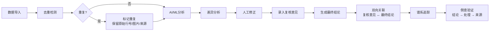

## 1. 产品概述

生物安全柜使用记录AI/ML工作流系统，专为医院检验师设计，解决传统记录流程依赖人工经验、测序结果补录后变更追溯困难的问题。系统串联样本、版本、人工修正和分组指标，实现从数据导入到最终结论的全链路可追溯。

目标价值：消除人工查表的低效，确保同一样本不会出现多份矛盾结论，为质控组提供完整的审计追踪能力。

## 2. 核心功能

### 2.1 用户角色

| 角色 | 注册方式 | 核心权限 |
|------|----------|----------|
| 检验师 | 工号登录 | 日常差异分析、数据导入、人工修正、复核意见录入 |
| 质控组 | 工号登录 | 谱系追踪审计、倒查验证、最终结论确认、验收测试 |
| 管理员 | 工号登录 | 用户管理、系统配置、AI/ML模型管理 |

### 2.2 功能模块

1. **差异分析（日常入口）**：日常工作首页，展示样本导入、版本变更、人工修正的差异对比
2. **谱系追踪（审计入口）**：月底/课前审计视图，展示样本全生命周期血缘关系
3. **条码重复处理**：样本条码重复记录的检测、标记与保留机制
4. **倒查验证**：从最终结论一路追溯到原始数据来源的完整链路
5. **复核与结论**：复核意见与最终结论的双向关联与跳转
6. **导入去重**：重复导入检测，避免同一事件产生多份结论
7. **AI/ML工作流**：测序结果分析、异常检测、智能推荐修正

### 2.3 页面详情

| 页面名称 | 模块名称 | 功能描述 |
|---------|----------|----------|
| 差异分析首页 | 概览面板 | 今日导入数、待处理差异、重复条码预警、AI分析进度 |
| 差异分析首页 | 差异列表 | 按时间倒序的记录变更列表，展示变更前后对比 |
| 差异分析首页 | 版本时间线 | 单样本多版本可视化时间轴，支持点击跳转 |
| 差异分析首页 | 人工修正面板 | 修正原因录入、分组指标标记、复核意见输入 |
| 谱系追踪页 | 样本血缘图 | 样本从导入到最终结论的完整血缘关系可视化 |
| 谱系追踪页 | 审计时间线 | 按操作人、时间、操作类型的审计日志 |
| 谱系追踪页 | 分组指标分析 | 按批次、日期、检验类型的分组统计 |
| 条码重复处理页 | 重复列表 | 条码重复记录列表，高亮显示冲突项 |
| 条码重复处理页 | 原始来源保留 | 原始行号、图片名、来源备注的完整展示与跳转 |
| 倒查验证页 | 链路追踪 | 从最终结论反向追溯到原始记录的完整链路 |
| 倒查验证页 | 验收测试 | 质控组验收工具，随机抽样倒查验证 |
| 复核管理页 | 复核列表 | 待复核、已复核记录，支持复核意见与最终结论互跳 |
| 数据导入页 | 导入预览 | 导入前预览、重复检测、冲突标记 |
| AI工作台 | 模型管理 | AI/ML工作流配置、模型版本、分析任务监控 |

## 3. 核心流程

### 3.1 日常差异分析流程

检验师每日登录后进入差异分析首页，查看新增样本导入、版本变更和AI分析结果。对有差异的记录进行人工修正，填写修正原因和分组指标。遇到条码重复记录时，系统自动保留原始来源信息，检验师录入复核意见后提交。

### 3.2 质控审计流程

月底或课前，质控组进入谱系追踪页面，查看样本全生命周期的血缘关系。通过验收测试模块随机抽取条码重复记录进行倒查验证，从最终结论一路追溯到原始数据、图片和处理记录，确认数据完整性和准确性。

### 3.3 全链路追溯流程

## 4. 用户界面设计

### 4.1 设计风格

**设计基调：专业医疗·数据可信·精密严谨**

- **主色调**：深海蓝 `#0F2B5B` - 代表医疗专业性和数据可信度
- **辅助色**：科研青 `#00B8A9` - 用于AI分析和正向状态
- **警示色**：琥珀橙 `#F08A00` - 用于条码重复、差异警告
- **错误色**：医疗红 `#E63946` - 用于严重冲突和错误
- **背景**：渐变冷灰 `#F5F7FA` → `#E8EDF2` - 营造洁净专业的医疗氛围

**视觉元素：**
- 卡片式布局，微妙的内投影和边框，营造精密仪器感
- 数据可视化采用深色底配霓虹色高亮，模拟实验室分析仪显示风格
- 时间线采用竖向排列，节点使用微脉冲动画标记关键变更点
- 血缘图谱采用有机流动的连接线，hover时显示详细信息

**字体选择：**
- 标题：Noto Serif SC - 稳重专业的衬线字体，体现医疗报告的正式感
- 正文：Noto Sans SC - 清晰易读的无衬线字体，确保长时间使用不疲劳
- 数据/编号：JetBrains Mono - 等宽字体，确保条码、编号对齐易读

**交互细节：**
- 卡片悬浮时轻微上浮并产生柔和阴影
- 数据变更时使用淡入+高亮动画，吸引注意力但不刺眼
- 倒查链路采用逐步展开动画，从结论反向点亮每一个节点
- 条码重复记录使用脉动边框持续提示

### 4.2 页面设计概述

| 页面名称 | 模块名称 | UI元素 |
|---------|----------|--------|
| 差异分析首页 | 概览面板 | 4个统计卡片（渐变背景+微动画数字）、AI工作流状态指示器 |
| 差异分析首页 | 差异列表 | 斑马纹表格、变更前后diff高亮、版本标签、操作人头像 |
| 差异分析首页 | 版本时间线 | 竖向时间轴、圆形节点、连接线hover高亮、点击展开详情 |
| 谱系追踪页 | 样本血缘图 | 力导向图布局、节点可拖拽、点击高亮上下游、搜索定位 |
| 谱系追踪页 | 审计时间线 | 横向泳道图、按操作人分道、时间缩放控制 |
| 条码重复处理页 | 重复列表 | 琥珀色高亮行、原始来源标签组、一键跳转来源按钮 |
| 倒查验证页 | 链路追踪 | 反向高亮动画、每步可展开详情、来源预览浮窗 |
| 复核管理页 | 复核列表 | 双向链接图标、点击互跳、意见与结论并排对比 |

### 4.3 响应式

桌面优先设计，支持1920×1080及以上分辨率。
- 侧边导航在平板宽度折叠为图标模式
- 数据表格在小屏转为卡片式列表
- 血缘图谱支持触摸手势缩放拖拽

### 4.4 数据可视化专项

- **版本差异**：采用split-pane左右对比，差异行使用背景色+下划线标记
- **血缘图谱**：节点颜色区分状态（正常/待复核/有冲突），连线粗细表示关联强度
- **分组指标**：堆叠柱状图+热力图组合，支持钻取查看明细
- **AI分析置信度**：仪表盘样式展示，低置信度区域自动标记待人工审核
