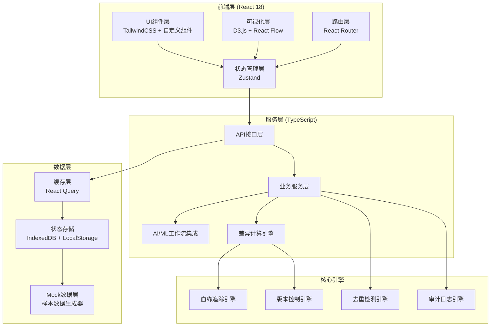
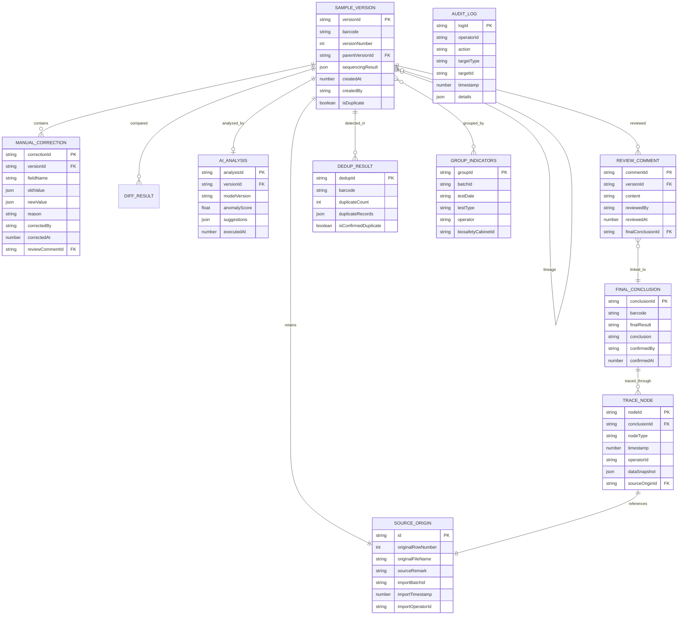

## 1. 架构设计



## 2. 技术描述

- **前端框架**：React@18.2.0 + TypeScript@5
- **构建工具**：Vite@5
- **样式方案**：TailwindCSS@3 + CSS Variables
- **状态管理**：Zustand@4（轻量级，适合复杂业务状态）
- **数据获取**：@tanstack/react-query@5
- **路由**：react-router-dom@6
- **可视化**：
  - d3@7（图表、热力图、血缘图布局计算）
  - @xyflow/react@12（原React Flow，用于血缘图谱可视化）
  - recharts@2（统计图表）
- **日期处理**：dayjs@1
- **工具库**：lodash-es、uuid、clsx
- **本地存储**：IndexedDB（存储大量样本数据）+ LocalStorage（用户配置）
- **Mock方案**：@faker-js/faker + MSW@2（可选），直接内置Mock数据生成器

## 3. 路由定义

| 路由 | 页面 | 用途 |
|------|------|------|
| `/` | 差异分析首页 | 日常工作入口，展示差异列表、概览、版本时间线 |
| `/lineage` | 谱系追踪页 | 月底/课前审计，样本血缘图、审计时间线 |
| `/duplicates` | 条码重复处理 | 重复记录列表、原始来源保留与跳转 |
| `/trace` | 倒查验证页 | 从结论反向追溯、验收测试工具 |
| `/review` | 复核管理页 | 复核意见与最终结论双向关联 |
| `/import` | 数据导入页 | 导入预览、去重检测、冲突标记 |
| `/ai-station` | AI工作台 | AI/ML工作流配置与监控 |
| `/sample/:barcode` | 样本详情页 | 单样本全量信息、版本历史、操作记录 |

## 4. 核心类型定义

```typescript
// 样本条码
type Barcode = string;

// 原始来源信息
interface SourceOrigin {
  id: string;
  originalRowNumber: number;      // 原始行号
  originalFileName: string;       // 图片名/文件名
  sourceRemark: string;           // 来源备注
  importBatchId: string;          // 导入批次ID
  importTimestamp: number;        // 导入时间戳
  importOperatorId: string;       // 导入操作人
}

// 版本记录
interface SampleVersion {
  versionId: string;
  versionNumber: number;
  parentVersionId: string | null; // 父版本ID，用于谱系追踪
  barcode: Barcode;
  sequencingResult: Record<string, any>;  // 测序结果
  manualCorrections: ManualCorrection[];  // 人工修正记录
  groupIndicators: GroupIndicators;       // 分组指标
  createdAt: number;
  createdBy: string;
  changeReason: string;           // 变更原因
  isDuplicate: boolean;           // 是否条码重复
  sourceOrigin: SourceOrigin;     // 原始来源，每个版本都保留
}

// 人工修正记录
interface ManualCorrection {
  correctionId: string;
  fieldName: string;
  oldValue: any;
  newValue: any;
  reason: string;
  correctedBy: string;
  correctedAt: number;
  reviewCommentId: string | null; // 关联的复核意见
}

// 分组指标
interface GroupIndicators {
  batchId: string;                // 批次
  testDate: string;               // 检验日期
  testType: string;               // 检验类型
  operator: string;               // 操作人
  biosafetyCabinetId: string;     // 生物安全柜编号
  [key: string]: any;
}

// 复核意见
interface ReviewComment {
  commentId: string;
  barcode: Barcode;
  versionId: string;
  content: string;
  reviewedBy: string;
  reviewedAt: number;
  finalConclusionId: string | null; // 关联的最终结论
}

// 最终结论
interface FinalConclusion {
  conclusionId: string;
  barcode: Barcode;
  finalResult: string;
  conclusion: string;
  confirmedBy: string;
  confirmedAt: number;
  reviewCommentIds: string[];     // 关联的复核意见列表
  traceLinkIds: string[];         // 追溯链路ID
}

// 追溯链路节点
interface TraceNode {
  nodeId: string;
  nodeType: 'import' | 'ai_analysis' | 'manual_correction' | 'review' | 'conclusion';
  timestamp: number;
  operatorId: string;
  dataSnapshot: Record<string, any>;
  sourceOriginId: string;
  previousNodeId: string | null;
  nextNodeId: string | null;
}

// 血缘关系
interface LineageRelation {
  fromVersionId: string;
  toVersionId: string;
  relationType: 'correction' | 'reimport' | 'supplement' | 'merge';
  changedFields: string[];
}

// 差异对比结果
interface DiffResult {
  barcode: Barcode;
  oldVersion: SampleVersion;
  newVersion: SampleVersion;
  changedFields: Array<{
    field: string;
    oldValue: any;
    newValue: any;
    isAiSuggested: boolean;
    confidence: number;
  }>;
  aiAnalysis: AiAnalysisResult | null;
}

// AI分析结果
interface AiAnalysisResult {
  analysisId: string;
  modelVersion: string;
  anomalyScore: number;
  suggestions: Array<{
    field: string;
    suggestedValue: any;
    confidence: number;
    reasoning: string;
  }>;
  executedAt: number;
}

// 去重检测结果
interface DedupResult {
  barcode: Barcode;
  duplicateCount: number;
  duplicateRecords: Array<{
    versionId: string;
    sourceOrigin: SourceOrigin;
    importTimestamp: number;
    similarity: number;  // 内容相似度 0-1
  }>;
  isConfirmedDuplicate: boolean;
  mergeStrategy: 'keep_latest' | 'keep_original' | 'manual' | null;
}

// 审计日志
interface AuditLog {
  logId: string;
  operatorId: string;
  action: string;
  targetType: string;
  targetId: string;
  timestamp: number;
  details: Record<string, any>;
  ipAddress?: string;
}
```

## 5. 数据模型ER图



## 6. 核心引擎设计

### 6.1 版本控制引擎 (VersionControlEngine)

负责样本版本的创建、对比、回溯。每个版本完整保留原始来源信息，确保条码重复记录可追溯。

```typescript
interface VersionControlEngine {
  createVersion(barcode: Barcode, data: Partial<SampleVersion>, source: SourceOrigin): SampleVersion;
  compareVersions(oldId: string, newId: string): DiffResult;
  getVersionHistory(barcode: Barcode): SampleVersion[];
  rollbackToVersion(versionId: string, operatorId: string): SampleVersion;
}
```

### 6.2 血缘追踪引擎 (LineageEngine)

构建样本版本间的血缘关系图，支持正向和反向追溯。

```typescript
interface LineageEngine {
  buildLineageGraph(barcode: Barcode): LineageRelation[];
  traceForward(versionId: string): TraceNode[];
  traceBackward(versionId: string): TraceNode[];
  getFullTracePath(conclusionId: string): TraceNode[];  // 从结论追溯到源头
}
```

### 6.3 去重检测引擎 (DeduplicationEngine)

检测条码重复记录，计算内容相似度，保留所有原始来源。

```typescript
interface DeduplicationEngine {
  detectDuplicates(importBatch: SourceOrigin[]): DedupResult[];
  calculateSimilarity(version1: SampleVersion, version2: SampleVersion): number;
  getDuplicateGroup(barcode: Barcode): SampleVersion[];
  markAsDuplicate(barcode: Barcode, confirmed: boolean): void;
}
```

### 6.4 差异计算引擎 (DiffEngine)

计算版本间的差异，识别AI建议变更和人工变更。

```typescript
interface DiffEngine {
  calculateFieldDiff(oldValue: any, newValue: any, field: string): { changed: boolean; diff: any };
  highlightDifferences(oldVersion: SampleVersion, newVersion: SampleVersion): DiffResult;
  getPendingDiffs(dateRange?: [number, number]): DiffResult[];
}
```

### 6.5 审计日志引擎 (AuditEngine)

记录所有操作，确保所有变更可审计。

```typescript
interface AuditEngine {
  logAction(operatorId: string, action: string, targetType: string, targetId: string, details: Record<string, any>): void;
  getAuditTrail(targetType: string, targetId: string): AuditLog[];
  getOperatorLogs(operatorId: string, dateRange?: [number, number]): AuditLog[];
}
```

## 7. AI/ML工作流集成点

系统设计为可插拔的AI/ML工作流架构，支持：

1. **测序结果异常检测**：导入后自动运行AI模型检测异常值
2. **智能修正建议**：基于历史修正模式推荐修正方案
3. **重复内容智能比对**：条码重复时自动比对内容差异
4. **置信度评估**：对AI分析结果给出置信度评分
5. **模型版本管理**：记录使用的模型版本，确保结果可复现

## 8. 状态管理设计

使用Zustand创建多个独立的状态切片：

- `useSampleStore`：样本版本、差异、血缘数据
- `useReviewStore`：复核意见、最终结论
- `useDedupStore`：重复记录检测结果
- `useTraceStore`：倒查链路数据
- `useAuditStore`：审计日志
- `useUIStore`：UI状态（当前选中、展开项、筛选条件）

每个状态切片集成持久化（IndexedDB）和缓存策略（React Query）。
