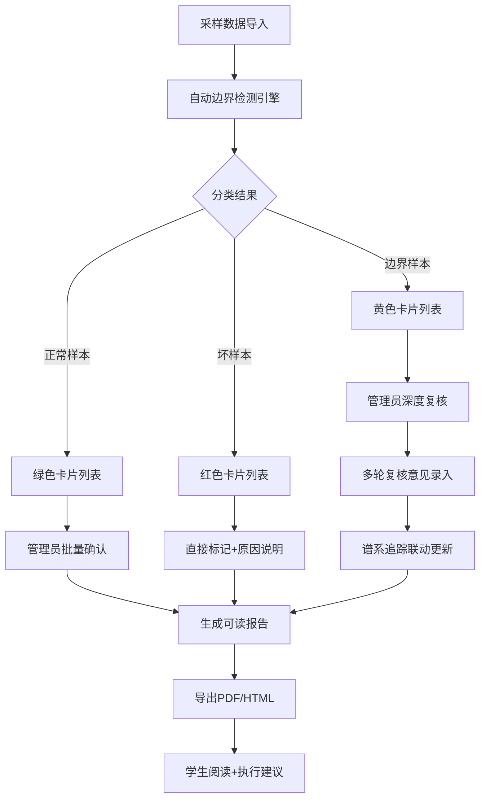

## 1. 产品概述

引物设计边界检查系统是面向动物房实验室管理员与科研人员的质量管控工具，旨在自动化完成引物设计的边界检测、批次效应识别与复核流程管理，替代传统人工清洗采样地点、手工标红批次效应的低效工作方式。

- **核心痛点**：动物房管理员每日需耗费大量时间清洗采样数据、手工识别并标注批次效应，效率低下且易出错
- **目标用户**：动物房管理员、实验室质量负责人、科研学生
- **产品价值**：自动化边界检测 + 可视化批次效应 + 可追溯复核流程，确保引物质量可控、审计留痕

## 2. 核心功能

### 2.1 用户角色

| 角色 | 注册方式 | 核心权限 |
|------|----------|----------|
| 动物房管理员 | 系统分配 | 全量样本查看、边界判定、复核意见录入、谱系更新、报告导出 |
| 质量负责人 | 系统分配 | 审批复核意见、查看统计报表、配置阈值参数 |
| 科研学生 | 系统分配 | 查看本人批次、阅读导出报告、理解拦截原因 |

### 2.2 功能模块

1. **引物设计边界检查主页**：批次概览仪表盘、三类样本卡片（正常/边界/坏样本）、快捷操作入口
2. **样本详情与分类模块**：单样本深度分析、边界阈值可视化、多维度指标雷达图
3. **批次效应检测模块**：PCA聚类散点图、批次分布热力图、效应拦截原因明细解释
4. **人工复核与谱系追踪**：复核意见补录面板、非一次性判断支持、复核历史版本、谱系联动更新
5. **报告导出模块**：学生友好型PDF/HTML报告、批次效应拦截原因详述、建议操作清单

### 2.3 页面详情

| 页面名称 | 模块名称 | 功能描述 |
|----------|----------|----------|
| 边界检查主页 | 顶部仪表盘 | 批次总数、三类样本占比统计、待复核数量告警、快速筛选条 |
| 边界检查主页 | 样本列表区 | 三色样本卡片（绿=正常/黄=边界/红=坏样本）、点击展开详情、搜索与排序 |
| 边界检查主页 | 批次效应总览图 | PCA散点图（带文字解释面板）、热力图（带数值注解）、悬停显示明细 |
| 样本详情页 | 质量指标雷达图 | GC含量/熔解温度/二聚体评分/特异性评分等6维度，每项附阈值说明 |
| 样本详情页 | 边界判定卡片 | 正常/边界/异常三类标签，显示自动判定理由 + 阈值依据 |
| 样本详情页 | 人工复核面板 | 多轮意见录入（支持追加而非覆盖）、判定状态切换、谱系自动更新提示 |
| 样本详情页 | 谱系追踪时间轴 | 采样→初检→复核1→复核2→最终判定的完整链路，每步留痕 |
| 报告预览页 | 学生友好报告 | 批次编号、拦截原因（白话文）、指标对比图、建议操作步骤、FAQ |
| 报告预览页 | 导出控制栏 | PDF/HTML格式切换、包含/排除原始数据、打印预览 |

## 3. 核心流程

管理员日常工作流程：登录系统 → 查看今日待复核批次 → 浏览自动分类的三类样本 → 点击样本查看边界判定详情与图表明细解释 → 在复核面板录入/追加意见（非一次性）→ 提交后谱系自动更新 → 导出学生可读报告

学生阅读报告流程：接收导出报告 → 查看批次基本信息 → 阅读"为什么被拦截"白话文解释 → 查看指标对比图与阈值说明 → 执行建议操作 → 联系管理员复核

## 4. 用户界面设计

### 4.1 设计风格

- **主色调**：深海蓝 `#1e3a5f`（专业可靠），搭配实验室青 `#0d9488`（正常）、琥珀黄 `#f59e0b`（边界）、警示红 `#dc2626`（异常）
- **辅助色**：浅灰蓝背景 `#f0f4f8`，卡片白底带细边，数据可视化采用半透明渐变色块
- **按钮风格**：圆角8px，主按钮深蓝填充+白色文字，悬停加深；次按钮白底+深蓝描边
- **字体**：标题用 Noto Serif SC（衬线，学术感），正文用 JetBrains Mono（等宽，数据易读）
- **布局风格**：顶部导航 + 左侧筛选 + 主内容卡片网格，图表与解释面板左右并列（非纯颜色）
- **图标**：lucide-react 线性图标，数据可视化配数字徽章

### 4.2 页面设计概述

| 页面名称 | 模块名称 | UI元素 |
|----------|----------|--------|
| 边界检查主页 | 顶部仪表盘 | 4张数据统计卡（数字+趋势箭头）、待复核红色徽章、渐变背景分隔线 |
| 边界检查主页 | 三色样本卡片区 | 3列网格，每张卡显示样本ID/采集地点/2个关键指标/状态色条/查看详情按钮 |
| 边界检查主页 | 批次效应图表区 | 左侧PCA散点图+右侧文字解释面板（"为什么这个点被判定为批次效应"） |
| 样本详情页 | 指标雷达图区 | 雷达图居左，右侧6项指标逐条解释（数值、阈值、是否超出、超出百分比） |
| 样本详情页 | 复核面板 | 历史意见时间轴（左侧头像+时间+内容）、底部文本框+"追加意见"按钮（非"提交"）、谱系更新勾选框 |
| 样本详情页 | 谱系追踪 | 垂直时间轴，每节点含操作人/时间/动作/状态变更，高亮最新节点 |
| 报告预览页 | 报告主体 | 大标题+批次号+状态横幅（绿/黄/红）、"拦截原因"用大号卡片+项目符号+对比图 |
| 报告预览页 | 导出控制 | 顶部悬浮条，PDF/HTML切换按钮、打印图标、包含原始数据开关 |

### 4.3 响应式设计

- **桌面端优先**（1280px+）：3列样本卡片、图表与解释面板左右并列、侧边筛选栏常驻
- **平板端（768-1279px）**：2列样本卡片、图表与解释上下排列、筛选栏折叠为抽屉
- **移动端（<768px）**：单列样本卡片、图表全屏+滚动查看解释、底部操作栏固定

### 4.4 视觉氛围

- 页面顶部放置细噪点纹理渐变条（深蓝→青），营造实验室科技感
- 每张样本卡片悬停时上浮4px+柔和阴影，选中时左侧显示8px宽状态色边
- 数据变化时数字采用计数滚动动画（0.6秒缓动）
- 图表元素进入页面采用从下往上的错落淡入动画
