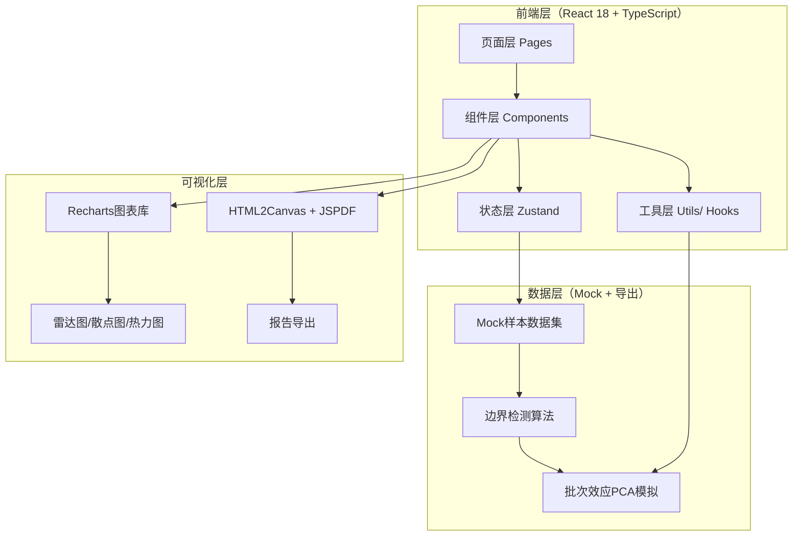

## 1. 架构设计



## 2. 技术描述

- **前端框架**：React@18 + TypeScript@5 + Vite@5
- **样式方案**：TailwindCSS@3（原子化CSS）+ CSS变量定义主题色
- **状态管理**：Zustand@4（轻量状态库，管理样本数据、筛选条件、复核状态）
- **路由**：React Router Dom@6（边界检查主页、样本详情、报告预览）
- **图表可视化**：Recharts@2（React原生图表库，支持雷达图、散点图、热力图）
- **导出功能**：html2canvas + jspdf（HTML转PDF报告导出）
- **图标**：lucide-react@latest
- **初始化方式**：pnpm create vite-init@latest . --template react-ts --force
- **后端**：无后端，全部使用Mock数据模拟真实业务场景
- **数据源**：内置3条精心设计的样例数据（1条顺利/1条待确认/1条坏数据）+ 批量模拟数据

## 3. 路由定义

| Route | 页面目的 |
|-------|----------|
| `/` | 引物设计边界检查主页（仪表盘+样本列表+批次效应图） |
| `/sample/:id` | 样本详情页（指标雷达图+边界判定+复核面板+谱系追踪） |
| `/report/:id` | 报告预览页（学生友好报告+导出控制） |

## 4. 数据模型（TypeScript类型定义）

### 4.1 核心类型

```typescript
// 样本状态枚举
enum SampleStatus {
  NORMAL = 'normal',       // 正常样本（绿色）
  BORDERLINE = 'borderline', // 边界样本（黄色）
  ABNORMAL = 'abnormal'    // 坏样本（红色）
}

// 复核动作
enum ReviewAction {
  CONFIRM = 'confirm',     // 确认自动判定
  ADJUST = 'adjust',       // 调整判定结果
  REQUEST_RECHECK = 'recheck' // 请求重测
}

// 质量指标维度
interface QualityMetric {
  name: string;            // 指标名称：GC含量、熔解温度、二聚体评分等
  value: number;           // 实际数值
  thresholdMin: number;    // 阈值下限
  thresholdMax: number;    // 阈值上限
  unit: string;            // 单位
  isOutOfRange: boolean;   // 是否越界
  explanation: string;     // 指标含义解释
}

// 复核意见（支持多轮，非一次性）
interface ReviewNote {
  id: string;
  author: string;          // 复核人
  role: string;            // 角色
  timestamp: number;       // 时间戳
  content: string;         // 意见内容
  action: ReviewAction;    // 动作
  newStatus?: SampleStatus; // 调整后的新状态
  updatesLineage: boolean; // 是否更新谱系
}

// 谱系追踪节点
interface LineageNode {
  id: string;
  stage: string;           // 阶段名称：采样/初检/复核1/复核2/最终
  operator: string;
  timestamp: number;
  statusBefore: SampleStatus | null;
  statusAfter: SampleStatus;
  note: string;
  relatedReviewId?: string;
}

// 批次效应点
interface BatchEffectPoint {
  sampleId: string;
  pc1: number;             // 主成分1坐标
  pc2: number;             // 主成分2坐标
  batch: string;           // 所属批次
  isOutlier: boolean;      // 是否为离群点
  reason: string;          // 判定为批次效应的原因
}

// 完整样本对象
interface PrimerSample {
  id: string;              // 样本ID
  name: string;            // 引物名称
  batch: string;           // 批次号
  location: string;        // 采样地点
  collectionDate: string;  // 采集日期
  operator: string;        // 采样人
  status: SampleStatus;    // 当前状态
  autoDetectReason: string; // 自动判定理由
  metrics: QualityMetric[]; // 质量指标数组
  reviews: ReviewNote[];   // 复核意见列表
  lineage: LineageNode[];  // 谱系追踪
  batchEffect?: BatchEffectPoint; // 批次效应信息
}
```

### 4.2 状态管理（Zustand Store）

```typescript
interface AppState {
  samples: PrimerSample[];
  selectedId: string | null;
  filterStatus: SampleStatus | 'all';
  searchKeyword: string;
  
  // 操作方法
  selectSample: (id: string | null) => void;
  setFilter: (status: SampleStatus | 'all') => void;
  setSearch: (kw: string) => void;
  addReviewNote: (sampleId: string, note: Omit<ReviewNote, 'id' | 'timestamp'>) => void;
  updateSampleStatus: (sampleId: string, newStatus: SampleStatus, reason: string) => void;
}
```

## 5. 数据初始化（3条样例数据）

### 样例1：顺利记录（NORMAL正常样本）
- ID: P-2026-0611-001，批次：BAT-2026-W24，采样地点：A区-3号笼架-02
- 指标全在阈值内：GC含量52%（45-60）、熔解温度58.2℃（55-62）、二聚体评分92（≥80）、特异性评分88（≥75）、产物长度204bp（150-300）、跨内含子评分95（≥85）
- 自动判定理由：全部6项指标均落在安全阈值范围内，无越界项；PCA聚类与该批次中心距离<1σ
- 谱系：采样→自动初检NORMAL→管理员确认NORMAL
- 复核：1条确认意见，谱系已更新

### 样例2：待确认记录（BORDERLINE边界样本）
- ID: P-2026-0611-002，批次：BAT-2026-W24，采样地点：B区-1号笼架-07
- 指标接近边界：GC含量44.8%（45-60，低0.2%）、熔解温度54.6℃（55-62，低0.4℃）、二聚体评分81（≥80，高1）、特异性评分76（≥75，高1）、产物长度148bp（150-300，短2bp）、跨内含子评分86（≥85，高1）
- 自动判定理由：6项指标中5项触达阈值边缘（偏差<5%），存在潜在风险；PCA聚类与批次中心距离=1.8σ，介于边界线附近
- 谱系：采样→自动初检BORDERLINE→等待管理员复核
- 复核：0条意见，待管理员追加

### 样例3：明显坏数据（ABNORMAL异常样本）
- ID: P-2026-0611-003，批次：BAT-2026-W24，采样地点：C区-2号笼架-11
- 指标严重越界：GC含量32%（45-60，低13%）、熔解温度48.5℃（55-62，低6.5℃）、二聚体评分52（≥80，低28）、特异性评分41（≥75，低34）、产物长度86bp（150-300，短64bp）、跨内含子评分62（≥85，低23）
- 自动判定理由：6项指标全部严重越界（偏差>10%）；PCA聚类为明显离群点，与批次中心距离=4.2σ>3σ；采样地点C-2-11历史上已出现3次类似异常，怀疑环境污染
- 谱系：采样→自动初检ABNORMAL→管理员标记环境污染→建议重测
- 复核：2条意见，谱系已更新2次

## 6. 目录结构

```
src/
├── pages/
│   ├── Dashboard.tsx        # 边界检查主页
│   ├── SampleDetail.tsx     # 样本详情页
│   └── ReportPreview.tsx    # 报告预览页
├── components/
│   ├── dashboard/
│   │   ├── StatsCards.tsx       # 统计仪表盘卡片
│   │   ├── SampleCardList.tsx   # 三色样本卡片列表
│   │   ├── SampleCard.tsx       # 单张样本卡片
│   │   ├── BatchEffectChart.tsx # 批次效应PCA图+解释面板
│   │   └── FilterBar.tsx        # 筛选搜索栏
│   ├── detail/
│   │   ├── MetricsRadar.tsx     # 质量指标雷达图+明细解释
│   │   ├── StatusBadge.tsx      # 状态判定卡片
│   │   ├── ReviewPanel.tsx      # 多轮复核面板（非一次性）
│   │   └── LineageTimeline.tsx  # 谱系追踪时间轴
│   └── report/
│       ├── ReportHeader.tsx     # 报告标题横幅
│       ├── BlockReasonCard.tsx  # 拦截原因解释卡（学生友好）
│       ├── MetricComparison.tsx # 指标对比图
│       ├── SuggestionList.tsx   # 建议操作清单
│       └── ExportToolbar.tsx    # 导出控制工具栏
├── store/
│   └── useSampleStore.ts    # Zustand状态管理
├── data/
│   └── mockSamples.ts       # 3条样例+批量模拟数据
├── types/
│   └── index.ts             # TypeScript类型定义
├── utils/
│   ├── boundaryCheck.ts     # 边界检测算法函数
│   ├── pcaSimulation.ts     # PCA坐标模拟生成
│   └── exportReport.ts      # 报告导出工具函数
├── hooks/
│   └── useAnimatedNumber.ts # 数字滚动动画Hook
├── App.tsx
├── main.tsx
└── index.css
```
