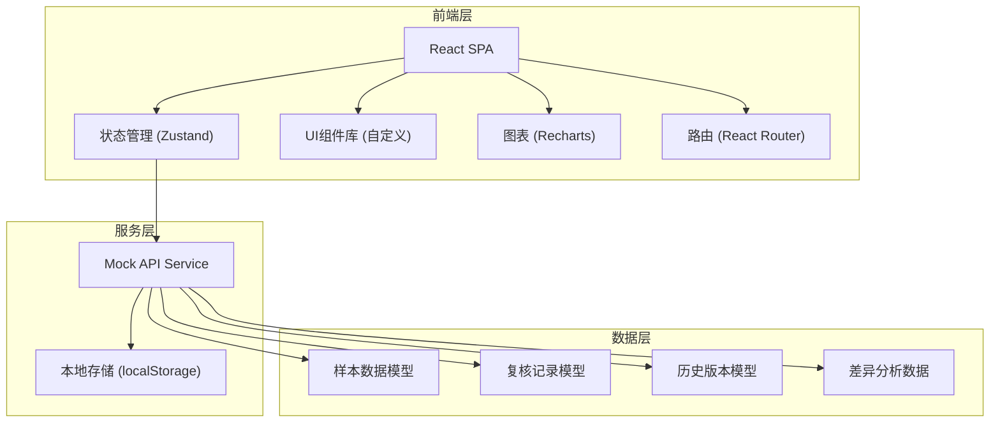
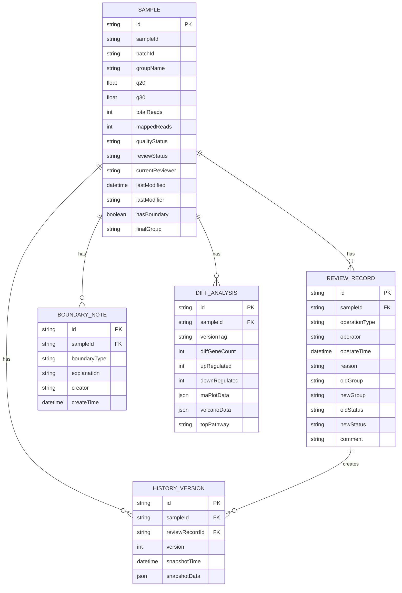

## 1. 架构设计



---

## 2. 技术描述

- **前端框架**：React@18 + TypeScript@5
- **构建工具**：Vite@5
- **样式方案**：TailwindCSS@3 + CSS变量
- **状态管理**：Zustand@4
- **路由管理**：React Router@6
- **图表库**：Recharts@2
- **图标库**：Lucide React
- **数据持久化**：localStorage + IndexedDB
- **后端**：无（纯前端应用，使用Mock数据）

### 关键技术决策
1. **纯前端架构**：无需后端服务，所有数据存储在浏览器本地，方便实验室内网部署
2. **Zustand状态管理**：轻量级、API简洁，适合中后台数据管理场景
3. **Recharts**：基于SVG的图表库，便于自定义MA图、火山图等生物信息学常用图表
4. **TypeScript**：确保数据模型的类型安全，减少业务逻辑错误

---

## 3. 路由定义

| 路由 | 页面 | 功能 |
|------|------|------|
| `/` | 样本列表页 | 批次概览、样本表格、筛选搜索 |
| `/sample/:id` | 样本复核详情页 | 分组编辑、边界标注、复核意见、低质量处理 |
| `/sample/:id/history` | 历史对比视图 | 操作时间线、新旧对比、差异分析对比 |
| `/audit-log` | 复核记录追溯页 | 完整操作日志、版本回溯 |

---

## 4. 数据模型

### 4.1 实体关系图



### 4.2 TypeScript 类型定义

```typescript
// 样本质量状态
type QualityStatus = 'pass' | 'low_quality' | 'warning' | 'fail';

// 复核状态
type ReviewStatus = 'pending' | 'reviewing' | 'confirmed' | 'rejected';

// 边界类型
type BoundaryType = 'group_ambiguous' | 'negative_control_abnormal' | 'low_quality_edge' | 'timepoint_cross';

// 操作类型
type OperationType = 'import' | 'modify_group' | 'modify_quality' | 'add_note' | 'confirm' | 'reject' | 'revert';

interface Sample {
  id: string;
  sampleId: string;
  batchId: string;
  groupName: string;
  q20: number;
  q30: number;
  totalReads: number;
  mappedReads: number;
  qualityStatus: QualityStatus;
  reviewStatus: ReviewStatus;
  currentReviewer: string;
  lastModified: Date;
  lastModifier: string;
  hasBoundary: boolean;
  finalGroup?: string;
}

interface ReviewRecord {
  id: string;
  sampleId: string;
  operationType: OperationType;
  operator: string;
  operateTime: Date;
  reason: string;
  oldGroup?: string;
  newGroup?: string;
  oldStatus?: QualityStatus | ReviewStatus;
  newStatus?: QualityStatus | ReviewStatus;
  comment: string;
}

interface BoundaryNote {
  id: string;
  sampleId: string;
  boundaryType: BoundaryType;
  explanation: string;
  creator: string;
  createTime: Date;
}

interface DiffAnalysis {
  id: string;
  sampleId: string;
  versionTag: 'before' | 'after';
  diffGeneCount: number;
  upRegulated: number;
  downRegulated: number;
  maPlotData: MAPlotPoint[];
  volcanoData: VolcanoPoint[];
  topPathway: string;
}

interface MAPlotPoint {
  gene: string;
  log2FoldChange: number;
  baseMean: number;
  significant: boolean;
}

interface VolcanoPoint {
  gene: string;
  log2FoldChange: number;
  negLog10Pvalue: number;
  significant: boolean;
  regulated: 'up' | 'down' | 'none';
}
```

---

## 5. 目录结构

```
src/
├── assets/              # 静态资源
├── components/          # 可复用组件
│   ├── layout/         # 布局组件
│   ├── ui/             # 基础UI组件（卡片、按钮、表格等）
│   ├── charts/         # 图表组件
│   └── features/       # 业务组件
├── pages/              # 页面组件
│   ├── SampleList/
│   ├── SampleDetail/
│   ├── HistoryCompare/
│   └── AuditLog/
├── store/              # 状态管理
│   ├── sampleStore.ts
│   ├── reviewStore.ts
│   └── userStore.ts
├── types/              # TypeScript 类型定义
│   └── index.ts
├── data/               # Mock数据
│   ├── samples.ts
│   ├── reviewRecords.ts
│   ├── boundaryNotes.ts
│   └── diffAnalysis.ts
├── utils/              # 工具函数
│   ├── formatters.ts
│   ├── validators.ts
│   └── storage.ts
├── hooks/              # 自定义Hooks
│   ├── useSample.ts
│   └── useReview.ts
├── App.tsx
├── main.tsx
└── index.css
```

---

## 6. 核心业务逻辑实现要点

### 6.1 历史版本追踪
- 每次修改样本信息时自动创建历史版本快照
- 使用 Immer 进行不可变状态更新
- 版本号自增，支持任意版本回溯
- 存储完整的修改前后对比数据

### 6.2 并排对比视图
- 左右分栏布局，左侧显示修改前数据，右侧显示修改后数据
- 使用删除线样式标记被修改的字段
- 新增值使用绿色高亮显示
- 差异分析图表并排展示，同步缩放交互

### 6.3 边界标注系统
- 预定义4种常见边界类型，每种类型内置解释模板
- 标注后在样本列表中显示橙色边界标签
- 解释文本支持Markdown格式，便于添加专业术语说明

### 6.4 真实样例数据
- S002-LV：低质量读段复核通过，Q20=18.3%，差异基因数变化+127
- S015-MO：分组边界不清，从"对照组"改为"处理组8h"，通路富集变化
- NTC-03：阴性对照异常，判定为交叉污染，影响同批次其他样本判断
