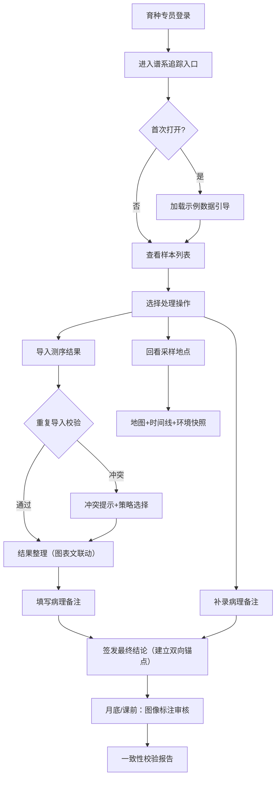

## 1. 产品概述

动植物样本冷链追踪系统面向育种专员，提供谱系追踪入口下的样本测序结果整理、采样地点回溯、病理分析联动功能，解决冷链样本从采样到测序分析全过程的数据一致性与可追溯问题。

- **核心目标**：确保测序结果、病理备注、最终结论三者可溯源且一一对应，重复导入不产生冗余数据
- **目标用户**：育种实验室专员、动植物遗传分析人员
- **核心价值**：将人工查表复盘的低效流程转为系统化的双向关联追溯，降低重复导入导致的数据混乱风险

---

## 2. 核心功能

### 2.1 用户角色

| 角色 | 注册方式 | 核心权限 |
|------|----------|----------|
| 育种专员 | 系统内部账号 | 样本全流程管理、测序导入、病理标注、结论追溯、重复导入校验 |

### 2.2 功能模块

1. **谱系追踪主页（日常入口）**：样本总览卡片、冷链状态仪表盘、快速处理入口、待办事项列表
2. **测序结果整理页**：测序结果表格、质量分布图、文字说明区（图表文字三者联动对应）
3. **采样地点回看页**：地理地图标注、采样点时间线、环境参数快照
4. **病理与结论双向追溯页**：病理备注列表、最终结论卡片、双向跳转锚点、变更日志
5. **图像标注审核页（月底/课前）**：标注缩略图墙、标注详情放大镜、标注解释说明对照
6. **重复导入测试场景页**：模拟重复导入流程、去重冲突提示、合并策略选择器、一致性校验报告

### 2.3 页面详情

| 页面名称 | 模块名称 | 功能描述 |
|-----------|-------------|---------------------|
| 谱系追踪主页 | 状态仪表盘 | 展示在途样本数、冷链异常数、待测序数、已完成数的实时卡片 |
| 谱系追踪主页 | 快速处理入口 | "导入测序结果"、"补录病理备注"、"查看采样地点"三个快捷按钮 |
| 谱系追踪主页 | 样本列表 | 支持按编号/物种/采样日期筛选，点击进入详情 |
| 谱系追踪主页 | 首次引导卡片 | 首次打开时展示示例数据加载入口与快速上手指引 |
| 测序结果整理页 | 结果数据表 | 展示样本ID、基因位点、测序深度、质量值、匹配物种等列 |
| 测序结果整理页 | 质量分布图 | 测序深度直方图、GC含量折线图、质量箱线图（点击图表定位表格行） |
| 测序结果整理页 | 文字说明区 | 对应选中行的实验说明、分析备注、参考链接（与表格行双向绑定） |
| 采样地点回看页 | 地图标注区 | 按经纬度在地图上标注采样点，颜色代表冷链状态 |
| 采样地点回看页 | 时间线组件 | 采样→入库→转运→测序各节点时间戳，支持回放模式 |
| 采样地点回看页 | 环境快照面板 | 采样时温度、湿度、海拔、GPS精度等参数快照 |
| 病理与结论页 | 病理备注列表 | 每条备注带唯一锚点ID，支持富文本与图片附件 |
| 病理与结论页 | 最终结论卡片 | 展示最终判定、签发人、签发时间，点击"关联备注"跳转到对应病理条目 |
| 病理与结论页 | 反向跳转入口 | 每条病理备注末尾显示"引用此备注的结论"，点击跳转 |
| 病理与结论页 | 变更日志 | 记录每次修改的时间、操作人、修改前后差异，防篡改 |
| 图像标注审核页 | 缩略图墙 | 按样本分组展示标注图像，支持按标注人/时间筛选 |
| 图像标注审核页 | 标注详情 | 放大查看，显示标注框坐标、标注标签、置信度与人工审核意见 |
| 图像标注审核页 | 解释对照表 | 标注类型、标准描述、判定规则三列对照，供课前讲解 |
| 重复导入测试页 | 导入模拟器 | 选择样本与数据类型，模拟导入流程，含故意重复场景 |
| 重复导入测试页 | 冲突提示面板 | 展示冲突字段、重复检测依据（MD5+样本ID+时间戳） |
| 重复导入测试页 | 合并策略选择 | 跳过/覆盖/合并/人工对比四种策略，实时预览差异 |
| 重复导入测试页 | 一致性报告 | 导入后生成校验报告，提示是否存在"一事两结论"风险 |

---

## 3. 核心流程

### 3.1 日常处理流程
育种专员从谱系追踪入口进入，查看当日待处理样本列表 → 导入或补录测序数据 → 系统自动校验是否重复导入（基于样本ID+测序批次号+数据MD5）→ 无冲突则进入结果整理，关联图表与文字说明 → 如需回溯则跳转采样地点地图 → 填写病理备注并签发最终结论，建立双向锚点。

### 3.2 重复导入校验流程
提交导入数据 → 计算文件MD5并比对历史记录 → 查询相同样本ID+批次号 → 发现重复时弹出冲突面板 → 专员选择合并策略 → 执行导入并记录操作日志 → 生成一致性校验报告。

### 3.3 月底/课前审核流程
进入图像标注审核页 → 按时间范围筛选本周期标注 → 逐张查看标注详情与解释对照表 → 核对标注是否与结论一致 → 标记审核状态。

### 3.4 Mermaid 流程图

---

## 4. 用户界面设计

### 4.1 设计风格
- **主色调**：深海蓝 `#1e3a5f`（专业科研感）+ 苔原绿 `#3d8b6b`（生命科学联想）
- **辅助色**：琥珀橙 `#e07b39`（预警/冲突）、月白灰 `#f4f6f8`（背景层次）
- **按钮风格**：圆角6px，微阴影（2px 2px 0 rgba(0,0,0,0.08)），悬停上浮2px
- **字体**：标题使用「思源宋体」（学术气质），正文使用「JetBrains Mono」+ 系统中文等宽字体（便于数据对齐）
- **布局风格**：左侧固定导航栏 + 右侧内容区，卡片式信息块，卡片间16px间距
- **图标风格**：线性图标（Lucide风格），关键节点搭配小型emoji（🧬 🗺️ 🔬 📋）增加识别度

### 4.2 页面设计概述

| 页面名称 | 模块名称 | UI元素 |
|-----------|-------------|-------------|
| 谱系追踪主页 | 仪表盘 | 4张渐变数据卡片 + 微动画数值递增 |
| 谱系追踪主页 | 样本列表 | 斑马纹表格 + 状态彩色徽章 + 行悬停展开预览 |
| 测序结果整理页 | 三栏联动 | 左：结果表（可选中高亮）；右上：图表；右下：文字说明，选中行同步高亮三者 |
| 测序结果整理页 | 图表区 | 点击柱状图的某条柱 → 表格滚动到对应样本行 → 文字说明切换内容 |
| 采样地点回看页 | 地图 | 深色底地图 + 脉冲动画采样点 + 悬浮气泡卡显示详情 |
| 病理与结论页 | 双向锚点 | 备注右侧「🔗结论」徽章，结论底部「关联备注: #P-2024-0315-017」可点击 |
| 病理与结论页 | 变更日志 | 时间线样式，修改处用红绿diff对比高亮 |
| 重复导入测试页 | 冲突对比 | 左右并排diff视图，差异处黄色背景闪烁 |
| 重复导入测试页 | 策略按钮组 | 4个策略卡片，选中后边框变主色+勾选动画 |

### 4.3 响应式
- **桌面优先**：最小支持1280px宽度，三栏布局（导航240px + 内容自适应）
- **平板适配（768-1279px）**：导航折叠为汉堡菜单，测序页三栏改为上下堆叠
- **触屏优化**：可点击区域不小于44px，表格支持横向滑动，地图支持双指缩放

### 4.4 动画细节
- 页面进入：导航先从左侧滑入，内容卡片依次渐入（stagger 80ms）
- 数据卡片数值：从0递增到目标值（duration: 800ms, ease-out）
- 冲突提示：黄色边框脉冲动画3次，吸引注意力
- 双向跳转：点击锚点后目标元素淡蓝底色闪烁2秒后淡出，辅助定位
