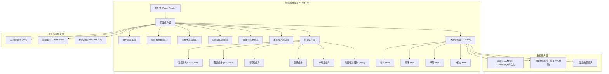
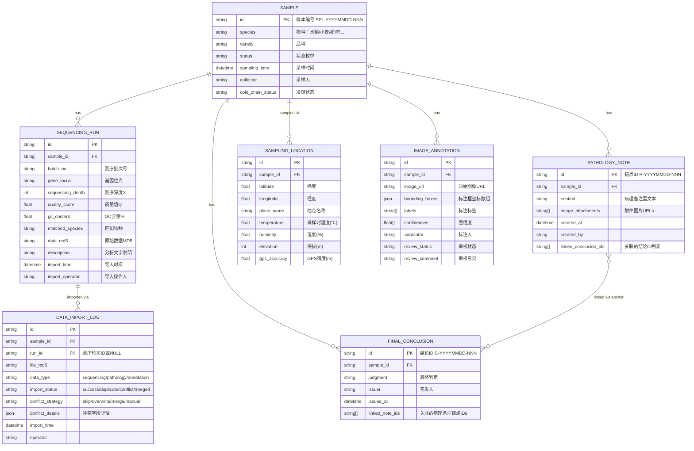

## 1. 架构设计



## 2. 技术描述

- **前端框架**：React@18 + TypeScript@5
- **初始化工具**：Vite@5
- **样式系统**：TailwindCSS@3 + CSS Variables（主题色管理）
- **状态管理**：Zustand@4（轻量级，避免Redux冗余）
- **路由**：React Router DOM@6
- **图表库**：Recharts@2（React生态友好，支持交互点击）
- **图标**：Lucide React@0.400（线性风格，符合设计规范）
- **后端/数据库**：无后端，使用localStorage + JSON Mock数据模拟
- **持久化方案**：zustand/middleware persist 中间件自动同步到localStorage

## 3. 路由定义

| 路由路径 | 页面名称 | 用途 |
|----------|----------|------|
| `/` | 重定向到谱系追踪 | 默认入口 |
| `/lineage` | 谱系追踪主页 | 日常入口，仪表盘+样本列表+快速操作 |
| `/sequencing` | 测序结果整理页 | 图表文三者联动整理测序结果 |
| `/sampling-map` | 采样地点回看页 | 地图标注+时间线+环境快照 |
| `/pathology` | 病理结论追溯页 | 病理备注与最终结论双向跳转 |
| `/annotation-review` | 图像标注审核页 | 月底/课前标注审核与解释对照 |
| `/import-test` | 重复导入测试页 | 模拟重复导入+去重策略+一致性报告 |

## 4. 数据模型

### 4.1 数据模型定义 (ER图)



### 4.2 类型定义 (TypeScript)

```typescript
// ===== 枚举类型 =====
export type ColdChainStatus = 'normal' | 'warning' | 'alert' | 'unknown';
export type SampleStatus = 'sampled' | 'in_transit' | 'sequencing' | 'analyzing' | 'completed' | 'archived';
export type ImportStrategy = 'skip' | 'overwrite' | 'merge' | 'manual';
export type ReviewStatus = 'pending' | 'approved' | 'rejected' | 'needs_revision';

// ===== 核心实体 =====
export interface Sample {
  id: string;
  species: string;
  variety: string;
  status: SampleStatus;
  samplingTime: string;
  collector: string;
  coldChainStatus: ColdChainStatus;
}

export interface SamplingLocation {
  id: string;
  sampleId: string;
  latitude: number;
  longitude: number;
  placeName: string;
  temperature: number;
  humidity: number;
  elevation: number;
  gpsAccuracy: number;
}

export interface SequencingRun {
  id: string;
  sampleId: string;
  batchNo: string;
  geneLocus: string;
  sequencingDepth: number;
  qualityScore: number;
  gcContent: number;
  matchedSpecies: string;
  dataMd5: string;
  description: string;
  importTime: string;
  importOperator: string;
}

export interface PathologyNote {
  id: string;
  sampleId: string;
  content: string;
  imageAttachments: string[];
  createdAt: string;
  createdBy: string;
  linkedConclusionIds: string[];
}

export interface FinalConclusion {
  id: string;
  sampleId: string;
  judgment: string;
  issuer: string;
  issuedAt: string;
  linkedNoteIds: string[];
}

export interface ImageAnnotation {
  id: string;
  sampleId: string;
  imageUrl: string;
  boundingBoxes: Array<{ x: number; y: number; width: number; height: number }>;
  labels: string[];
  confidences: number[];
  annotator: string;
  reviewStatus: ReviewStatus;
  reviewComment: string;
}

export interface DataImportLog {
  id: string;
  sampleId: string;
  runId: string | null;
  fileMd5: string;
  dataType: 'sequencing' | 'pathology' | 'annotation';
  importStatus: 'success' | 'duplicate' | 'conflict' | 'merged';
  conflictStrategy: ImportStrategy | null;
  conflictDetails: Record<string, { old: any; new: any }> | null;
  importTime: string;
  operator: string;
}

// ===== 重复导入检测结果 =====
export interface DuplicateCheckResult {
  isDuplicate: boolean;
  matchType: 'exact_md5' | 'same_sample_batch' | 'none';
  existingRecordId: string | null;
  conflictingFields: string[];
}

// ===== 一致性校验报告 =====
export interface ConsistencyReport {
  totalChecked: number;
  duplicateConclusions: string[];  // "一事两结论"的样本ID
  orphanNotes: string[];           // 未关联结论的病理备注
  orphanConclusions: string[];     // 未关联备注的结论
  importAnomalies: string[];       // 导入异常日志ID
  overallScore: number;            // 0-100
}
```

## 5. 核心算法逻辑

### 5.1 重复导入检测算法
1. **层级校验**：先比对MD5（完全相同）→ 再比对样本ID+批次号（同一样本同一批次）→ 通过
2. **冲突字段检测**：非完全重复时，逐字段比对数值差异率>5%或文字不同的字段
3. **返回结果**：匹配类型+已存在记录ID+冲突字段列表

### 5.2 一事两结论检测
1. 遍历同一样本ID下所有FinalConclusion
2. 若存在2条及以上签发时间不同但判定覆盖区间重叠的结论 → 标记风险
3. 检查病理备注锚点与结论关联是否对称（备注引用结论，结论也应引用备注）

### 5.3 双向锚点跳转机制
1. 每条病理备注生成唯一锚点ID：`P-YYYYMMDD-序号`
2. 每条最终结论生成唯一ID：`C-YYYYMMDD-序号`
3. 跳转使用URL Hash + DOM scrollIntoView + 背景闪烁动画
4. 关联关系存储在双方的linkedIds数组中，修改时保持双向同步
