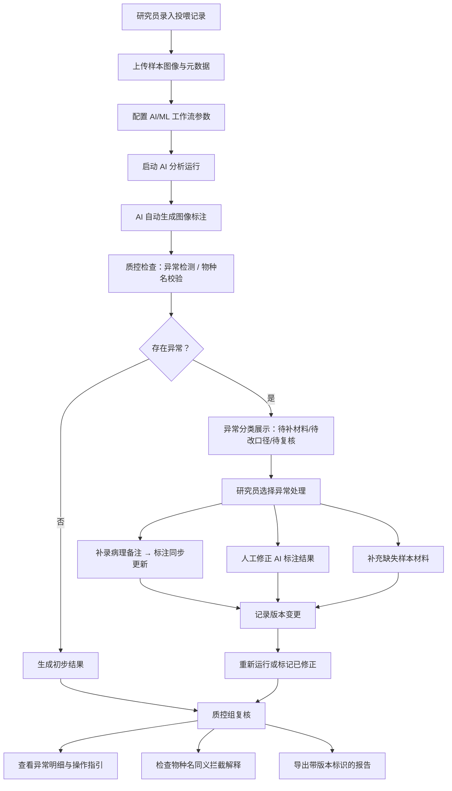

## 1. 产品概述

实验鱼投喂日历是面向药企研究员与质控组的 AI/ML 工作流工具，用于管理实验鱼类的投喂记录、样本数据、图像标注和质控复核。系统将样本、版本、人工修正和分组指标串联为完整工作流，降低项目验收时的解释成本。

- 核心价值：消除研究员与质控组之间的数据歧义，将异常信息转化为可执行的下一步操作
- 目标用户：药企研究员（数据录入与复核）、质控组（数据审核与报告导出）

## 2. 核心功能

### 2.1 用户角色

| 角色 | 核心权限 |
|------|----------|
| 药企研究员 | 录入投喂记录、上传样本图像、补录病理备注、人工修正 AI 标注结果、执行 AI/ML 分析、下载运行结果 |
| 质控组 | 复核数据、查看异常明细、导出质控报告、审核物种名同义记录 |

### 2.2 功能模块

1. **投喂日历主页**：日历视图、投喂记录列表、异常概览面板
2. **样本管理页**：样本列表、版本历史、分组指标、图像标注
3. **AI/ML 工作流页**：分析运行配置、进度追踪、人工修正入口、结果对比
4. **复核与报告页**：异常明细、下一步操作指引、物种名同义解释、报告导出

### 2.3 页面详情

| 页面名称 | 模块名称 | 功能描述 |
|----------|----------|----------|
| 投喂日历主页 | 顶部导航栏 | 页面切换、版本选择、用户角色切换 |
| 投喂日历主页 | 日历网格 | 按月/周视图展示投喂日期，标记异常日期，点击查看当日记录 |
| 投喂日历主页 | 异常概览面板 | 不使用单一红色数字，按异常类型分类展示：待补材料 / 待改口径 / 待复核，每项显示数量并链接到明细 |
| 投喂日历主页 | 最近运行列表 | 展示最近 5 次 AI/ML 运行结果，标注运行时间、版本号、状态 |
| 样本管理页 | 样本筛选栏 | 按物种、分组、日期范围、版本号筛选样本 |
| 样本管理页 | 样本卡片列表 | 展示样本缩略图、物种名、分组、版本标签、标注状态 |
| 样本管理页 | 样本详情抽屉 | 显示样本元数据、版本历史、图像标注、病理备注、人工修正记录 |
| 样本管理页 | 图像标注编辑器 | 支持 AI 自动标注与人工修正，病理备注补录后标注同步更新 |
| AI/ML 工作流页 | 运行配置区 | 选择样本集合、分组指标、分析模型版本 |
| AI/ML 工作流页 | 运行进度条 | 分步骤展示：数据加载 → AI 分析 → 标注生成 → 质控检查 |
| AI/ML 工作流页 | 版本对比视图 | 左右对比本次运行与上次运行的样本、标注、指标差异 |
| AI/ML 工作流页 | 人工修正面板 | 逐条展示 AI 结果，支持逐项修正并记录修正原因 |
| 复核与报告页 | 异常分类列表 | 每个异常条目包含：异常类型、严重程度、涉及样本、下一步操作建议（补材料 / 改口径 / 其他） |
| 复核与报告页 | 图表明细面板 | 每个图表/画布/三维视图旁附带文字解释面板，说明数据来源、指标含义、异常阈值 |
| 复核与报告页 | 物种名同义解释 | 被拦截的同义物种名记录展示：标准名、输入别名、拦截原因、引用的物种词典版本 |
| 复核与报告页 | 报告导出区 | 支持选择导出范围（单次运行 / 版本对比 / 全量异常），文件名自动包含运行版本号和时间戳 |

## 3. 核心流程

研究员录入投喂数据和上传样本图像后，启动 AI/ML 工作流进行分析。AI 自动生成图像标注并进行质控检查，产生的异常按类型分类提示。研究员可对 AI 结果进行人工修正，补录病理备注会同步更新标注。质控组复核时，每个异常都附带下一步操作指引，物种名同义等拦截项自带解释说明。最终导出的报告包含版本标识，可区分不同运行批次。

## 4. 用户界面设计

### 4.1 设计风格

- 主色调：深海蓝 `#1e3a5f`（专业可信），辅助色：墨绿 `#2d5a4a`（生命科学），警示色：琥珀 `#d4a017`（柔和提醒，避免纯红刺激）、珊瑚 `#c75b5b`（严重异常）
- 按钮风格：微立体圆角按钮，4px 圆角，悬停有微妙上浮阴影
- 字体：标题使用 IBM Plex Serif（学术感），正文使用 IBM Plex Sans（清晰易读），数据表格使用 JetBrains Mono（等宽对齐）
- 布局风格：三栏式工作台 — 左侧导航、中间主内容、右侧上下文详情面板
- 图标风格：Lucide 线性图标，统一 18px 尺寸

### 4.2 页面设计概述

| 页面名称 | 模块名称 | UI 元素 |
|----------|----------|----------|
| 投喂日历主页 | 日历网格 | 深海蓝背景卡片，日期格子悬停发光效果，异常日期带琥珀/珊瑚色圆点标记，选中日期边框高亮 |
| 投喂日历主页 | 异常概览面板 | 三张并排卡片，每张带图标 + 数量 + 类型标签 + 操作按钮，卡片间有细微高度差营造层次感 |
| 样本管理页 | 样本卡片列表 | 瀑布流布局，卡片顶部带缩略图，悬停显示快速操作，版本标签为角标样式 |
| 样本管理页 | 图像标注编辑器 | 画布居中，左侧工具栏，右侧标注属性面板，病理备注与标注区域双向高亮联动 |
| AI/ML 工作流页 | 版本对比视图 | 可折叠左右分栏，中间差异列用色块标记新增/修改/删除项，差异项可点击展开详情 |
| AI/ML 工作流页 | 运行进度条 | 横向步骤条，每个步骤带图标和状态指示灯，当前步骤有脉冲动画 |
| 复核与报告页 | 异常分类列表 | 表格视图，每行左侧有状态色条，悬停展开该行的下一步操作建议面板 |
| 复核与报告页 | 图表明细面板 | 图表旁固定宽度的解释面板，包含指标定义、数据范围、异常判定规则文本 |
| 复核与报告页 | 物种名同义解释 | 信息卡片布局，标准名大号展示，别名列表带词典引用链接，拦截原因用引用块样式 |

### 4.3 响应式

桌面端优先设计，支持 1280px 及以上分辨率。平板端右侧详情面板改为底部抽屉，手机端采用单栏滚动布局，优先保证数据表格可读性。

### 4.4 三维视图场景指引（如启用）

- 环境：冷白色均匀布光，模拟实验室环境
- 光照：三点光源，主光 45° 侧上方，柔光阴影
- 相机：45° 俯视等距视角，支持轨道控制
- 焦点元素：实验组鱼群高亮，对照组半透明
- 交互：点击个体显示投喂记录和样本编号
- 后处理：轻微泛光，增强数据点可读性
