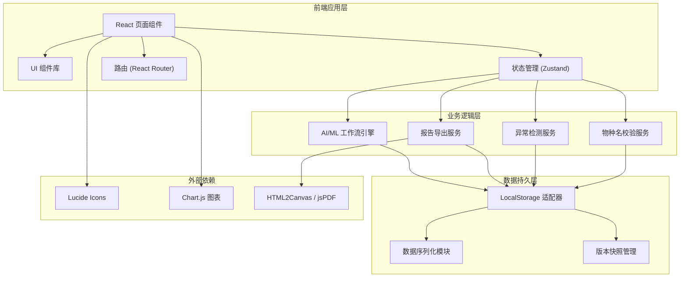
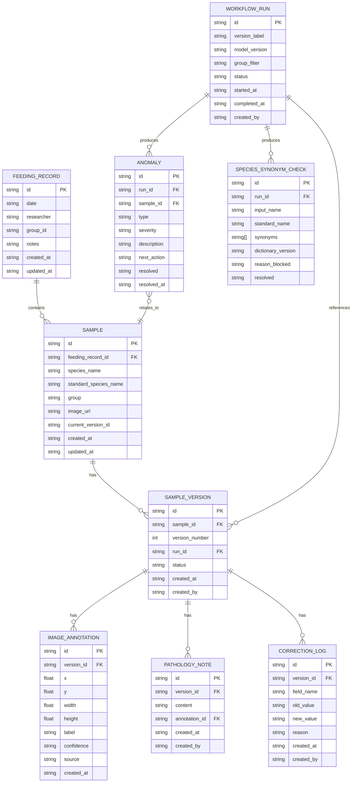

## 1. 架构设计



## 2. 技术描述

- 前端：React@18 + TypeScript@5 + tailwindcss@3 + Vite@5
- 状态管理：Zustand@4
- 路由：react-router-dom@6
- 图表：chart.js@4 + react-chartjs-2@5
- 报告导出：html2canvas + jspdf
- 图标：lucide-react
- 后端：无（纯前端应用）
- 数据库：浏览器 LocalStorage（JSON 序列化存储）

## 3. 路由定义

| 路由 | 用途 |
|------|------|
| / | 投喂日历主页：日历视图、异常概览、最近运行 |
| /samples | 样本管理页：样本列表、筛选、详情查看与编辑 |
| /samples/:id | 样本详情页：图像标注编辑器、病理备注、版本历史 |
| /workflow | AI/ML 工作流页：运行配置、进度追踪、版本对比、人工修正 |
| /review | 复核与报告页：异常明细、物种名同义解释、报告导出 |

## 4. 数据模型

### 4.1 数据模型 ER 图



### 4.2 LocalStorage 存储键

| 键名 | 说明 |
|------|------|
| feeding_records | 投喂记录数组 |
| samples | 样本数组 |
| sample_versions | 样本版本数组 |
| image_annotations | 图像标注数组 |
| pathology_notes | 病理备注数组 |
| correction_logs | 人工修正日志数组 |
| workflow_runs | AI/ML 工作流运行记录数组 |
| anomalies | 异常记录数组 |
| species_synonym_checks | 物种名同义校验记录数组 |
| app_settings | 应用设置（当前角色、视图偏好等） |

## 5. 核心模块划分

### 5.1 目录结构

```
src/
├── components/           # 可复用组件
│   ├── layout/           # 布局组件（导航、侧边栏、页头）
│   ├── calendar/         # 日历相关组件
│   ├── sample/           # 样本相关组件（卡片、筛选器、标注编辑器）
│   ├── workflow/         # 工作流相关组件（进度条、版本对比、修正面板）
│   ├── review/           # 复核相关组件（异常列表、图表解释、报告导出）
│   └── ui/               # 基础 UI 组件（按钮、卡片、模态框、标签）
├── pages/                # 页面级组件
│   ├── CalendarPage.tsx
│   ├── SamplesPage.tsx
│   ├── SampleDetailPage.tsx
│   ├── WorkflowPage.tsx
│   └── ReviewPage.tsx
├── store/                # Zustand 状态管理
│   ├── useFeedingStore.ts
│   ├── useSampleStore.ts
│   ├── useWorkflowStore.ts
│   ├── useReviewStore.ts
│   └── useAppStore.ts
├── hooks/                # 自定义 React Hooks
│   ├── useLocalStorage.ts
│   ├── useVersionDiff.ts
│   └── useReportExport.ts
├── utils/                # 工具函数
│   ├── storage.ts        # LocalStorage 封装
│   ├── version.ts        # 版本号生成与对比
│   ├── species.ts        # 物种名校验与同义处理
│   ├── anomaly.ts        # 异常检测与分类
│   └── export.ts         # 报告导出工具
├── types/                # TypeScript 类型定义
│   └── index.ts
├── data/                 # Mock 初始数据
│   └── mockData.ts
├── App.tsx
├── main.tsx
└── index.css
```

### 5.2 状态管理划分

| Store | 职责 |
|-------|------|
| useAppStore | 全局应用状态：当前用户角色、选中版本号、页面主题 |
| useFeedingStore | 投喂记录：CRUD 操作、按日期查询 |
| useSampleStore | 样本与版本：样本管理、版本快照、图像标注、病理备注、人工修正记录 |
| useWorkflowStore | AI/ML 工作流：运行配置、进度模拟、版本对比、人工修正面板 |
| useReviewStore | 复核与报告：异常查询、下一步操作、物种名同义解释、报告导出配置 |
