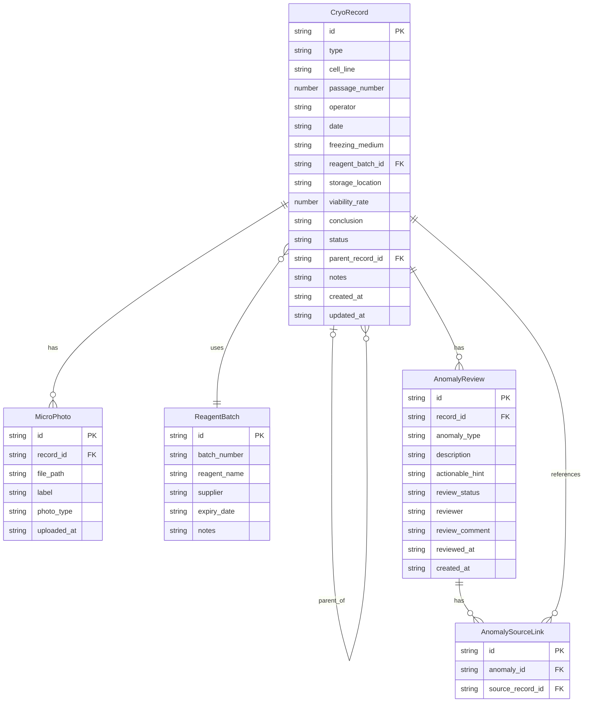

## 1. 架构设计

```mermaid
graph TB
    "前端 React" --> "Express API"
    "Express API" --> "Service 层"
    "Service 层" --> "Repository 层"
    "Repository 层" --> "SQLite (better-sqlite3)"
    "Express API" --> "文件存储 (显微照片)"
```

## 2. 技术说明

- 前端：React@18 + TailwindCSS@3 + Vite + Zustand + React Router + Recharts
- 初始化工具：vite-init
- 后端：Express@4 + TypeScript (ESM)
- 数据库：SQLite (better-sqlite3)，单文件本地数据库
- 文件存储：本地 `uploads/` 目录存储显微照片
- 图表：Recharts 用于分组统计可视化

## 3. 路由定义

| 路由 | 用途 |
|------|------|
| `/` | 台账总览页 |
| `/records` | 培养记录列表 |
| `/records/:id` | 培养记录详情 |
| `/records/new` | 新增冻存/复苏记录 |
| `/statistics` | 分组统计页 |
| `/lineage` | 谱系追踪页 |
| `/anomaly` | 异常复核页 |
| `/import` | 数据导入页 |

## 4. API 定义

### 4.1 冻存/复苏记录

```typescript
interface CryoRecord {
  id: string;
  type: "freeze" | "thaw";
  cell_line: string;
  passage_number: number;
  operator: string;
  date: string;
  freezing_medium: string;
  reagent_batch_id: string;
  storage_location: string;
  viability_rate: number | null;
  conclusion: "success" | "failed" | "pending";
  status: "usable" | "review_needed" | "reviewed_ok" | "reviewed_failed";
  parent_record_id: string | null;
  notes: string;
  created_at: string;
  updated_at: string;
}

interface MicroPhoto {
  id: string;
  record_id: string;
  file_path: string;
  label: string;
  photo_type: "pre_freeze" | "post_thaw" | "observation";
  uploaded_at: string;
}

interface ReagentBatch {
  id: string;
  batch_number: string;
  reagent_name: string;
  supplier: string;
  expiry_date: string;
  notes: string;
}

interface AnomalyReview {
  id: string;
  record_id: string;
  anomaly_type: "missing_photo" | "annotation_conflict" | "viability_anomaly" | "label_unclear";
  description: string;
  actionable_hint: string;
  review_status: "pending" | "approved" | "rejected";
  reviewer: string | null;
  review_comment: string | null;
  reviewed_at: string | null;
  source_material_ids: string[];
  created_at: string;
}
```

### 4.2 REST API 端点

| 方法 | 路径 | 说明 |
|------|------|------|
| GET | `/api/records` | 获取记录列表（支持筛选/分页） |
| GET | `/api/records/:id` | 获取记录详情（含照片与试剂） |
| POST | `/api/records` | 创建冻存/复苏记录 |
| PUT | `/api/records/:id` | 更新记录 |
| DELETE | `/api/records/:id` | 删除记录 |
| POST | `/api/records/:id/photos` | 上传显微照片 |
| GET | `/api/statistics` | 分组统计数据 |
| GET | `/api/statistics/by-cell-line` | 按细胞系分组统计 |
| GET | `/api/statistics/by-batch` | 按试剂批号分组统计 |
| GET | `/api/statistics/by-date` | 按时间分组统计 |
| GET | `/api/lineage/:id` | 获取谱系追踪树 |
| GET | `/api/anomalies` | 获取异常列表 |
| PUT | `/api/anomalies/:id/review` | 提交复核结果 |
| POST | `/api/import` | 批量导入数据 |
| POST | `/api/import/check` | 导入前重复检测 |
| GET | `/api/reagents/:batchNumber/trace` | 试剂批号追溯（到关联记录与结论） |

### 4.3 请求/响应示例

```typescript
// POST /api/records 请求
interface CreateRecordRequest {
  type: "freeze" | "thaw";
  cell_line: string;
  passage_number: number;
  operator: string;
  date: string;
  freezing_medium: string;
  reagent_batch_id: string;
  storage_location: string;
  viability_rate?: number;
  parent_record_id?: string;
  notes?: string;
}

// POST /api/records 响应
interface CreateRecordResponse {
  record: CryoRecord;
  warnings: string[];
  anomaly_ids: string[];
}

// POST /api/import/check 响应
interface ImportCheckResponse {
  new_count: number;
  duplicate_count: number;
  conflict_count: number;
  duplicates: { existing_id: string; incoming: Partial<CryoRecord>; match_field: string }[];
  conflicts: { existing_id: string; incoming: Partial<CryoRecord>; conflict_fields: string[] }[];
}

// GET /api/statistics 响应
interface StatisticsResponse {
  total_records: number;
  freeze_count: number;
  thaw_count: number;
  success_rate: number;
  review_needed_count: number;
  by_cell_line: { cell_line: string; count: number; success_rate: number }[];
  by_month: { month: string; freeze_count: number; thaw_count: number; success_rate: number }[];
}

// GET /api/lineage/:id 响应
interface LineageResponse {
  root: CryoRecord;
  children: LineageNode[];
}

interface LineageNode {
  record: CryoRecord;
  children: LineageNode[];
}

// GET /api/reagents/:batchNumber/trace 响应
interface ReagentTraceResponse {
  batch: ReagentBatch;
  linked_records: { record: CryoRecord; conclusion: string; photos: MicroPhoto[] }[];
  conclusion_summary: { success: number; failed: number; pending: number };
}
```

## 5. 服务端架构图

```mermaid
graph LR
    "Controller" --> "Service"
    "Service" --> "Repository"
    "Repository" --> "SQLite"
    "Service" --> "AnomalyDetector"
    "AnomalyDetector" --> "Repository"
    "Service" --> "DuplicateChecker"
    "DuplicateChecker" --> "Repository"
```

## 6. 数据模型

### 6.1 数据模型定义



### 6.2 数据定义语言

```sql
CREATE TABLE reagent_batches (
  id TEXT PRIMARY KEY,
  batch_number TEXT NOT NULL UNIQUE,
  reagent_name TEXT NOT NULL,
  supplier TEXT NOT NULL DEFAULT '',
  expiry_date TEXT NOT NULL,
  notes TEXT NOT NULL DEFAULT ''
);

CREATE TABLE cryo_records (
  id TEXT PRIMARY KEY,
  type TEXT NOT NULL CHECK(type IN ('freeze', 'thaw')),
  cell_line TEXT NOT NULL,
  passage_number INTEGER NOT NULL,
  operator TEXT NOT NULL,
  date TEXT NOT NULL,
  freezing_medium TEXT NOT NULL DEFAULT '',
  reagent_batch_id TEXT NOT NULL,
  storage_location TEXT NOT NULL DEFAULT '',
  viability_rate REAL,
  conclusion TEXT NOT NULL CHECK(conclusion IN ('success', 'failed', 'pending')),
  status TEXT NOT NULL CHECK(status IN ('usable', 'review_needed', 'reviewed_ok', 'reviewed_failed')),
  parent_record_id TEXT,
  notes TEXT NOT NULL DEFAULT '',
  created_at TEXT NOT NULL,
  updated_at TEXT NOT NULL,
  FOREIGN KEY (reagent_batch_id) REFERENCES reagent_batches(id),
  FOREIGN KEY (parent_record_id) REFERENCES cryo_records(id) ON DELETE SET NULL
);

CREATE TABLE micro_photos (
  id TEXT PRIMARY KEY,
  record_id TEXT NOT NULL,
  file_path TEXT NOT NULL,
  label TEXT NOT NULL DEFAULT '',
  photo_type TEXT NOT NULL CHECK(photo_type IN ('pre_freeze', 'post_thaw', 'observation')),
  uploaded_at TEXT NOT NULL,
  FOREIGN KEY (record_id) REFERENCES cryo_records(id) ON DELETE CASCADE
);

CREATE TABLE anomaly_reviews (
  id TEXT PRIMARY KEY,
  record_id TEXT NOT NULL,
  anomaly_type TEXT NOT NULL CHECK(anomaly_type IN ('missing_photo', 'annotation_conflict', 'viability_anomaly', 'label_unclear')),
  description TEXT NOT NULL,
  actionable_hint TEXT NOT NULL,
  review_status TEXT NOT NULL DEFAULT 'pending' CHECK(review_status IN ('pending', 'approved', 'rejected')),
  reviewer TEXT,
  review_comment TEXT,
  reviewed_at TEXT,
  created_at TEXT NOT NULL,
  FOREIGN KEY (record_id) REFERENCES cryo_records(id) ON DELETE CASCADE
);

CREATE TABLE anomaly_source_links (
  id TEXT PRIMARY KEY,
  anomaly_id TEXT NOT NULL,
  source_record_id TEXT NOT NULL,
  FOREIGN KEY (anomaly_id) REFERENCES anomaly_reviews(id) ON DELETE CASCADE,
  FOREIGN KEY (source_record_id) REFERENCES cryo_records(id) ON DELETE CASCADE
);

CREATE INDEX idx_cryo_records_type ON cryo_records(type);
CREATE INDEX idx_cryo_records_cell_line ON cryo_records(cell_line);
CREATE INDEX idx_cryo_records_date ON cryo_records(date);
CREATE INDEX idx_cryo_records_status ON cryo_records(status);
CREATE INDEX idx_cryo_records_parent ON cryo_records(parent_record_id);
CREATE INDEX idx_cryo_records_reagent ON cryo_records(reagent_batch_id);
CREATE INDEX idx_micro_photos_record ON micro_photos(record_id);
CREATE INDEX idx_anomaly_reviews_record ON anomaly_reviews(record_id);
CREATE INDEX idx_anomaly_reviews_status ON anomaly_reviews(review_status);
CREATE INDEX idx_anomaly_source_links_anomaly ON anomaly_source_links(anomaly_id);
```
