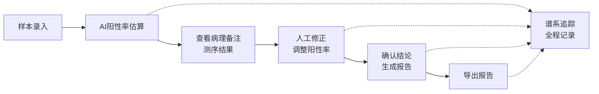
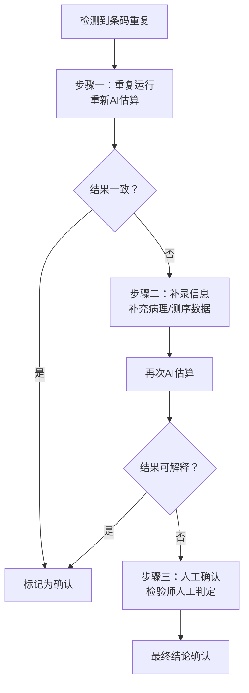
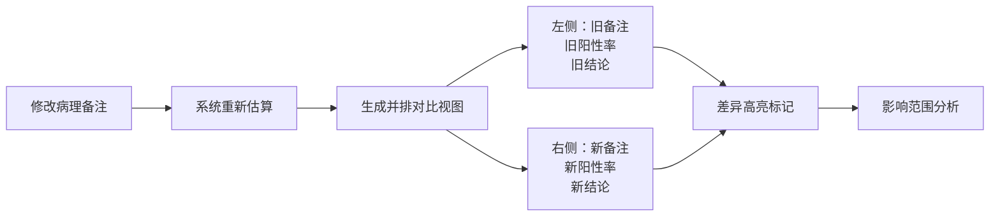

# 免疫组化阳性率估算 AI 工作流平台 PRD

## 1. 产品概述

面向医院病理科检验师的免疫组化阳性率智能估算与病理数据管理平台，整合病理备注、测序结果与处理意见，提供完整的样本生命周期追踪与AI辅助决策能力。解决传统依赖临时群沟通、数据分散、版本混乱的痛点，实现从样本录入、AI估算、人工修正到报告导出的全流程闭环管理。

**核心价值：**
- 消除信息孤岛：病理备注、测序结果、处理意见统一视图
- AI赋能效率：智能阳性率估算，人工修正闭环迭代
- 全链路可追溯：谱系追踪记录每一次变更，前后对比一目了然
- 异常数据规范化：重复条码等异常场景标准化处理流程

## 2. 核心功能

### 2.1 用户角色

| 角色 | 说明 | 核心权限 |
|------|------|----------|
| 检验师 | 日常使用，处理样本 | 样本管理、AI估算、人工修正、报告导出 |
| 导师/审核者 | 审核结果，指导工作 | 查看谱系追踪、版本对比、审核确认 |

### 2.2 功能模块

1. **工作台仪表盘**：概览统计、待处理事项、快捷操作入口
2. **样本管理**：样本列表、条码管理、分组指标、批量导入
3. **AI估算工作流**：阳性率智能估算、多版本管理、分组指标串联
4. **人工修正中心**：修正记录、备注编辑、结论确认
5. **谱系追踪**：版本对比、变更日志、报告导出前后差异
6. **异常处理中心**：重复条码处理（重跑/补录/人工确认三流程）
7. **备注对比视图**：病理备注修改前后，旧结论与新结论并排对比

### 2.3 页面详情

| 页面名称 | 模块名称 | 功能描述 |
|----------|----------|----------|
| 工作台 | 数据概览 | 样本总数、AI估算进度、待处理异常、今日完成统计卡片 |
| 工作台 | 快捷操作 | 新建样本、导入样本、启动AI估算、导出报告快捷入口 |
| 工作台 | 最近活动 | 最近修改的样本、异常提醒时间线 |
| 样本列表 | 样本表格 | 样本条码、分组、阳性率、状态、版本号、操作列 |
| 样本列表 | 筛选搜索 | 按分组、状态、条码关键字筛选 |
| 样本详情 | 基础信息 | 样本条码、分组指标、采集信息 |
| 样本详情 | 病理备注 | 富文本备注编辑、历史版本 |
| 样本详情 | 测序结果 | 测序数据展示、关键指标高亮 |
| 样本详情 | 处理意见 | 结构化处理意见、可选项模板 |
| AI估算 | 估算面板 | 选择算法版本、参数配置、启动估算 |
| AI估算 | 结果展示 | 阳性率数值、置信区间、可视化图谱 |
| AI估算 | 版本管理 | 多版本列表、版本对比、版本回退 |
| 人工修正 | 修正表单 | 手动调整阳性率、修正原因、备注 |
| 人工修正 | 修正历史 | 所有修正记录时间线、修正人信息 |
| 谱系追踪 | 时间线视图 | 样本全生命周期事件时间线 |
| 谱系追踪 | 对比视图 | 任意两版本并排对比（阳性率、备注、结论） |
| 谱系追踪 | 导出记录 | 报告导出历史、导出前后结论变化标记 |
| 异常处理 | 重复条码列表 | 条码重复的样本分组展示 |
| 异常处理 | 处理流程 | 重复运行、补录信息、人工确认三步流程 |
| 异常处理 | 状态追踪 | 每个步骤完成状态、处理人、处理时间 |
| 备注对比 | 并排对比 | 旧备注/新备注左右并排展示 |
| 备注对比 | 结论对比 | 旧结论/新结论并排，差异高亮标记 |
| 备注对比 | 影响分析 | 备注变更对阳性率、处理意见的影响范围分析 |

## 3. 核心流程

### 3.1 常规样本处理流程

检验师从样本录入开始，经过AI估算得到初始阳性率，结合病理备注和测序结果进行人工修正，确认后导出报告。整个过程中的每一次变更都被谱系追踪记录。

### 3.2 重复条码异常处理流程

遇到样本条码重复时，必须依次尝试重复运行、补录信息、人工确认三个步骤，确保数据准确性。

### 3.3 病理备注修改对比流程

病理备注被修改后，系统自动对比旧结论与新结论，并排展示差异，帮助检验师快速评估影响范围。

## 4. 用户界面设计

### 4.1 设计风格

**整体定位：** 专业医疗级工具，强调信息密度与可读性的平衡，冷静理性的视觉语言。

- **主色调：** 深海蓝 (#1e3a5f) - 代表专业、可信、医疗
- **辅助色：** 青瓷绿 (#2d9a8c) - 代表生命、希望、阳性
- **警示色：** 琥珀橙 (#e8913a) - 代表待处理、异常
- **中性色：** 冷灰色系 - 保证长时间阅读舒适度
- **数据色阶：** 从浅蓝到深红的阳性率渐变色谱
- **字体：** 标题使用 Source Serif Pro（专业衬线），正文使用 IBM Plex Sans（高可读性无衬线）
- **布局风格：** 三栏式布局（左侧导航 + 中间主内容 + 右侧详情面板）
- **卡片设计：** 细边框 + 微妙阴影 + 1px高光顶边，营造精密仪器感
- **图标风格：** 线性轮廓图标，2px描边，圆角处理
- **动效：** 微妙的过渡动画，数据变化时的数字滚动效果

### 4.2 页面设计概览

| 页面名称 | 模块名称 | UI 元素 |
|----------|----------|---------|
| 工作台 | 数据概览 | 四张统计卡片，带趋势小图表，悬停微上浮效果 |
| 工作台 | 快捷操作 | 图标+文字的大按钮组，网格排列 |
| 工作台 | 最近活动 | 时间线样式，右侧对齐，带状态色标 |
| 样本列表 | 样本表格 | 密集型数据表格，斑马纹，行悬停高亮 |
| 样本列表 | 筛选栏 | 标签式筛选 + 搜索框，顶部固定 |
| 样本详情 | 三栏布局 | 左侧样本信息，中间数据面板，右侧操作区 |
| 样本详情 | 病理备注 | 卡片式，带编辑历史展开 |
| AI估算 | 结果展示 | 大号数字显示阳性率，配环形进度图 |
| AI估算 | 版本管理 | 垂直时间线，可点击切换版本 |
| 谱系追踪 | 时间线 | 左侧时间轴，右侧事件卡片，彩色状态标记 |
| 谱系追踪 | 对比视图 | 左右分栏，中间可拖动分隔线，差异处闪烁提示 |
| 异常处理 | 流程步骤 | 三步流程指示器，已完成打勾，进行中高亮 |
| 备注对比 | 并排对比 | 左右两张卡片，中间VS分隔，差异处黄色高亮 |

### 4.3 响应式设计

- **桌面端（1200px+）：** 完整三栏布局，所有信息同屏展示
- **平板端（768-1200px）：** 两栏布局，右侧面板改为底部抽屉
- **移动端（<768px）：** 单栏堆叠，导航收至汉堡菜单
- 核心表格支持横向滚动，保证数据完整性

### 4.4 数据可视化

- 阳性率环形图：使用SVG绘制，根据数值动态变色
- 版本对比柱状图：多版本阳性率对比
- 分组统计热力图：按分组展示阳性率分布
- 时间趋势折线图：样本处理量趋势
