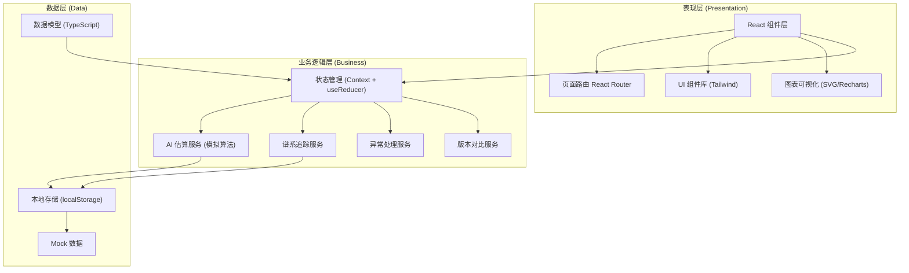
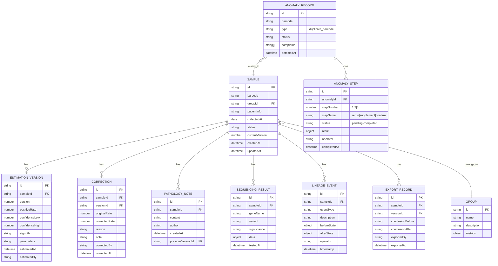

# 免疫组化阳性率估算工作流 技术架构文档

## 1. 架构设计

本项目采用前端单页应用架构，使用本地状态管理模拟后端数据，所有功能在浏览器端完整运行。架构分为表现层、业务逻辑层、数据层三层结构。



## 2. 技术描述

- **前端框架：** React 18 + TypeScript
- **构建工具：** Vite 5
- **样式方案：** Tailwind CSS 3
- **路由管理：** React Router 6
- **状态管理：** React Context + useReducer
- **图表库：** Recharts（数据可视化）
- **图标库：** Lucide React
- **数据持久化：** localStorage
- **日期处理：** date-fns
- **初始化方式：** vite-create

## 3. 路由定义

| 路由路径 | 页面名称 | 说明 |
|----------|----------|------|
| / | 工作台仪表盘 | 数据概览、快捷操作、最近活动 |
| /samples | 样本列表 | 样本管理、筛选搜索 |
| /samples/:id | 样本详情 | 单样本完整信息视图 |
| /samples/:id/estimation | AI估算 | 阳性率估算工作流 |
| /samples/:id/correction | 人工修正 | 人工修正中心 |
| /lineage | 谱系追踪 | 全局谱系追踪视图 |
| /lineage/:sampleId | 样本谱系 | 单样本详细谱系 |
| /anomalies | 异常处理中心 | 重复条码等异常处理 |
| /anomalies/duplicate/:barcode | 重复条码详情 | 单组重复条码处理 |
| /compare/notes | 备注对比 | 病理备注修改前后对比 |

## 4. 数据模型

### 4.1 数据模型 ER 图



### 4.2 核心类型定义

```typescript
// 样本状态枚举
type SampleStatus = 'pending' | 'estimating' | 'estimated' | 'corrected' | 'confirmed' | 'exported' | 'anomaly';

// 样本
interface Sample {
  id: string;
  barcode: string;
  groupId: string;
  patientInfo: {
    age?: number;
    gender?: 'male' | 'female';
    diagnosis?: string;
  };
  collectedAt: string;
  status: SampleStatus;
  currentVersion: number;
  createdAt: string;
  updatedAt: string;
}

// 估算版本
interface EstimationVersion {
  id: string;
  sampleId: string;
  version: number;
  positiveRate: number;
  confidenceInterval: [number, number];
  algorithm: string;
  parameters: Record<string, any>;
  cellCount?: number;
  tissueArea?: number;
  estimatedAt: string;
  estimatedBy: 'ai' | 'human' | 'hybrid';
  conclusion: string;
}

// 修正记录
interface Correction {
  id: string;
  sampleId: string;
  versionId: string;
  originalRate: number;
  correctedRate: number;
  reason: string;
  note: string;
  correctedBy: string;
  correctedAt: string;
}

// 病理备注
interface PathologyNote {
  id: string;
  sampleId: string;
  content: string;
  author: string;
  createdAt: string;
  previousVersionId?: string;
}

// 测序结果
interface SequencingResult {
  id: string;
  sampleId: string;
  gene: string;
  variant: string;
  significance: 'pathogenic' | 'likely_pathogenic' | 'uncertain' | 'likely_benign' | 'benign';
  alleleFrequency?: number;
  data: Record<string, any>;
  testedAt: string;
}

// 谱系事件
type LineageEventType = 'created' | 'estimated' | 'corrected' | 'note_updated' | 'sequencing_added' | 'status_changed' | 'exported' | 'confirmed';

interface LineageEvent {
  id: string;
  sampleId: string;
  eventType: LineageEventType;
  description: string;
  beforeState?: Record<string, any>;
  afterState?: Record<string, any>;
  operator: string;
  timestamp: string;
}

// 异常记录
type AnomalyType = 'duplicate_barcode';
type AnomalyStatus = 'detected' | 'processing' | 'resolved';
type AnomalyStepName = 'rerun' | 'supplement' | 'confirm';
type StepStatus = 'pending' | 'in_progress' | 'completed';

interface AnomalyRecord {
  id: string;
  barcode: string;
  type: AnomalyType;
  status: AnomalyStatus;
  sampleIds: string[];
  steps: AnomalyStep[];
  detectedAt: string;
  resolvedAt?: string;
}

interface AnomalyStep {
  id: string;
  stepNumber: 1 | 2 | 3;
  stepName: AnomalyStepName;
  status: StepStatus;
  result?: string;
  operator?: string;
  completedAt?: string;
}

// 导出记录
interface ExportRecord {
  id: string;
  sampleId: string;
  versionId: string;
  conclusionBefore: string;
  conclusionAfter: string;
  format: 'pdf' | 'excel' | 'print';
  exportedBy: string;
  exportedAt: string;
}
```

## 5. 核心模块设计

### 5.1 AI估算模块

模拟基于图像分析的免疫组化阳性率估算算法，支持：
- 多算法版本切换
- 参数可配置
- 置信区间计算
- 估算进度模拟
- 结果缓存

### 5.2 谱系追踪模块

记录样本生命周期中的每一个状态变化：
- 事件溯源设计
- 状态快照对比
- 任意两版本diff算法
- 时间线可视化

### 5.3 异常处理模块

标准化异常处理流程：
- 三步处理流程强制校验
- 步骤状态流转控制
- 处理结果记录
- 异常统计与报表

### 5.4 版本对比模块

支持多维度数据对比：
- 阳性率数值对比
- 病理备注文本diff
- 结论变化高亮
- 影响范围评估

## 6. 目录结构

```
src/
├── assets/           # 静态资源
├── components/       # 通用组件
│   ├── ui/          # 基础UI组件
│   ├── charts/      # 图表组件
│   └── layout/      # 布局组件
├── pages/           # 页面组件
│   ├── Dashboard/
│   ├── Samples/
│   ├── Estimation/
│   ├── Correction/
│   ├── Lineage/
│   ├── Anomalies/
│   └── Compare/
├── store/           # 状态管理
│   ├── sampleStore.ts
│   ├── lineageStore.ts
│   └── anomalyStore.ts
├── services/        # 业务服务
│   ├── estimationService.ts
│   ├── lineageService.ts
│   └── anomalyService.ts
├── types/           # TypeScript类型
├── utils/           # 工具函数
├── mock/            # Mock数据
├── hooks/           # 自定义Hooks
├── App.tsx
├── main.tsx
└── index.css
```
