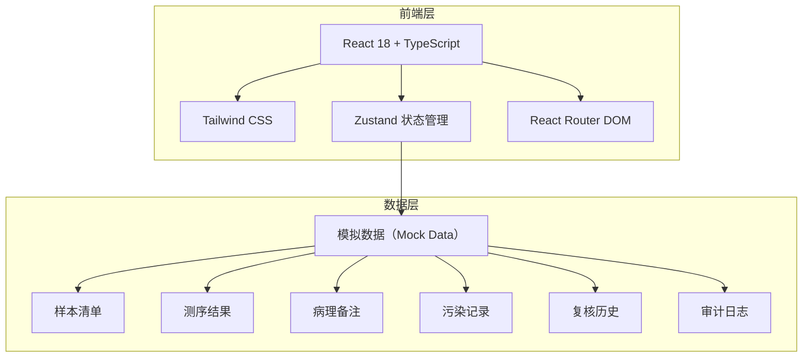
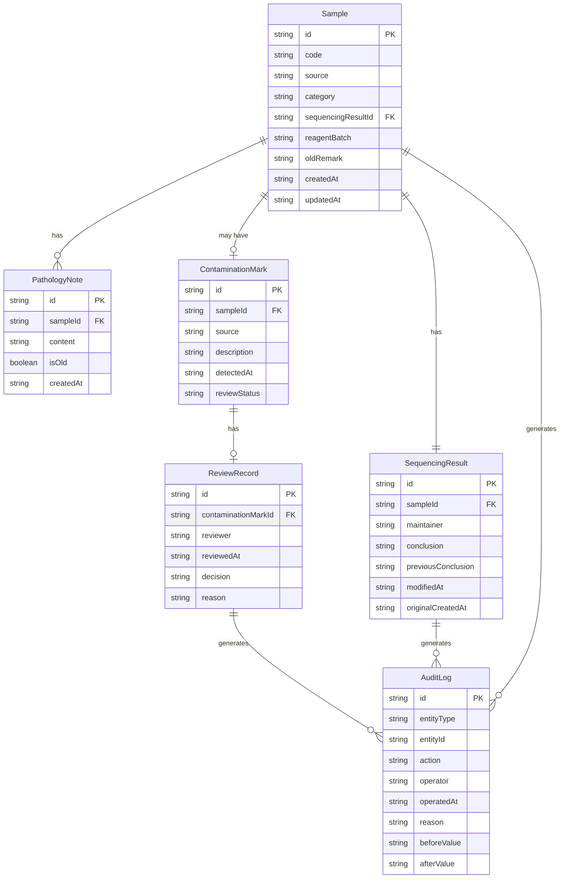

## 1. 架构设计



纯前端项目，所有数据通过 Zustand store 管理，使用模拟数据模拟真实育种场景。

## 2. 技术说明

- 前端：React@18 + Tailwind CSS@3 + Vite
- 初始化工具：vite-init
- 后端：无（纯前端，模拟数据）
- 数据库：无（使用 Zustand store + 初始模拟数据）

## 3. 路由定义

| 路由 | 用途 |
|------|------|
| / | 分类检索工作台（主页） |
| /review | 异常复核面板 |
| /audit | 审计追踪中心 |
| /compare | 结论对比视图 |
| /report | 分类报告 |

## 4. API定义

无后端API，所有数据操作通过 Zustand store 的 actions 完成。

### 核心数据类型

```typescript
interface Sample {
  id: string
  code: string
  source: string
  category: 'normal' | 'boundary' | 'bad'
  sequencingResultId: string
  pathologyNotes: PathologyNote[]
  contaminationMark: ContaminationMark | null
  reagentBatch: string | null
  oldRemark: string | null
  createdAt: string
  updatedAt: string | null
}

interface SequencingResult {
  id: string
  sampleId: string
  maintainer: string
  data: SequencingDataPoint[]
  conclusion: string
  previousConclusion: string | null
  modifiedAt: string | null
  originalCreatedAt: string
}

interface PathologyNote {
  id: string
  sampleId: string
  content: string
  isOld: boolean
  createdAt: string
}

interface ContaminationMark {
  id: string
  sampleId: string
  source: string
  description: string
  detectedAt: string
  reviewStatus: 'pending' | 'passed' | 'rejected'
  reviewRecord: ReviewRecord | null
}

interface ReviewRecord {
  id: string
  reviewer: string
  reviewedAt: string
  decision: 'passed' | 'rejected'
  reason: string
  beforeAnnotation: AnnotationData
  afterAnnotation: AnnotationData
  relatedMaterials: string[]
}

interface AuditLog {
  id: string
  entityType: 'sample' | 'sequencing' | 'contamination' | 'review'
  entityId: string
  action: string
  operator: string
  operatedAt: string
  reason: string
  beforeValue: string
  afterValue: string
}

interface AnnotationData {
  regions: AnnotationRegion[]
  imageUrl: string
  label: string
}

interface AnnotationRegion {
  id: string
  type: 'contamination' | 'abnormality' | 'reference'
  x: number
  y: number
  width: number
  height: number
  label: string
}
```

## 5. 服务端架构图

不适用（纯前端项目）

## 6. 数据模型

### 6.1 数据模型定义



### 6.2 数据定义语言

不适用（纯前端项目，使用 TypeScript 类型定义和初始模拟数据）
