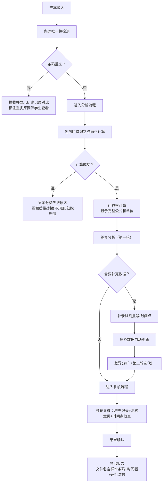

## 1. 产品概述

面向医院检验科的专业细胞迁移划痕分析计算工具，解决病理检验中细胞迁移实验的数据分析、质量控制和报告导出全流程问题。特别关注边界记录、条码重复、试剂批号补录等真实场景中的异常处理，确保检验师和学生用户都能清晰理解每一步分析逻辑。

核心价值：将科研级的细胞迁移分析方法转化为临床检验可用的标准化工具，内置完整的公式说明、单位定义、适用范围和失败原因解释，支持多轮复核和质控追溯。

## 2. 核心功能

### 2.1 用户角色

| 角色 | 注册方式 | 核心权限 |
|------|----------|----------|
| 检验师 | 工号登录 | 样本录入、分析计算、结果审核、报告导出、试剂批号维护 |
| 学生/实习生 | 工号登录 | 查看样本、浏览分析过程、阅读报告、学习异常拦截原因 |
| 质控管理员 | 工号登录 | 质控规则配置、试剂批号管理、数据追溯 |

### 2.2 功能模块

1. **样本管理页**：样本列表、条码检测、批量录入、状态标识
2. **分析计算页**：划痕面积测量、迁移率计算、公式展示、单位换算、失败原因
3. **差异分析页**：迭代式差异判断、多时间点对比、试剂批号关联质控
4. **图表可视化页**：划痕面积趋势图、迁移率柱状图、划痕区域示意图、明细解释面板
5. **复核中心页**：培养记录、复核意见、时间点缺失检查、多轮复核流转
6. **报告导出页**：带运行标识的文件名、标准化报告格式、异常拦截说明

### 2.3 页面详情

| 页面名称 | 模块名称 | 功能描述 |
|---------|---------|----------|
| 样本管理 | 条码重复检测 | 实时检测样本条码，若重复则高亮拦截，显示历史运行记录对比 |
| 样本管理 | 样本状态标识 | 三类典型状态：顺利（绿色）、待确认（黄色）、坏数据（红色） |
| 分析计算 | 公式说明面板 | 显示划痕面积公式、迁移率公式、单位定义、适用范围、不适用情况 |
| 分析计算 | 失败原因展示 | 分析失败时分类展示：图像质量差、划痕不规则、细胞密度异常、边界模糊 |
| 差异分析 | 迭代判断 | 不做一次性结论，支持多次补充数据后重新分析，保留每次分析记录 |
| 差异分析 | 试剂批号联动 | 补录试剂批号后自动重新计算质控指标，更新所有关联样本的质控状态 |
| 图表可视化 | 明细解释 | 每个图表旁配文字解释，不单靠颜色区分，标注关键数值点和异常原因 |
| 复核中心 | 多轮复核 | 同一轮复核中整合：培养记录检查 + 复核意见填写 + 时间点缺失补全 |
| 报告导出 | 运行标识 | 文件名包含：样本条码 + 运行时间戳 + 运行次数（如RUN1/RUN2） |
| 报告导出 | 异常说明 | 报告中明确说明条码重复被拦截的原因、历史对比数据、处理建议 |

## 3. 核心流程



## 4. 用户界面设计

### 4.1 设计风格

**整体定位**：专业医疗检验系统风格——严谨、清晰、可追溯

- **主色调**：医学蓝 `#165DFF`（专业、可信）
- **辅助色**：
  - 顺利通过：医学绿 `#00B42A`
  - 待确认：警示黄 `#FF7D00`
  - 坏数据/拦截：危险红 `#F53F3F`
  - 中性灰：`#86909C`
- **按钮风格**：直角矩形，2px边框，hover状态有细微阴影变化，强调严谨感
- **字体**：
  - 标题：思源黑体 Heavy，清晰醒目
  - 正文：思源黑体 Regular，易读性优先
  - 数据/公式：JetBrains Mono，等宽字体保证数值对齐
- **布局风格**：卡片式分区，清晰的边界线，充足留白但不松散，数据表格使用斑马纹便于阅读
- **图标风格**：Lucide线性图标，统一24px尺寸，保持专业简洁

### 4.2 页面设计概述

| 页面名称 | 模块名称 | UI元素 |
|---------|---------|--------|
| 样本管理 | 样本列表 | 卡片式表格，状态色标，条码重复时整行红色边框+历史记录展开按钮 |
| 分析计算 | 公式面板 | 固定在页面右侧的公式说明卡，包含：公式（LaTeX渲染）、单位定义、适用范围、失败原因对照表 |
| 差异分析 | 迭代面板 | 时间轴式布局，每次分析记录为一个节点，显示试剂批号变更前后的质控数据对比 |
| 图表可视化 | 图表+解释 | 左右分栏：左侧图表（面积趋势/迁移率柱状），右侧明细解释卡，标注每个数据点的含义和判断依据 |
| 复核中心 | 多轮复核 | 三栏并排：培养记录（左）+ 复核意见（中）+ 时间点检查（右），同一轮次数据联动显示 |
| 报告导出 | 预览面板 | 报告实时预览，底部导出按钮旁显示即将生成的文件名示例（含时间戳和运行次数） |

### 4.3 响应式设计

- **桌面优先**：1280px以上分辨率最优，三栏布局完整展示
- **平板适配**：1024px时转为两栏，复核中心改为上下布局
- **移动适配**：768px以下转为单栏滚动，关键操作按钮固定底部
- **触控优化**：所有可点击区域最小44x44px，表格支持横向滚动

### 4.4 样例数据设计

预置三条典型样例，覆盖检验真实场景：

1. **顺利记录（样本条码：WBC-20260611-001）**
   - 划痕清晰，边界规则
   - 0h面积：2.34 mm²，24h面积：0.89 mm²
   - 迁移率：61.97%，质控合格
   - 培养记录完整，时间点无缺失

2. **待确认记录（样本条码：WBC-20260611-002）**
   - 划痕边界部分模糊
   - 0h面积：2.18 mm²，24h面积：1.35 mm²
   - 迁移率：38.07%，处于临界值
   - 试剂批号待补录，质控状态待确认
   - 12h时间点缺失，需复核

3. **明显坏数据（样本条码：WBC-20260611-003）**
   - 条码与WBC-20260611-001重复，系统拦截
   - 划痕区域有污染，细胞分布不均
   - 面积计算失败，失败原因：图像污染+划痕不规则
   - 培养记录不完整，缺少操作人签字

## 5. 关键业务规则

### 5.1 计算规则

**划痕面积计算**：
```
Area = 像素面积 × 校准系数 (mm²/像素)
校准系数 = 物镜倍数 × 相机像素尺寸
```

**细胞迁移率**：
```
Migration Rate (%) = [(Area₀ - Areaₜ) / Area₀] × 100%
其中：
- Area₀ = 初始划痕面积 (0h)
- Areaₜ = t时间点划痕面积
```

**适用范围**：
- 细胞类型：贴壁生长细胞（肿瘤细胞、成纤维细胞等）
- 划痕宽度：500-1000 μm
- 观察时间点：0h, 6h, 12h, 24h, 48h
- 质控要求：初始面积CV < 10%，活细胞率 > 90%

### 5.2 条码重复拦截规则

- 同一批次内条码唯一，跨批次允许重复但需明确标注
- 拦截时显示：历史运行时间、操作人员、分析结果对比
- 学生查看模式：用通俗语言解释"为什么同样的条码不能用两次"——避免同一样本重复计数导致统计偏差

### 5.3 差异分析迭代规则

- 不输出最终"有差异/无差异"的二元结论，改为"当前证据支持/不支持"
- 每次补充数据（试剂批号、时间点、复孔数据）后自动重新计算
- 保留所有历史分析记录，标注每次变更的原因和操作人员

### 5.4 试剂批号联动规则

- 试剂批号补录后，自动追溯使用该试剂的所有样本
- 重新计算质控参数（CV值、Z'因子）
- 更新样本状态，触发复核提醒
