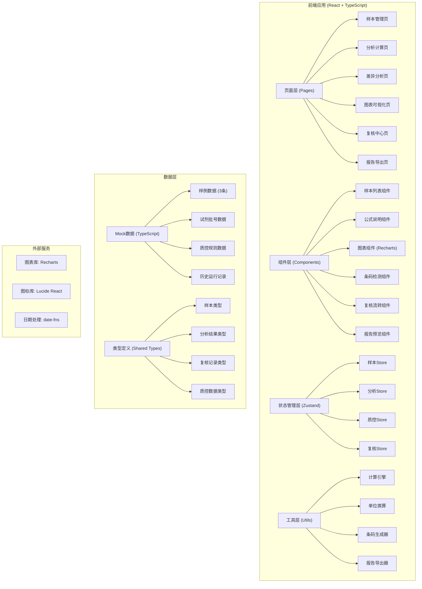
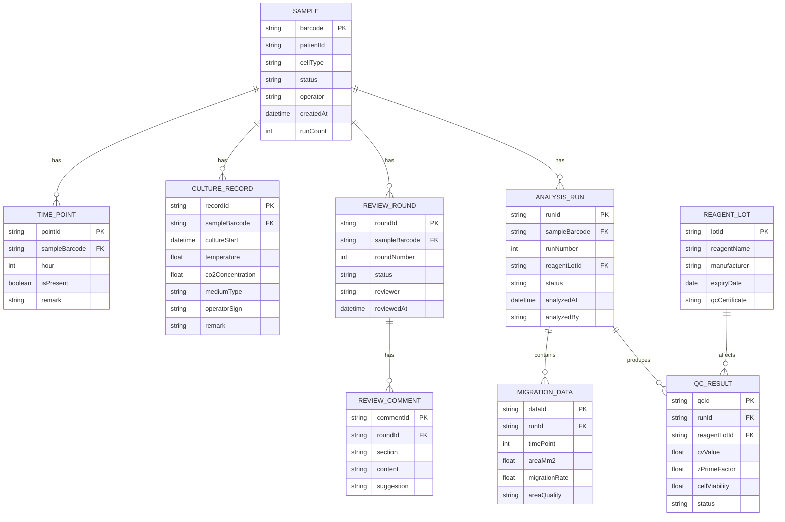

## 1. 架构设计



## 2. 技术描述

- **前端框架**: React@18 + TypeScript@5
- **构建工具**: Vite@5
- **样式方案**: Tailwind CSS@3
- **状态管理**: Zustand@4
- **路由**: React Router DOM@6
- **图表库**: Recharts@2
- **图标库**: Lucide React@0.400
- **日期处理**: date-fns@3
- **后端**: 无后端，纯前端Mock数据
- **数据库**: 无，使用TypeScript定义的Mock数据

## 3. 路由定义

| 路由路径 | 页面名称 | 用途 |
|---------|---------|------|
| / | 样本管理页 | 样本列表展示、条码检测、状态筛选 |
| /analysis/:sampleId | 分析计算页 | 划痕面积计算、迁移率计算、公式展示 |
| /diff/:sampleId | 差异分析页 | 迭代式差异判断、试剂批号补录、质控联动 |
| /chart/:sampleId | 图表可视化页 | 面积趋势图、迁移率柱状图、明细解释 |
| /review/:sampleId | 复核中心页 | 培养记录、复核意见、时间点检查 |
| /export/:sampleId | 报告导出页 | 报告预览、带运行标识的文件名导出 |

## 4. 数据模型

### 4.1 数据模型ER图



### 4.2 数据类型定义 (TypeScript)

```typescript
// 样本状态枚举
export type SampleStatus = 'success' | 'pending' | 'bad' | 'blocked';

// 样本接口
export interface Sample {
  barcode: string;
  patientId: string;
  cellType: string;
  status: SampleStatus;
  operator: string;
  createdAt: Date;
  runCount: number;
  isBarcodeDuplicate: boolean;
  duplicateWith?: string;
  notes?: string;
}

// 分析运行记录
export interface AnalysisRun {
  runId: string;
  sampleBarcode: string;
  runNumber: number;
  reagentLotId?: string;
  status: 'pending' | 'processing' | 'completed' | 'failed';
  analyzedAt: Date;
  analyzedBy: string;
  migrationData: MigrationDataPoint[];
  failureReason?: FailureReason;
  qcResult?: QCResult;
}

// 迁移率数据点
export interface MigrationDataPoint {
  timePoint: number;
  areaMm2: number;
  migrationRate: number;
  areaQuality: 'good' | 'fair' | 'poor';
  pixelArea?: number;
  calibrationFactor?: number;
}

// 失败原因分类
export interface FailureReason {
  category: 'image_quality' | 'scratch_irregular' | 'cell_density' | 'boundary_blur' | 'contamination';
  description: string;
  severity: 'mild' | 'moderate' | 'severe';
}

// 质控结果
export interface QCResult {
  qcId: string;
  cvValue: number;
  zPrimeFactor: number;
  cellViability: number;
  status: 'pass' | 'warning' | 'fail';
  calculatedAt: Date;
}

// 复核轮次
export interface ReviewRound {
  roundId: string;
  sampleBarcode: string;
  roundNumber: number;
  status: 'in_progress' | 'completed';
  reviewer: string;
  reviewedAt?: Date;
  cultureRecordCheck: CheckItem;
  timePointCheck: CheckItem;
  comments: ReviewComment[];
}

// 检查项
export interface CheckItem {
  isComplete: boolean;
  issues: string[];
  remark: string;
}

// 复核意见
export interface ReviewComment {
  commentId: string;
  section: 'culture' | 'analysis' | 'qc' | 'other';
  content: string;
  suggestion: string;
}

// 试剂批号
export interface ReagentLot {
  lotId: string;
  reagentName: string;
  manufacturer: string;
  expiryDate: Date;
  qcCertificate: string;
}

// 计算公式定义
export interface CalculationFormula {
  name: string;
  formula: string;
  latex: string;
  unit: string;
  description: string;
  applicableRange: string;
  notApplicable: string[];
}
```

### 4.3 计算公式定义

```typescript
export const CALCULATION_FORMULAS: CalculationFormula[] = [
  {
    name: '划痕面积',
    formula: 'Area = 像素面积 × 校准系数',
    latex: 'S = N_p \\times K_{calib}',
    unit: 'mm²',
    description: '通过显微镜图像的像素面积乘以校准系数，得到实际物理面积。校准系数由物镜倍数和相机像素尺寸共同决定。',
    applicableRange: '划痕宽度500-1000μm，贴壁生长细胞',
    notApplicable: ['悬浮细胞', '3D培养', '非均匀划痕']
  },
  {
    name: '细胞迁移率',
    formula: '迁移率 = [(初始面积 - t时间面积) / 初始面积] × 100%',
    latex: 'MR = \\frac{S_0 - S_t}{S_0} \\times 100\\%',
    unit: '%',
    description: '衡量细胞向划痕区域迁移的能力，值越高表示迁移能力越强。',
    applicableRange: '时间点0-48h，细胞存活率>90%',
    notApplicable: ['细胞增殖过快', '划痕区域有细胞死亡', '污染样本']
  },
  {
    name: '变异系数(CV)',
    formula: 'CV = (标准差 / 均值) × 100%',
    latex: 'CV = \\frac{\\sigma}{\\mu} \\times 100\\%',
    unit: '%',
    description: '衡量平行样本间的一致性，CV值越小重复性越好。',
    applicableRange: '至少3个复孔',
    notApplicable: ['单样本检测']
  },
  {
    name: "Z'因子",
    formula: "Z' = 1 - (3×σ样本 + 3×σ对照) / |μ样本 - μ对照|",
    latex: "Z' = 1 - \\frac{3\\sigma_s + 3\\sigma_c}{|\\mu_s - \\mu_c|}",
    unit: '',
    description: '衡量实验体系的稳定性，Z\'>0.5表示实验体系优良。',
    applicableRange: '有阳性和阴性对照的实验',
    notApplicable: ['无对照实验', '小样本量']
  }
];
```

### 4.4 初始Mock数据

```typescript
export const MOCK_SAMPLES: Sample[] = [
  {
    barcode: 'WBC-20260611-001',
    patientId: 'P202606001',
    cellType: 'A549 肺癌细胞',
    status: 'success',
    operator: '李检验师',
    createdAt: new Date('2026-06-11T08:30:00'),
    runCount: 1,
    isBarcodeDuplicate: false,
    notes: '划痕清晰，边界规则，质控良好'
  },
  {
    barcode: 'WBC-20260611-002',
    patientId: 'P202606002',
    cellType: 'HUVEC 脐静脉内皮细胞',
    status: 'pending',
    operator: '王检验师',
    createdAt: new Date('2026-06-11T09:15:00'),
    runCount: 1,
    isBarcodeDuplicate: false,
    notes: '划痕边界部分模糊，12h时间点缺失，待补录试剂批号'
  },
  {
    barcode: 'WBC-20260611-001',
    patientId: 'P202606003',
    cellType: 'HeLa 宫颈癌细胞',
    status: 'blocked',
    operator: '张检验师',
    createdAt: new Date('2026-06-11T10:00:00'),
    runCount: 0,
    isBarcodeDuplicate: true,
    duplicateWith: 'WBC-20260611-001',
    notes: '条码重复，已拦截。划痕区域有污染，细胞分布不均'
  }
];
```

## 5. 核心算法模块

### 5.1 计算引擎模块 (calculationEngine.ts)

```typescript
// 计算划痕面积
export function calculateScratchArea(
  pixelArea: number,
  calibrationFactor: number
): number {
  return pixelArea * calibrationFactor;
}

// 计算迁移率
export function calculateMigrationRate(
  initialArea: number,
  currentArea: number,
  timePoint: number
): { rate: number; isValid: boolean; reason?: string } {
  if (initialArea <= 0) {
    return { rate: 0, isValid: false, reason: '初始面积不能为零或负数' };
  }
  if (currentArea < 0) {
    return { rate: 0, isValid: false, reason: '当前面积不能为负数' };
  }
  if (currentArea > initialArea) {
    return { rate: 0, isValid: false, reason: '当前面积大于初始面积，可能存在划痕区域扩张' };
  }
  if (timePoint < 0) {
    return { rate: 0, isValid: false, reason: '时间点不能为负数' };
  }
  
  const rate = ((initialArea - currentArea) / initialArea) * 100;
  return { rate: parseFloat(rate.toFixed(2)), isValid: true };
}

// 计算变异系数CV
export function calculateCV(values: number[]): { cv: number; isValid: boolean; reason?: string } {
  if (values.length < 3) {
    return { cv: 0, isValid: false, reason: '计算CV至少需要3个数据点' };
  }
  
  const mean = values.reduce((a, b) => a + b, 0) / values.length;
  if (mean === 0) {
    return { cv: 0, isValid: false, reason: '均值为零，无法计算CV' };
  }
  
  const variance = values.reduce((acc, val) => acc + Math.pow(val - mean, 2), 0) / values.length;
  const stdDev = Math.sqrt(variance);
  const cv = (stdDev / mean) * 100;
  
  return { cv: parseFloat(cv.toFixed(2)), isValid: true };
}

// 计算Z'因子
export function calculateZPrime(
  sampleValues: number[],
  controlValues: number[]
): { zPrime: number; isValid: boolean; reason?: string } {
  if (sampleValues.length < 3 || controlValues.length < 3) {
    return { zPrime: 0, isValid: false, reason: '计算Z\'因子每组至少需要3个数据点' };
  }
  
  const sampleMean = sampleValues.reduce((a, b) => a + b, 0) / sampleValues.length;
  const controlMean = controlValues.reduce((a, b) => a + b, 0) / controlValues.length;
  
  const sampleVar = sampleValues.reduce((acc, val) => acc + Math.pow(val - sampleMean, 2), 0) / sampleValues.length;
  const controlVar = controlValues.reduce((acc, val) => acc + Math.pow(val - controlMean, 2), 0) / controlValues.length;
  
  const sampleStd = Math.sqrt(sampleVar);
  const controlStd = Math.sqrt(controlVar);
  
  const denominator = Math.abs(sampleMean - controlMean);
  if (denominator === 0) {
    return { zPrime: 0, isValid: false, reason: '样本组与对照组均值相同，无法计算Z\'因子' };
  }
  
  const zPrime = 1 - (3 * sampleStd + 3 * controlStd) / denominator;
  return { zPrime: parseFloat(zPrime.toFixed(3)), isValid: true };
}
```

### 5.2 条码检测模块 (barcodeValidator.ts)

```typescript
// 检测条码是否重复
export function checkBarcodeDuplicate(
  barcode: string,
  existingBarcodes: string[],
  currentBatchId: string
): {
  isDuplicate: boolean;
  duplicateType?: 'same_batch' | 'cross_batch';
  matchedBarcode?: string;
  message: string;
  studentExplanation: string;
} {
  const normalizedBarcode = barcode.trim().toUpperCase();
  
  if (!normalizedBarcode) {
    return {
      isDuplicate: false,
      message: '条码不能为空',
      studentExplanation: '每个样本需要一个唯一的识别编号，就像每个人的身份证号一样。'
    };
  }
  
  const isDuplicate = existingBarcodes.includes(normalizedBarcode);
  
  if (!isDuplicate) {
    return {
      isDuplicate: false,
      message: '条码有效',
      studentExplanation: ''
    };
  }
  
  return {
    isDuplicate: true,
    duplicateType: 'same_batch',
    matchedBarcode: normalizedBarcode,
    message: `条码 ${normalizedBarcode} 已存在于当前批次，请检查或更换条码`,
    studentExplanation: `⚠️ 学习提示：为什么条码不能重复？\n\n` +
      `就像考试时不能有两个同学用同一个准考证号一样，` +
      `如果两个样本用了同一个条码"${normalizedBarcode}"，系统就无法区分它们。` +
      `这会导致：\n` +
      `1. 数据混淆：不知道哪个结果属于哪个样本\n` +
      `2. 统计错误：同一个样本被重复计算，导致偏差\n` +
      `3. 报告错误：最终报告可能发错给病人\n\n` +
      `✅ 处理建议：检查是否录入错误，或给新样本分配新的条码编号。`
  };
}

// 生成带运行标识的文件名
export function generateExportFileName(
  barcode: string,
  runNumber: number,
  timestamp: Date,
  format: 'pdf' | 'excel' | 'csv' = 'pdf'
): string {
  const dateStr = timestamp.toISOString().slice(0, 10).replace(/-/g, '');
  const timeStr = timestamp.toTimeString().slice(0, 5).replace(/:/g, '');
  const runStr = `RUN${runNumber}`;
  
  return `细胞迁移分析_${barcode}_${dateStr}${timeStr}_${runStr}.${format}`;
}
```

## 6. 目录结构

```
/Users/mac/pro/solo/workspaces/y12844/
├── .trae/
│   └── documents/
│       ├── PRD_细胞迁移划痕分析.md
│       └── TECH_细胞迁移划痕分析.md
├── src/
│   ├── components/
│   │   ├── SampleList/
│   │   ├── FormulaPanel/
│   │   ├── MigrationChart/
│   │   ├── BarcodeValidator/
│   │   ├── ReviewCenter/
│   │   ├── ReportPreview/
│   │   └── StatusBadge/
│   ├── pages/
│   │   ├── SampleManagement.tsx
│   │   ├── AnalysisCalculation.tsx
│   │   ├── DiffAnalysis.tsx
│   │   ├── ChartVisualization.tsx
│   │   ├── ReviewCenter.tsx
│   │   └── ReportExport.tsx
│   ├── store/
│   │   ├── useSampleStore.ts
│   │   ├── useAnalysisStore.ts
│   │   ├── useQCStore.ts
│   │   └── useReviewStore.ts
│   ├── utils/
│   │   ├── calculationEngine.ts
│   │   ├── barcodeValidator.ts
│   │   ├── unitConverter.ts
│   │   └── reportGenerator.ts
│   ├── types/
│   │   └── index.ts
│   ├── data/
│   │   ├── mockSamples.ts
│   │   ├── mockReagents.ts
│   │   ├── mockAnalysisRuns.ts
│   │   └── formulas.ts
│   ├── hooks/
│   │   ├── useAnalysis.ts
│   │   ├── useQC.ts
│   │   └── useReview.ts
│   ├── App.tsx
│   ├── main.tsx
│   └── index.css
├── package.json
├── tsconfig.json
├── vite.config.ts
└── tailwind.config.js
```
