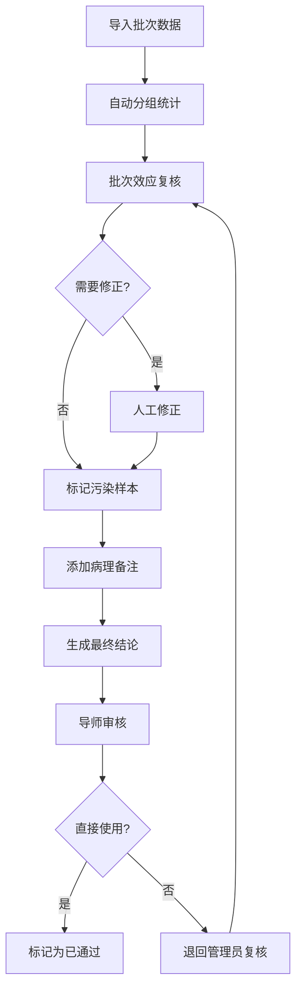

## 1. 产品概述

抗生素梯度实验复核系统是面向生物实验室的实验数据管理与复核平台，解决批次效应复核、人工修正、分组统计及样本溯源等核心痛点，目标用户包括动物房管理员、导师/PI、实验工程师等角色。

产品核心价值在于：让新同事也能看懂复核逻辑、让结论可追溯到原始材料、让每批次实验都能闭环验证，替代传统经验传帮带模式。

## 2. 核心功能

### 2.1 用户角色

| 角色 | 注册方式 | 核心权限 |
|------|----------|----------|
| 动物房管理员 | 系统分配 | 批次复核、人工修正、样本管理、导出报告 |
| 导师/PI | 系统分配 | 查看结果、标记状态、审批结论 |
| 实验工程师 | 系统分配 | 导入数据、查看统计、辅助复核 |

### 2.2 功能模块

1. **实验总览页**：批次列表、状态概览、快速入口
2. **批次复核详情页**：批次效应解释、人工修正、分组统计、谱系追踪
3. **样本清单页**：原始行号、图片名、来源备注、污染标记
4. **结论追溯页**：最终结论反向溯源到样本材料
5. **测试路径页**：重复导入场景验证、数据一致性检查

### 2.3 页面详情

| 页面名称 | 模块名称 | 功能描述 |
|----------|----------|----------|
| 实验总览页 | 批次卡片列表 | 展示各批次状态、可直接使用/需复核标记、快速进入详情 |
| 实验总览页 | 统计概览 | 批次总数、待复核数、已通过数、污染样本数 |
| 批次复核详情页 | 批次效应解释 | 每项结果旁附1-2句解释说明，支持新同事理解 |
| 批次复核详情页 | 人工修正模块 | 支持修正原始数据、记录修正原因、保留修改历史 |
| 批次复核详情页 | 分组统计模块 | 按组别统计存活率/抑菌率、图表可视化 |
| 批次复核详情页 | 谱系追踪模块 | 结论追溯到具体样本、孔板、图片、原始行号 |
| 批次复核详情页 | 病理备注面板 | 同一轮复核内整合病理备注、样本清单、污染样本 |
| 样本清单页 | 样本列表 | 展示样本ID、原始行号、图片名、来源备注、状态标签 |
| 样本清单页 | 污染样本标记 | 标记污染样本、记录污染原因、统计影响范围 |
| 测试路径页 | 重复导入场景 | 模拟多次导入验证数据一致性、避免越跑越乱 |
| 测试路径页 | 数据校验 | 导入前后数据对比、行号保留验证、来源备注完整性检查 |

## 3. 核心流程

### 3.1 批次复核主流程

实验工程师导入批次数据 → 系统自动分组统计 → 动物房管理员复核批次效应 → 人工修正异常数据 → 标记污染样本 → 添加病理备注 → 生成最终结论 → 导师审核（直接使用/需再复核）

### 3.2 谱系追溯流程

从最终结论出发 → 点击关联样本 → 跳转样本清单并高亮 → 查看原始行号和图片名 → 追溯来源材料和备注

## 4. 用户界面设计

### 4.1 设计风格

- **主色调**：深青色（#0F4C5C）作为主色，体现专业科研感；暖橙色（#E36414）作为强调色，用于需复核/异常状态
- **辅助色**：薄荷绿（#5FAD41）表示通过/正常，酒红色（#9A031E）表示污染/危险
- **按钮风格**：微圆角（6px），悬停有轻微上浮和阴影变化
- **字体**：标题使用思源宋体（Source Han Serif），正文使用思源黑体（Source Han Sans），营造学术严谨感
- **布局风格**：左侧导航 + 主内容区的经典后台布局，卡片式模块划分
- **图标风格**：线性细边图标，颜色与模块主题一致

### 4.2 页面设计概览

| 页面名称 | 模块名称 | UI 元素 |
|----------|----------|---------|
| 实验总览页 | 统计概览 | 四个数据卡片并排，渐变背景，数字放大显示 |
| 实验总览页 | 批次列表 | 表格形式，状态标签色区分，悬停行高亮 |
| 批次复核详情页 | 结果解释卡片 | 结果值旁带问号图标，点击展开解释文字 |
| 批次复核详情页 | 修正记录 | 时间线样式展示修改历史，区分原始值和修正值 |
| 批次复核详情页 | 谱系追踪 | 树状结构，可点击节点跳转，高亮关联项 |
| 样本清单页 | 样本表格 | 带斑马纹，污染行红色背景标记，可点击行号溯源 |
| 测试路径页 | 导入对比 | 左右分栏对比导入前后数据，差异处高亮显示 |

### 4.3 响应式

桌面端优先设计，支持平板自适应；核心表格区域在小屏幕下可横向滚动。

### 4.4 动效设计

- 页面加载时模块依次淡入（staggered fade-in）
- 状态标签切换时有颜色过渡动画
- 谱系追踪树节点展开/收起有平滑过渡
- 鼠标悬停可点击元素时有轻微缩放反馈
