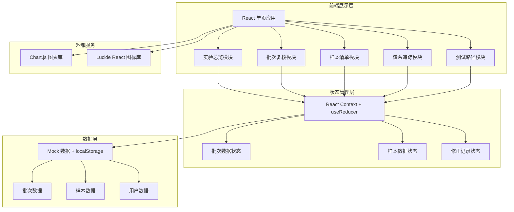
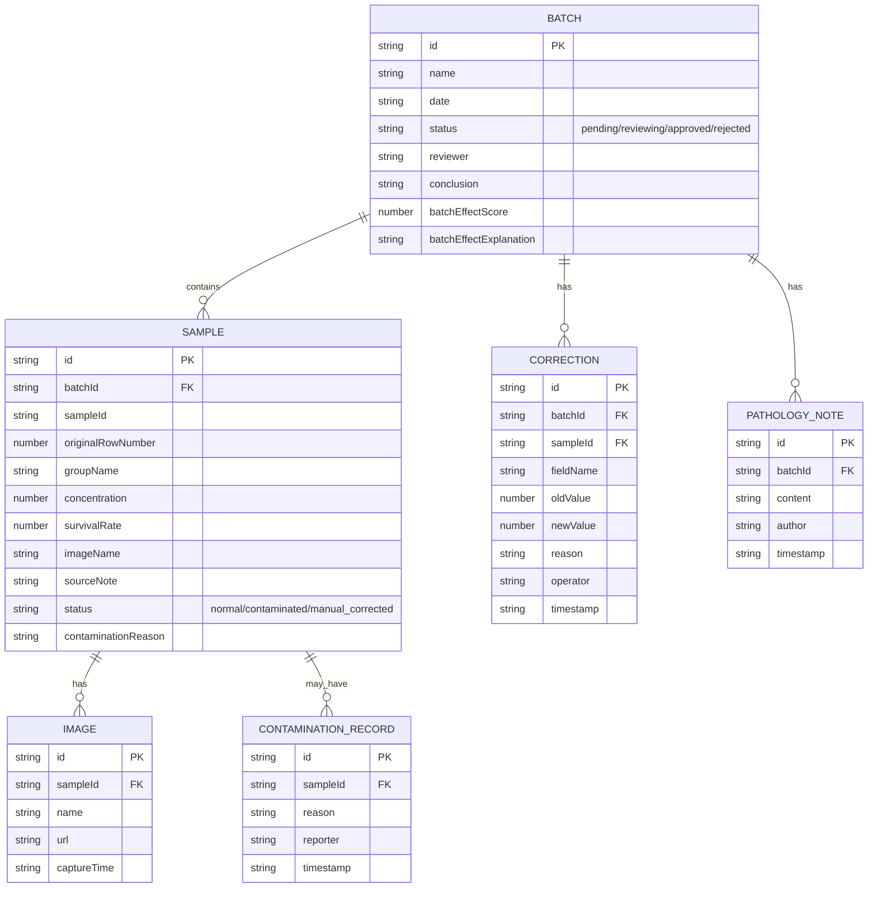

## 1. 架构设计



## 2. 技术描述

- **前端框架**：React@18 + TypeScript
- **构建工具**：Vite@5
- **样式方案**：TailwindCSS@3
- **路由管理**：React Router@6
- **图表库**：Chart.js + react-chartjs-2
- **图标库**：Lucide React
- **数据持久化**：localStorage 存储修正记录和复核状态
- **初始数据**：内置 Mock 数据模拟真实实验批次

## 3. 路由定义

| 路由 | 页面 | 用途 |
|------|------|------|
| / | 实验总览页 | 批次列表、统计概览、快速入口 |
| /batch/:id | 批次复核详情页 | 批次效应解释、人工修正、分组统计、谱系追踪 |
| /samples | 样本清单页 | 全部样本列表、原始行号、污染标记 |
| /samples/:id | 样本详情页 | 单样本溯源、图片、来源备注 |
| /test-path | 测试路径页 | 重复导入场景、数据一致性校验 |

## 4. 数据模型

### 4.1 数据模型定义



### 4.2 核心类型定义

```typescript
// 批次状态
type BatchStatus = 'pending' | 'reviewing' | 'approved' | 'needs_review';

// 样本状态
type SampleStatus = 'normal' | 'contaminated' | 'corrected';

// 批次数据
interface Batch {
  id: string;
  name: string;
  date: string;
  status: BatchStatus;
  reviewer?: string;
  conclusion?: string;
  batchEffectScore: number;
  batchEffectExplanation: string;
  groupStatistics: GroupStat[];
}

// 分组统计
interface GroupStat {
  groupName: string;
  sampleCount: number;
  avgSurvivalRate: number;
  stdDev: number;
  minValue: number;
  maxValue: number;
}

// 样本数据
interface Sample {
  id: string;
  batchId: string;
  sampleId: string;
  originalRowNumber: number;
  groupName: string;
  concentration: number;
  survivalRate: number;
  imageName: string;
  sourceNote: string;
  status: SampleStatus;
  contaminationReason?: string;
  correctionHistory?: CorrectionRecord[];
}

// 修正记录
interface CorrectionRecord {
  id: string;
  fieldName: string;
  oldValue: number;
  newValue: number;
  reason: string;
  operator: string;
  timestamp: string;
}

// 谱系追踪节点
interface LineageNode {
  id: string;
  type: 'conclusion' | 'group' | 'sample' | 'image' | 'source';
  label: string;
  children?: LineageNode[];
  metadata?: Record<string, any>;
}
```
