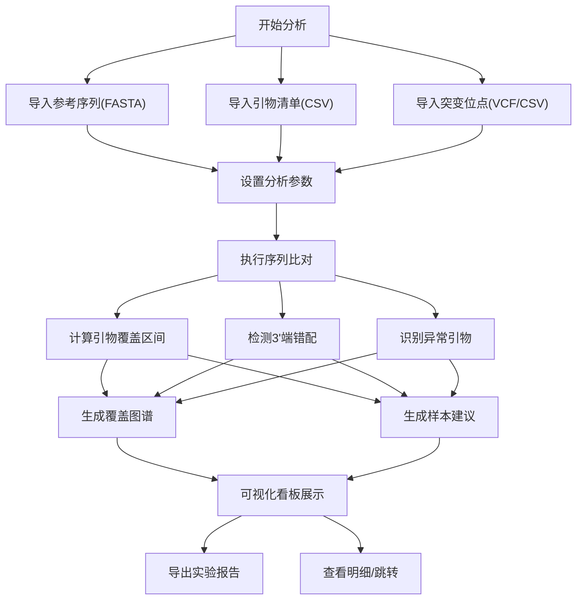

## 1. 产品概述

病毒引物覆盖检查工具是一款面向生信分析师和质控组的专业分析工具，用于在更换病毒参考序列后快速评估旧引物清单的可用性，辅助制定扩增方案。

- **核心问题**：更换参考序列后，旧引物是否仍有效？哪些突变会导致扩增失败？哪些样本需要更换引物？
- **目标用户**：生信分析师、实验室质控人员、实验操作人员
- **产品价值**：将数小时的人工序列比对工作缩短至分钟级，提供直观可视化结果和可执行的报告建议

## 2. 核心功能

### 2.1 用户角色

| 角色 | 使用场景 | 核心需求 |
|------|----------|----------|
| 生信分析师 | 评估引物覆盖度和突变影响 | 精确的序列比对、3'端错配分析、批量处理 |
| 质控组 | 制定扩增方案决策 | 覆盖缺口可视化、样本分类建议、风险预警 |
| 实验操作人员 | 执行扩增实验 | 清晰的操作指导、引物替换建议、直观报告 |

### 2.2 功能模块

1. **数据导入中心**：参考序列导入、候选引物批量导入、样本突变位点导入、退火温度设置
2. **引物覆盖分析**：每对引物覆盖区间计算、结合位点匹配、覆盖度统计
3. **突变影响评估**：3'端错配检测、错配级别分类、备用引物推荐
4. **异常检测中心**：反向引物写反检测、序列含N碱基标记、同名引物不同批次识别
5. **可视化看板**：全基因组覆盖图谱、覆盖缺口高亮、引物分布热力图
6. **报告导出**：实验员友好报告、引物替换建议表、问题清单汇总

### 2.3 页面详情

| 页面名称 | 模块名称 | 功能描述 |
|-----------|-------------|---------------------|
| 数据导入页 | 文件上传区 | 拖拽上传FASTA/CSV/VCF文件，支持格式校验和预览 |
| 数据导入页 | 参数配置 | 退火温度范围设置、3'端关键碱基数量、错配容忍度 |
| 分析看板 | 总览统计卡 | 引物总数、覆盖率、异常数、需替换样本数 |
| 分析看板 | 覆盖图谱 | 全基因组覆盖可视化，缺口区域高亮，点击查看详情 |
| 分析看板 | 引物明细表 | 覆盖区间、Tm值、突变影响、状态标签，支持筛选排序 |
| 分析看板 | 样本建议表 | 样本突变位点、受影响引物、推荐备用引物 |
| 异常检测页 | 反向引物清单 | 写反的反向引物列表及修正建议 |
| 异常检测页 | N碱基标记 | 含不确定碱基的引物及位置标注 |
| 异常检测页 | 重复引物识别 | 同名不同批次的引物对比及差异分析 |
| 报告导出页 | 报告预览 | 可视化报告预览，实验操作建议 |
| 报告导出页 | 多格式导出 | PDF/Excel/CSV三种格式 |

## 3. 核心流程

## 4. 用户界面设计

### 4.1 设计风格
- **主色调**：深海蓝 #0A3D62（专业感、信任感），辅以生命科学绿 #26DE81（成功/正常）、警示橙 #FD9644（警告/需注意）、危险红 #EB3B5A（错误/失效）
- **风格定位**：专业科研工具风，数据密度高但层次清晰，避免花哨装饰
- **字体**：标题用思源黑体 SemiBold，正文用 Inter Regular，等宽数据用 JetBrains Mono
- **组件**：圆角卡片、细边框分隔、微阴影层次、数据表格斑马纹
- **图标**：线性图标为主，辅以核酸序列相关的抽象图形元素

### 4.2 页面设计概览

| 页面名称 | 模块名称 | UI元素 |
|-----------|-------------|----------|
| 数据导入页 | 上传区域 | 大尺寸拖拽框，文件类型图标，实时进度条 |
| 数据导入页 | 格式说明 | 折叠面板展示样例数据和字段说明 |
| 分析看板 | 统计卡片 | 4张关键指标卡，渐变背景色，数值放大突出 |
| 分析看板 | 覆盖图谱 | 横向全基因组轨道视图，引物块、缺口区域、突变位点多层叠加 |
| 分析看板 | 数据表格 | 可排序可筛选，状态标签彩色编码，点击行展开详情 |
| 异常检测页 | 问题列表 | 分组卡片布局，每组配问题类型图标和修正建议 |
| 报告导出页 | 报告预览 | A4比例预览框，分页导航，导出按钮组 |

### 4.3 响应式设计
- 桌面端优先（1280px+），生物信息学分析以大屏为主
- 中等屏幕（1024px-1280px）：统计卡自动换行，表格横向滚动
- 平板（768px-1024px）：侧边栏收起为图标，图谱简化显示
- 移动端（<768px）：仅保留核心数据浏览功能

## 5. 数据去重与幂等性

- **引物去重策略**：基于「引物名称+序列内容+方向」生成唯一指纹哈希，重复导入时更新元数据但不生成重复记录
- **分析结果缓存**：同一批数据（基于文件内容哈希）二次分析时直接返回缓存结果
- **版本追踪**：同名引物不同批次保留历史版本，标注批次号和导入时间
