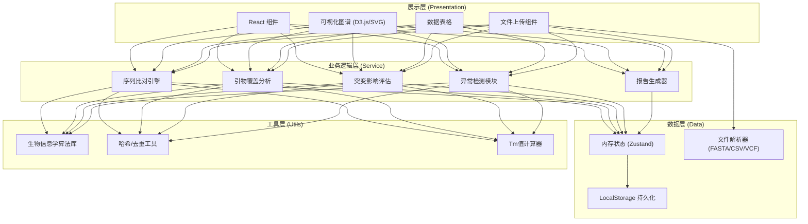

## 1. 架构设计



## 2. 技术选型说明

- **前端框架**：React@18 + TypeScript@5（类型安全，适合复杂数据处理）
- **构建工具**：Vite@5（快速开发启动，HMR体验优秀）
- **样式方案**：TailwindCSS@3 + 自定义设计Token（原子化CSS，科研风主题）
- **状态管理**：Zustand@4（轻量级，适合分析工具的复杂数据流）
- **数据可视化**：D3.js@7（覆盖图谱、热力图的精细控制）+ React基础SVG组件
- **UI组件**：Headless UI（无样式组件，便于定制科研风格）
- **文件处理**：自定义解析器（FASTA/CSV/VCF格式，纯前端处理）
- **导出功能**：jsPDF + jspdf-autotable（PDF报告）、SheetJS/xlsx（Excel导出）
- **图表**：轻量自研SVG组件（避免重型图表库，精准控制生物信息学展示）

## 3. 路由定义

| 路由 | 页面组件 | 用途 |
|-------|---------|------|
| / | DashboardPage | 分析看板主页面（总览+图谱+表格） |
| /import | ImportPage | 数据导入和参数配置 |
| /anomalies | AnomaliesPage | 异常检测中心 |
| /report | ReportPage | 报告预览和导出 |

## 4. 核心数据模型

### 4.1 TypeScript 类型定义

```typescript
// 参考序列
interface ReferenceSequence {
  id: string;
  name: string;
  sequence: string;
  length: number;
  gcContent: number;
}

// 引物对
interface PrimerPair {
  id: string;           // 唯一指纹ID
  name: string;
  batch?: string;       // 批次号（用于同名不同批次）
  forward: Primer;
  reverse: Primer;
  productSize: number;  // 预期产物长度
  ampliconStart: number;
  ampliconEnd: number;
  status: 'valid' | 'warning' | 'invalid' | 'needs_review';
  notes?: string;
  importHash: string;   // 用于去重
}

// 单条引物
interface Primer {
  id: string;
  sequence: string;
  direction: 'forward' | 'reverse';
  length: number;
  tm: number;           // 熔解温度
  gcContent: number;
  hasAmbiguity: boolean; // 是否含N等不确定碱基
  ambiguityPositions?: number[];
  isReversed: boolean;  // 是否疑似写反
  bindingStart: number; // 在参考序列上的结合起始位置
  bindingEnd: number;   // 在参考序列上的结合终止位置
}

// 突变位点
interface Mutation {
  id: string;
  sampleId: string;
  sampleName: string;
  position: number;     // 1-based 位置
  refBase: string;
  altBase: string;
  quality?: number;
  alleleFrequency?: number;
}

// 突变对引物的影响
interface MutationImpact {
  mutationId: string;
  primerPairId: string;
  isThreePrimeMismatch: boolean;  // 是否3'端错配
  distanceFromThreePrime: number; // 距3'端的碱基数
  mismatchLevel: 'critical' | 'high' | 'medium' | 'low';
  affectedPrimer: 'forward' | 'reverse' | 'both';
  recommendation: 'use' | 'caution' | 'replace';
}

// 覆盖区间
interface CoverageRegion {
  start: number;
  end: number;
  primerPairIds: string[];
  coverageDepth: number;
  isGap: boolean;
}

// 样本分析结果
interface SampleResult {
  sampleId: string;
  sampleName: string;
  mutationCount: number;
  criticalMismatches: MutationImpact[];
  recommendedPrimerPairs: string[];
  needsAlternativePrimers: boolean;
  notes: string;
}

// 异常记录
interface AnomalyRecord {
  id: string;
  type: 'reversed_primer' | 'ambiguity_base' | 'duplicate_name' | 'out_of_range_tm';
  severity: 'error' | 'warning' | 'info';
  primerPairId?: string;
  primerId?: string;
  message: string;
  suggestion: string;
}

// 分析参数
interface AnalysisConfig {
  minTm: number;
  maxTm: number;
  threePrimeCriticalBases: number;  // 3'端关键碱基数（默认3-5）
  maxAllowedMismatches: number;
  minimumAmpliconSize: number;
  maximumAmpliconSize: number;
}

// 完整分析结果
interface AnalysisResult {
  id: string;
  createdAt: timestamp;
  dataHash: string;       // 输入数据的哈希值，用于幂等判断
  reference: ReferenceSequence;
  primerPairs: PrimerPair[];
  mutations: Mutation[];
  coverage: CoverageRegion[];
  mutationImpacts: MutationImpact[];
  sampleResults: SampleResult[];
  anomalies: AnomalyRecord[];
  config: AnalysisConfig;
  summary: {
    totalPrimers: number;
    validPrimers: number;
    coveragePercent: number;
    gapCount: number;
    samplesNeedingAttention: number;
    anomalyCount: number;
  };
}
```

## 5. 核心算法模块

### 5.1 序列比对算法
- **局部比对**：使用改良的Smith-Waterman算法（简化版，适合引物短序列）
- **种子扩展**：先匹配10bp完美种子序列，再向两端扩展
- **反向互补**：自动检测并处理反向引物的结合位点
- **模糊匹配**：含N碱基按通配符处理，计入匹配但降低得分

### 5.2 Tm值计算
- **最近邻热力学法**（Nearest-Neighbor）：支持标准盐浓度校正
- **简化公式**：%GC法作为后备快速估算
- 输入参数：寡核苷酸浓度、钠离子浓度

### 5.3 3'端错配评估
- 3'端最后N个碱基（默认5个）内的突变标记为 critical
- 距3'端6-10个碱基标记为 high
- 10个碱基以外标记为 low
- 嘌呤↔嘧啶颠换比同类转换权重更高

### 5.4 覆盖度计算
- 将基因组按窗口滑动（窗口大小可配置，默认100bp）
- 统计每个窗口内被多少对引物覆盖
- 连续无覆盖区域标记为 Gap

## 6. 去重与幂等性实现

```
去重流程：
1. 文件上传 → 计算文件内容 SHA-256 哈希
2. 引物解析 → 对每条引物计算 (name+sequence+direction+batch) 指纹
3. 比对指纹库 → 已存在则更新元信息，不存在则新增
4. 分析完成 → 存储 (数据哈希 → 结果ID) 映射
5. 再次导入相同数据 → 命中缓存直接返回历史结果
```

## 7. 目录结构

```
src/
├── assets/              # 静态资源（图标、字体）
├── components/          # 通用组件
│   ├── ui/             # 基础UI组件（Button、Card、Table等）
│   ├── coverage/       # 覆盖图谱组件
│   ├── tables/         # 数据表格组件
│   └── charts/         # 统计图表
├── pages/              # 页面级组件
│   ├── ImportPage.tsx
│   ├── DashboardPage.tsx
│   ├── AnomaliesPage.tsx
│   └── ReportPage.tsx
├── store/              # Zustand 状态管理
│   └── analysisStore.ts
├── lib/                # 核心算法库
│   ├── bio/            # 生物信息学算法
│   │   ├── alignment.ts
│   │   ├── primer.ts
│   │   ├── mutation.ts
│   │   └── tm.ts
│   ├── parsers/        # 文件解析器
│   │   ├── fasta.ts
│   │   ├── csv.ts
│   │   └── vcf.ts
│   ├── exporters/      # 报告导出
│   │   ├── pdf.ts
│   │   └── excel.ts
│   └── utils/          # 通用工具
│       ├── hash.ts
│       ├── sequence.ts
│       └── types.ts
├── data/               # 样例数据
│   ├── sample_reference.fasta
│   ├── sample_primers.csv
│   └── sample_mutations.csv
├── hooks/              # 自定义Hooks
├── App.tsx
├── main.tsx
└── index.css
```
