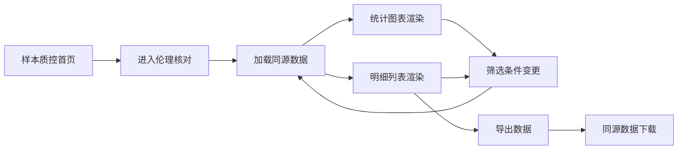
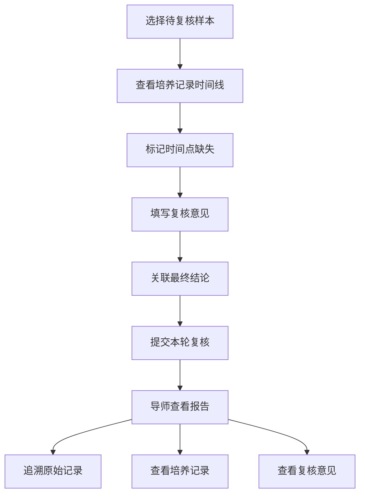
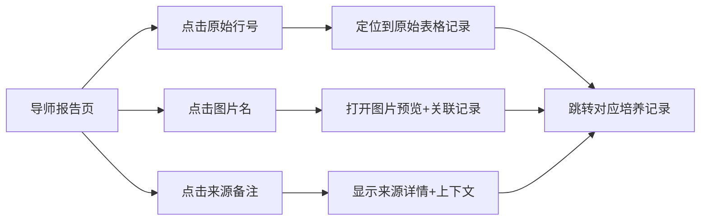

## 1. 产品概述

动物实验伦理材料核对系统，解决生物老师修改采样地点后，旧结果、新结果与导师报告数据不一致的问题。系统确保图表、明细和下载结果始终源自同一批数据，并提供完整的追溯链路。

- **核心问题**：多次修改采样地点后，不同版本的核对结果混乱，导师报告与实际数据脱节
- **目标用户**：生物老师（日常操作）、导师（审核查看）
- **产品价值**：单一数据源保证一致性，完整追溯链支持复盘，复核流程闭环管理

## 2. 核心功能

### 2.1 用户角色

| 角色 | 登录方式 | 核心权限 |
|------|----------|----------|
| 生物老师 | 账号登录 | 样本导入、采样地点修改、日常核对、复核提交 |
| 导师 | 账号登录 | 查看报告、复核意见、追溯原始记录、最终结论 |

### 2.2 功能模块

1. **样本质控首页**：日常入口、样本总览、快速统计、伦理核对入口
2. **伦理材料核对看板**：统计图表、明细列表、数据下载（同源数据）
3. **复核详情页**：培养记录、复核意见、时间点缺失、结论联动跳转
4. **导师报告页**：汇总报告、追溯链路、原始记录锚点、最终结论

### 2.3 页面详情

| 页面名称 | 模块名称 | 功能描述 |
|----------|----------|----------|
| 样本质控首页 | 顶部导航 | 角色切换、用户信息、系统名称 |
| 样本质控首页 | 统计卡片 | 样本总数、已核对、待复核、异常数 |
| 样本质控首页 | 样本列表 | 条码、采样地点、状态、操作入口 |
| 样本质控首页 | 快速操作 | 导入样本、修改采样地点、进入核对 |
| 伦理核对看板 | 数据筛选 | 批次、时间范围、采样地点、状态筛选 |
| 伦理核对看板 | 统计图表 | 核对通过率、地点分布、异常类型分布 |
| 伦理核对看板 | 明细表格 | 样本条码、原始行号、图片名、来源备注、状态 |
| 伦理核对看板 | 数据导出 | CSV/Excel 下载，与看板同源数据 |
| 伦理核对看板 | 示例数据引导 | 首次访问自动加载示例数据 |
| 复核详情页 | 样本信息卡 | 条码、采样地点、原始行号、图片预览 |
| 复核详情页 | 培养记录时间线 | 按时间点排列的培养记录，可点击跳转 |
| 复核详情页 | 复核意见区 | 本轮复核意见、历史意见、修改痕迹 |
| 复核详情页 | 时间点缺失标记 | 缺失的时间点高亮标注 |
| 复核详情页 | 最终结论区 | 与培养记录双向联动、结论状态 |
| 复核详情页 | 重复检测提示 | 重复条码/导入检测、去重处理 |
| 导师报告页 | 批次汇总 | 本轮复核批次概览、统计摘要 |
| 导师报告页 | 复核结论列表 | 所有样本结论、状态筛选 |
| 导师报告页 | 追溯锚点 | 原始行号、图片名、来源备注可点击回溯 |
| 导师报告页 | 批量操作 | 批量通过、批量驳回、导出报告 |

## 3. 核心流程

### 3.1 日常核对流程

生物老师在样本质控首页进入伦理材料核对，系统从同一数据源加载图表和明细，支持筛选和导出，所有操作确保数据一致性。

### 3.2 复核工作流

生物老师提交复核，将复核意见、培养记录和时间点缺失整合在同一轮复审核中，导师查看时能看到完整的上下文。

### 3.3 数据追溯流程

导师在报告中点击追溯锚点（原始行号/图片名/来源备注），系统直接定位到原始记录和对应培养记录。

## 4. 用户界面设计

### 4.1 设计风格

- **主色调**：深青绿色 #0D9488（专业、可信、生命科学感）
- **辅助色**：琥珀橙 #F59E0B（警示、待处理）、玫红 #EC4899（异常、错误）、翠绿 #10B981（通过、正常）
- **背景色**：浅灰蓝渐变背景 #F0F9FF → #ECFDF5，营造洁净专业的实验室氛围
- **字体**：标题用 Noto Serif SC（严谨学术感），正文用 Noto Sans SC（清晰易读）
- **卡片风格**：微圆角（8px）、轻阴影、细边框，卡片式布局
- **图标风格**：线性图标，统一 2px 线宽，学术严谨风格

### 4.2 页面设计概览

| 页面名称 | 模块名称 | UI 元素 |
|----------|----------|---------|
| 样本质控首页 | 顶部导航 | 左侧系统名称（深青绿色），右侧用户信息，白底阴影 |
| 样本质控首页 | 统计卡片 | 4列卡片网格，图标+数字+趋势，hover 微上浮 |
| 样本质控首页 | 样本列表 | 斑马纹表格，状态标签彩色，操作列按钮组 |
| 伦理核对看板 | 筛选栏 | 横向排列筛选器，应用/重置按钮 |
| 伦理核对看板 | 图表区 | 3个图表并排（通过率环形图、地点柱状图、异常饼图） |
| 伦理核对看板 | 明细表格 | 固定表头、可排序、状态标签、追溯链接 |
| 伦理核对看板 | 首次引导 | 右上角示例数据提示卡，可关闭 |
| 复核详情页 | 信息卡 | 左侧样本信息，右侧状态和操作 |
| 复核详情页 | 时间线 | 左侧竖线时间轴，右侧培养记录卡片 |
| 复核详情页 | 意见区 | 文本框+历史记录列表 |
| 复核详情页 | 结论区 | 结论选择+与培养记录联动按钮 |
| 导师报告页 | 汇总区 | 大数字统计+本轮复核标识 |
| 导师报告页 | 追溯列表 | 每行带追溯锚点，点击展开 |
| 导师报告页 | 批量操作 | 底部固定操作栏 |

### 4.3 响应式

- 桌面端优先设计（1280px 起步）
- 平板端：统计卡片变2列，图表堆叠
- 移动端：导航折叠，表格横向滚动

### 4.4 动效设计

- 页面加载：卡片错落渐入（staggered fade-in）
- 数据刷新：图表平滑过渡动画
- 追溯跳转：高亮闪烁目标元素
- 状态变更：颜色渐变过渡
- 悬停：按钮/卡片微上浮 + 阴影加深
