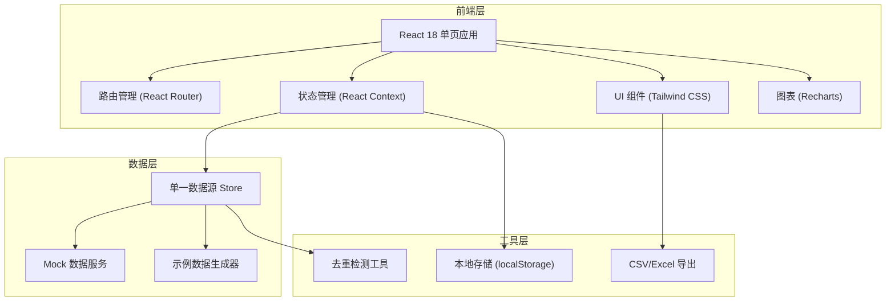
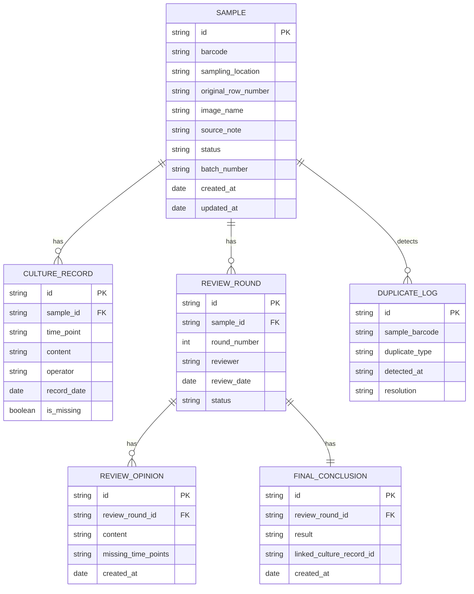
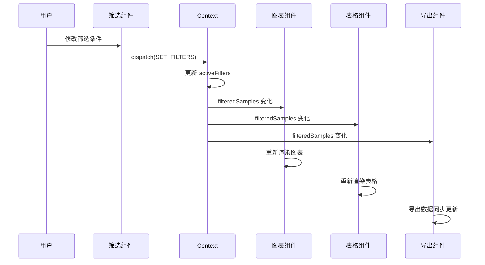

## 1. 架构设计



## 2. 技术描述

- **前端框架**: React@18 + TypeScript
- **构建工具**: Vite@5
- **样式方案**: Tailwind CSS@3
- **路由**: React Router DOM@6
- **图表库**: Recharts@2
- **状态管理**: React Context + useReducer
- **文件导出**: 原生 CSV 生成 + SheetJS (xlsx)
- **数据存储**: localStorage 持久化 + Mock 数据
- **图标**: Lucide React

## 3. 路由定义

| 路由路径 | 页面名称 | 说明 |
|----------|----------|------|
| `/` | 样本质控首页 | 日常入口，样本总览 |
| `/ethics-review` | 伦理材料核对看板 | 图表、明细、下载 |
| `/ethics-review/:id` | 复核详情页 | 培养记录、复核意见、结论联动 |
| `/supervisor-report` | 导师报告页 | 汇总报告、追溯链路 |

## 4. 数据模型

### 4.1 ER 图



### 4.2 TypeScript 类型定义

```typescript
// 样本状态
type SampleStatus = 'pending' | 'reviewing' | 'approved' | 'rejected' | 'duplicate';

// 样本
interface Sample {
  id: string;
  barcode: string;
  samplingLocation: string;
  originalRowNumber: string;
  imageName: string;
  sourceNote: string;
  status: SampleStatus;
  batchNumber: string;
  createdAt: string;
  updatedAt: string;
  isFirstVisit?: boolean;
}

// 培养记录
interface CultureRecord {
  id: string;
  sampleId: string;
  timePoint: string;
  content: string;
  operator: string;
  recordDate: string;
  isMissing: boolean;
}

// 复核轮次
interface ReviewRound {
  id: string;
  sampleId: string;
  roundNumber: number;
  reviewer: string;
  reviewDate: string;
  status: 'draft' | 'submitted' | 'finalized';
}

// 复核意见
interface ReviewOpinion {
  id: string;
  reviewRoundId: string;
  content: string;
  missingTimePoints: string[];
  createdAt: string;
}

// 最终结论
interface FinalConclusion {
  id: string;
  reviewRoundId: string;
  result: 'pass' | 'fail' | 'pending';
  linkedCultureRecordId: string | null;
  createdAt: string;
}

// 重复记录日志
interface DuplicateLog {
  id: string;
  sampleBarcode: string;
  duplicateType: 'barcode' | 'import' | 'supplement';
  detectedAt: string;
  resolution: 'merged' | 'removed' | 'pending';
  sampleIds: string[];
}

// 单一数据源状态
interface AppState {
  samples: Sample[];
  cultureRecords: CultureRecord[];
  reviewRounds: ReviewRound[];
  reviewOpinions: ReviewOpinion[];
  finalConclusions: FinalConclusion[];
  duplicateLogs: DuplicateLog[];
  activeFilters: {
    batchNumber?: string;
    dateRange?: [string, string];
    samplingLocation?: string;
    status?: SampleStatus;
  };
  currentUser: {
    role: 'teacher' | 'supervisor';
    name: string;
  };
  hasVisitedBefore: boolean;
}
```

## 5. 核心数据一致性设计

### 5.1 单一数据源原则

所有组件（图表、明细表格、导出功能）必须从同一个 `AppState` 读取数据，通过统一的 `useEthicsData()` Hook 访问：

```typescript
// 统一数据访问 Hook
function useEthicsData() {
  const { state } = useContext(EthicsContext);
  
  // 根据筛选条件计算派生数据
  const filteredSamples = useMemo(() => {
    return applyFilters(state.samples, state.activeFilters);
  }, [state.samples, state.activeFilters]);
  
  // 图表数据 - 与明细同源
  const chartData = useMemo(() => {
    return generateChartData(filteredSamples);
  }, [filteredSamples]);
  
  // 导出数据 - 与明细同源
  const exportData = useMemo(() => {
    return generateExportData(filteredSamples, state.cultureRecords);
  }, [filteredSamples, state.cultureRecords]);
  
  return {
    samples: filteredSamples,
    chartData,
    exportData,
    rawState: state,
  };
}
```

### 5.2 筛选变更触发全链路更新



## 6. 核心功能实现方案

### 6.1 追溯链路实现

每个样本保留 `originalRowNumber`、`imageName`、`sourceNote` 三个追溯锚点，点击时：

```typescript
function handleTraceAnchorClick(type: 'row' | 'image' | 'source', sample: Sample) {
  // 1. 高亮目标元素
  highlightElement(sample.id, type);
  
  // 2. 滚动到对应培养记录
  const linkedRecord = findLinkedCultureRecord(sample, type);
  if (linkedRecord) {
    scrollToCultureRecord(linkedRecord.id);
  }
  
  // 3. 显示上下文信息
  showTraceContext(sample, type);
}
```

### 6.2 培养记录与结论联动

```typescript
// 结论与培养记录双向引用
interface FinalConclusion {
  id: string;
  reviewRoundId: string;
  result: 'pass' | 'fail' | 'pending';
  linkedCultureRecordId: string | null;  // 正向关联
  createdAt: string;
}

interface CultureRecord {
  id: string;
  sampleId: string;
  timePoint: string;
  content: string;
  operator: string;
  recordDate: string;
  isMissing: boolean;
  linkedConclusionId: string | null;  // 反向关联
}
```

### 6.3 重复检测机制

```typescript
function detectDuplicates(samples: Sample[]): DuplicateLog[] {
  const duplicates: DuplicateLog[] = [];
  
  // 条码重复检测
  const barcodeGroups = groupBy(samples, 'barcode');
  Object.entries(barcodeGroups).forEach(([barcode, group]) => {
    if (group.length > 1) {
      duplicates.push({
        id: generateId(),
        sampleBarcode: barcode,
        duplicateType: 'barcode',
        detectedAt: new Date().toISOString(),
        resolution: 'pending',
        sampleIds: group.map(s => s.id),
      });
    }
  });
  
  // 导入/补录重复检测
  // ...
  
  return duplicates;
}
```

### 6.4 首次访问示例数据

```typescript
function useFirstVisitExperience() {
  const { state, dispatch } = useContext(EthicsContext);
  
  useEffect(() => {
    if (!state.hasVisitedBefore) {
      // 加载示例数据
      const demoData = generateDemoData();
      dispatch({ type: 'LOAD_DEMO_DATA', payload: demoData });
      dispatch({ type: 'MARK_VISITED' });
    }
  }, [state.hasVisitedBefore, dispatch]);
}
```

### 6.5 同一轮复核整合

```typescript
interface ReviewRoundSubmission {
  reviewRoundId: string;
  opinion: {
    content: string;
    missingTimePoints: string[];
  };
  conclusion: {
    result: 'pass' | 'fail' | 'pending';
    linkedCultureRecordId: string | null;
  };
  cultureRecords: {
    id: string;
    isMissing: boolean;
  }[];
}

// 一次性提交，确保三者在同一轮次
function submitReviewRound(submission: ReviewRoundSubmission) {
  return transaction(() => {
    createReviewOpinion(submission.opinion, submission.reviewRoundId);
    createFinalConclusion(submission.conclusion, submission.reviewRoundId);
    updateCultureRecords(submission.cultureRecords);
    markReviewRoundFinalized(submission.reviewRoundId);
  });
}
```
