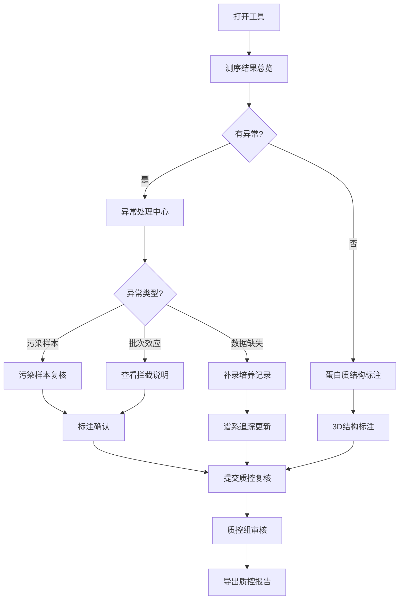

## 1. 产品概述

蛋白质结构突变标注日常工具，面向育种专员处理测序结果、污染样本检测、蛋白质3D结构突变可视化及谱系追踪的一站式工作平台。摒弃评审文档风格，以高效日常工具为设计核心，让育种专员打开即可上手处理具体批次的样本材料。

- **核心用户**：育种专员、质控组人员
- **解决问题**：测序结果处理效率低、污染样本难识别、突变标注不直观、谱系追踪僵化、异常处理无明确指引
- **产品价值**：将专业的生物信息分析转化为育种专员可日常操作的工具，实现测序结果→污染检测→结构标注→谱系追踪→质控报告的完整闭环

## 2. 核心 Features

### 2.1 用户角色

| 角色 | 核心权限 |
|------|----------|
| 育种专员 | 测序结果上传、污染样本标注、蛋白质结构突变标注、谱系追踪更新、培养记录补录 |
| 质控组 | 查看复核面板、批次效应拦截说明、导出质控报告、审核标注结果 |

### 2.2 功能模块

1. **测序结果总览面板**：批次效应检测、QC指标仪表盘、异常样本高亮
2. **蛋白质结构3D可视化**：三维结构展示、突变位点标注、实时明细解释面板
3. **污染样本复核工作台**：样本清单、病理备注、污染检测结果同屏展示
4. **谱系追踪动态面板**：系谱树可视化、培养记录补录入口、人工修正联动更新
5. **异常处理指引中心**：分类展示异常，明确标注"补材料"或"改口径"下一步操作
6. **质控报告导出**：批次效应拦截原因明细、可追溯的标注记录

### 2.3 页面详情

| 页面名称 | 模块名称 | 功能描述 |
|---------|----------|----------|
| 工作台首页 | 测序结果总览 | 展示当前批次样本清单、QC指标、批次效应检测结果、异常样本统计；点击异常可直接跳转处理 |
| 工作台首页 | 快捷操作区 | 一键进入污染复核、结构标注、谱系追踪模块；显示待办事项数量 |
| 蛋白质结构标注页 | 3D结构视图 | 交互式3D蛋白质模型，支持旋转、缩放；突变位点用不同形状标注而非仅颜色区分 |
| 蛋白质结构标注页 | 明细解释面板 | 与3D视图联动，实时显示选中位点的：氨基酸变化、功能影响预测、文献证据、置信度评分 |
| 蛋白质结构标注页 | 突变列表 | 表格形式展示所有突变，支持筛选、搜索；与3D视图双向联动 |
| 污染样本复核页 | 同屏复核区 | 左侧样本清单（含病理备注），中间污染检测热图，右侧人工标注面板；三者联动高亮 |
| 污染样本复核页 | 批次效应说明 | 详细解释本次批次效应被拦截的原因：统计指标、对比基线、风险等级 |
| 谱系追踪页 | 系谱树视图 | 可交互系谱树，节点显示个体信息；支持点击节点补录培养记录 |
| 谱系追踪页 | 动态更新机制 | 补录培养记录后，系统自动提示需要人工复核的关联节点，支持批量修正 |
| 异常处理中心 | 异常分类卡片 | 按"需补材料"、"需改口径"、"待确认"三类展示；每张卡片包含异常详情、建议操作、关联样本 |
| 异常处理中心 | 操作指引 | 对每个异常提供明确的下一步操作按钮，附带操作说明和模板 |
| 质控报告页 | 报告预览 | 完整质控报告预览，包含批次效应拦截说明、污染样本处理记录、突变标注明细、谱系追踪结果 |
| 质控报告页 | 导出功能 | 支持PDF/Excel导出，所有数据可追溯到具体操作人、操作时间 |

## 3. 核心流程

### 3.1 日常处理流程

育种专员打开工具→查看当前批次测序结果总览→发现异常（污染/批次效应/突变）→进入对应模块处理→补录培养记录→更新谱系追踪→提交质控→质控组复核→导出报告

### 3.2 谱系追踪动态更新流程

补录培养记录→系统识别关联节点→自动提示需人工修正项→育种专员确认修正→谱系树实时更新→历史版本可追溯

## 4. 用户界面设计

### 4.1 设计风格

**设计方向：科技感实验室风格 + 高效工具化布局**

- **主色调**：深海蓝 (#0F2B4A) - 代表专业、精准
- **辅助色**：
  - 警示橙 (#FF8C42) - 需补材料标识
  - 修正蓝 (#3B82F6) - 需改口径标识
  - 成功绿 (#10B981) - 正常/通过标识
  - 信息灰 (#6B7280) - 普通信息
- **按钮风格**：直角微圆角（2px），扁平化设计，强调状态变化
- **字体**：
  - 标题：Space Grotesk - 现代科技感
  - 正文：Noto Sans SC - 清晰易读的中文显示
  - 数据：JetBrains Mono - 等宽字体确保数据对齐
- **布局风格**：
  - 三栏式工具布局（左侧导航 + 中间主工作区 + 右侧明细面板）
  - 卡片式模块分区，清晰的视觉层次
  - 最大化工作区域，减少冗余装饰
- **图标风格**：线性图标，2px描边，统一圆角；避免纯颜色标识，必须配文字说明

### 4.2 页面设计概览

| 页面名称 | 模块名称 | UI 元素 |
|---------|----------|---------|
| 工作台首页 | 测序结果总览 | 顶部状态栏显示批次信息；QC指标卡片网格；批次效应拦截说明横幅（含展开详情）；异常样本列表带操作按钮 |
| 蛋白质结构标注页 | 3D结构视图 | 左侧3D画布（三键操作提示）；右侧联动明细面板（位点编号、氨基酸变化、功能预测、置信度、参考文献）；底部突变表格（点击高亮3D对应位点） |
| 蛋白质结构标注页 | 明细解释面板 | 固定宽度280px，随3D视图选择实时更新；每个指标配文字说明而非仅颜色；底部有"添加标注备注"输入框 |
| 污染样本复核页 | 同屏复核区 | 三栏等高布局：左栏样本树（带病理备注标签）、中栏污染热图（hover显示具体数值）、右栏标注面板（污染类型下拉、置信度滑块、备注框） |
| 污染样本复核页 | 批次效应说明 | 折叠式面板，展开后显示：本次批次与历史3批的对比箱线图、统计检验P值、拦截阈值设定、风险评估文字说明 |
| 谱系追踪页 | 系谱树视图 | 力导向布局系谱树；节点点击弹出侧边编辑面板；补录记录后相关节点闪烁提示需复核；支持撤销/重做 |
| 异常处理中心 | 异常分类卡片 | 三列卡片布局，每列顶部有明确的分类标题和颜色标识；卡片内包含：异常描述、影响样本数、建议操作按钮、优先级标签 |
| 质控报告页 | 报告预览 | 类Word文档布局，分页显示；所有数据项支持点击溯源到原始标注界面；导出按钮固定在右上角 |

### 4.3 响应式设计

- **桌面端优先**（1920px及以上）：完整三栏布局，所有功能全开
- **笔记本端**（1366-1920px）：右侧面板可折叠收起，增加主工作区宽度
- **平板端**（768-1366px）：改为上下布局，明细面板移至底部
- **关键交互优化**：3D视图支持触摸手势、表格支持横向滑动、按钮最小尺寸44px

### 4.4 3D 场景指引

**蛋白质3D结构视图：**

- **环境**：深色渐变背景（#0A1929 → #1E3A5F），营造实验室观察氛围
- **光照**：三光源设置
  - 主光：冷白色（5000K），45°角入射，强度1.2
  - 补光：浅蓝色，对侧入射，强度0.6，消除死黑
  - 轮廓光：背后照射，强度0.4，突出蛋白轮廓
- **相机**：
  - 初始视角：45°俯视角，能看到完整蛋白结构
  - 交互：左键旋转、滚轮缩放、右键平移
  - 自适应：突变位点被选中时相机自动调整到最佳观察角度
- **蛋白质渲染**：
  - 骨架显示：半透明管状体（透明度0.3），浅灰色
  - 正常残基：球棍模型，原子标准色（C=灰色、O=红色、N=蓝色、S=黄色）
  - 突变残基：
    - 错义突变：橙色球体 + 标签 + 闪烁动画
    - 无义突变：红色八面体 + 标签 + 脉冲动画
    - 同义突变：绿色立方体 + 标签 + 呼吸动画
    - 移码突变：紫色星形 + 标签 + 旋转动画
- **交互与动画**：
  - 点击突变位点：高亮放大1.5倍，周围出现信息圈显示变化前后对比
  - 鼠标悬停：显示氨基酸名称和编号tooltip
  - 面板联动：从表格选择突变时，相机位移动画过渡到该位点
- **性能控制**：
  - 蛋白质原子数超过5000时自动降级为卡通渲染模式
  - 实时帧率监控，低于30fps时自动关闭粒子效果

## 5. 样例数据要求

### 5.1 可复现样例批次

**批次编号**：BATCH-2026-0612-001（小麦高蛋白品系选育第3代）

**样本清单（12个样本，含2个污染模拟样本）**：
- WH-001：母本，高蛋白供体，病理备注：无异常
- WH-002：父本，抗病品系，病理备注：叶锈病抗性良好
- WH-003：F1代单株，病理备注：生长势强
- WH-004：F2代分离株1，病理备注：疑似杂合
- WH-005：F2代分离株2，病理备注：高蛋白表型
- WH-006：F2代分离株3，病理备注：**污染标记-疑似外来花粉**
- WH-007：F2代分离株4，病理备注：抗病表型
- WH-008：F2代分离株5，病理备注：**污染标记-样本交叉**
- WH-009：F3代株系1，病理备注：无异常
- WH-010：F3代株系2，病理备注：无异常
- WH-011：F3代株系3，病理备注：生育期偏晚
- WH-012：F3代株系4，病理备注：无异常

**测序结果设计**：
- WH-006样本：5个基因座出现杂合异常，污染概率92%
- WH-008样本：3个基因座与WH-002父本完全匹配，污染概率87%
- 批次效应：GC含量偏差3.2%，超过阈值3%，触发拦截

**蛋白质结构突变样例**：
- 基因：TaGW2（小麦籽粒重量调控基因）
- 突变位点1：Exon3 c.345A>T（p.Lys115Asn）- 错义突变，功能影响：中等
- 突变位点2：Exon5 c.679G>T（p.Glu227*）- 无义突变，功能影响：高
- 突变位点3：Exon2 c.123C>T（p.Ala41=）- 同义突变，功能影响：低

**谱系追踪样例**：
- 缺失培养记录：WH-005的授粉日期、WH-011的收获日期
- 补录后需要人工修正：WH-004的父本来源（原记录为WH-002，需修正为WH-001×WH-002的F1）
