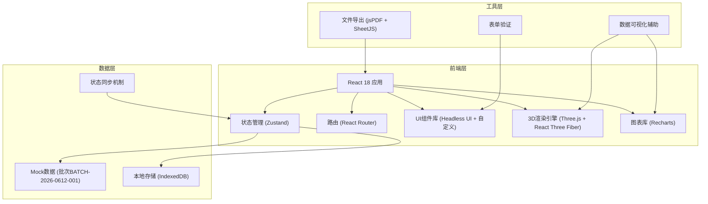
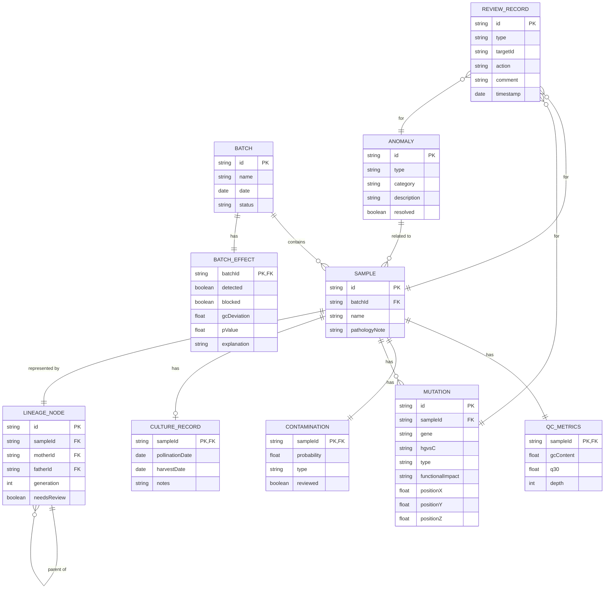

## 1. 架构设计



## 2. 技术描述

### 2.1 核心技术栈
- **前端框架**：React@18.2.0 + TypeScript@5.4
- **构建工具**：Vite@5.2
- **样式方案**：TailwindCSS@3.4 + PostCSS
- **状态管理**：Zustand@4.5（轻量级，避免redux的繁琐）
- **路由**：React Router@6.22
- **3D渲染**：three@0.162 + @react-three/fiber@8.15 + @react-three/drei@9.99

### 2.2 可视化与交互库
- **图表**：Recharts@2.12（箱线图、热图、折线图）
- **系谱树**：自定义D3力导向布局（轻量实现）
- **文件导出**：jspdf@2.5 + xlsx@0.18
- **图标**：Lucide React@0.363（线性图标，符合设计风格）
- **动画**：Framer Motion@11.0（微交互和过渡动画）

### 2.3 开发工具
- **代码规范**：ESLint + Prettier
- **类型检查**：TypeScript Strict模式
- **测试（可选）**：Vitest（预留配置）

### 2.4 后端与数据
- **后端**：无后端，纯前端实现
- **数据来源**：内置完整Mock数据（批次BATCH-2026-0612-001）
- **持久化**：IndexedDB存储用户标注和修改记录

## 3. 路由定义

| Route | 页面名称 | 核心功能 |
|-------|----------|----------|
| `/` | 工作台首页 | 测序结果总览、QC指标、批次效应说明、快捷入口 |
| `/structure` | 蛋白质结构标注 | 3D可视化、突变位点标注、明细解释面板、突变列表 |
| `/contamination` | 污染样本复核 | 同屏复核（样本清单+热图+标注）、批次效应详情 |
| `/lineage` | 谱系追踪 | 系谱树、培养记录补录、人工修正联动 |
| `/anomalies` | 异常处理中心 | 分类异常卡片、操作指引（补材料/改口径） |
| `/report` | 质控报告 | 报告预览、PDF/Excel导出 |

## 4. 核心数据模型

### 4.1 TypeScript 类型定义

```typescript
// 样本基础信息
interface Sample {
  id: string;
  name: string;
  generation: string;
  pathologyNote: string;
  qcMetrics: QCMetrics;
  contamination: ContaminationResult;
  mutations: Mutation[];
  cultureRecord?: CultureRecord;
  lineageInfo: LineageNode;
}

// QC指标
interface QCMetrics {
  gcContent: number;
  q30: number;
  depth: number;
  mappingRate: number;
  duplicateRate: number;
  totalReads: number;
}

// 污染检测结果
interface ContaminationResult {
  probability: number;
  type?: 'pollen' | 'cross-sample' | 'other';
  evidenceLoci: string[];
  confidence: 'low' | 'medium' | 'high';
  reviewed: boolean;
  reviewer?: string;
  reviewTime?: Date;
}

// 突变信息
interface Mutation {
  id: string;
  gene: string;
  exon: string;
  hgvsC: string;
  hgvsP: string;
  type: 'missense' | 'nonsense' | 'synonymous' | 'frameshift' | 'splice';
  functionalImpact: 'low' | 'medium' | 'high';
  confidence: number;
  position3d: { x: number; y: number; z: number };
  residueNumber: number;
  references: string[];
  annotation?: string;
  annotatedBy?: string;
}

// 培养记录
interface CultureRecord {
  pollinationDate?: Date;
  harvestDate?: Date;
  plantingDate?: Date;
  growthCondition?: string;
  notes?: string;
  lastUpdated: Date;
}

// 谱系节点
interface LineageNode {
  id: string;
  sampleId: string;
  motherId?: string;
  fatherId?: string;
  childrenIds: string[];
  generation: number;
  needsReview: boolean;
  reviewReason?: string;
  version: number;
}

// 批次信息
interface Batch {
  id: string;
  name: string;
  date: Date;
  description: string;
  samples: Sample[];
  batchEffect: BatchEffectResult;
  status: 'processing' | 'reviewing' | 'completed' | 'blocked';
}

// 批次效应检测结果
interface BatchEffectResult {
  detected: boolean;
  blocked: boolean;
  gcDeviation: number;
  gcThreshold: number;
  pValue: number;
  comparisonBatches: string[];
  explanation: string;
  riskLevel: 'low' | 'medium' | 'high';
}

// 异常项
interface Anomaly {
  id: string;
  type: 'missing-data' | 'contamination' | 'batch-effect' | 'lineage-conflict';
  category: 'need-material' | 'need-calibration' | 'pending';
  title: string;
  description: string;
  relatedSamples: string[];
  suggestedAction: string;
  actionTemplate?: string;
  priority: 'high' | 'medium' | 'low';
  resolved: boolean;
}

// 全局应用状态
interface AppState {
  currentBatch: Batch;
  selectedSampleId: string | null;
  selectedMutationId: string | null;
  anomalies: Anomaly[];
  reviewHistory: ReviewRecord[];
  setCurrentBatch: (batch: Batch) => void;
  selectSample: (id: string | null) => void;
  selectMutation: (id: string | null) => void;
  updateSample: (sampleId: string, updates: Partial<Sample>) => void;
  resolveAnomaly: (anomalyId: string) => void;
  addReviewRecord: (record: ReviewRecord) => void;
}

// 审核记录
interface ReviewRecord {
  id: string;
  type: 'contamination' | 'mutation' | 'lineage' | 'anomaly';
  targetId: string;
  action: string;
  comment: string;
  reviewer: string;
  timestamp: Date;
}
```

## 5. 数据模型 ER 图



## 6. 模块目录结构

```
src/
├── components/          # 通用组件
│   ├── layout/         # 布局组件（侧边栏、顶栏）
│   ├── ui/             # 基础UI（按钮、卡片、表格）
│   └── charts/         # 图表组件（箱线图、热图）
├── pages/              # 页面组件
│   ├── Dashboard/      # 工作台首页
│   ├── Structure/      # 蛋白质结构标注
│   ├── Contamination/  # 污染样本复核
│   ├── Lineage/        # 谱系追踪
│   ├── Anomalies/      # 异常处理中心
│   └── Report/         # 质控报告
├── store/              # 状态管理
│   └── useAppStore.ts
├── data/               # Mock数据
│   ├── batchData.ts    # 批次BATCH-2026-0612-001完整数据
│   └── proteinData.ts  # 蛋白质3D结构数据
├── types/              # TypeScript类型定义
│   └── index.ts
├── utils/              # 工具函数
│   ├── export.ts       # PDF/Excel导出
│   └── color.ts        # 颜色映射工具
├── hooks/              # 自定义Hooks
│   ├── use3DView.ts    # 3D视图控制
│   └── useLineage.ts   # 谱系树操作
├── App.tsx
├── main.tsx
└── index.css
```

## 7. 关键技术实现说明

### 7.1 3D蛋白质结构可视化
- 使用Three.js加载PDB格式蛋白结构数据（内置TaGW2基因的预测结构）
- React Three Fiber声明式管理3D场景
- 突变位点使用不同几何体（Sphere、Octahedron、Box、TorusKnot）区分类型
- 实现相机平滑过渡动画（lerp插值）
- 明细面板与3D视图双向联动

### 7.2 谱系追踪动态更新机制
- 系谱树使用D3力导向布局，节点支持拖拽
- 补录培养记录后，触发`needsReview`标记，相关节点闪烁动画
- 历史版本存储，支持回滚
- 状态变更实时同步到IndexedDB

### 7.3 批次效应拦截说明
- Recharts绘制多批次对比箱线图
- 统计指标实时计算并展示（P值、偏差值）
- 拦截原因文字说明模板化，支持自定义编辑
- 所有数据可溯源，点击可跳转到对应样本详情

### 7.4 异常处理指引
- 按`need-material`、`need-calibration`、`pending`三类分栏
- 每张异常卡片附带操作说明和模板
- 操作按钮触发对应流程跳转
- 解决状态同步更新到全局状态

### 7.5 质控报告导出
- 使用jspdf生成PDF，保持样式一致
- SheetJS生成Excel，多sheet结构
- 所有数据项包含操作人、时间戳、溯源链接
- 报告内嵌批次效应拦截详细说明

## 8. 性能优化策略

1. **3D场景**：
   - 实例化渲染（InstancedMesh）处理大量原子
   - 距离剔除（Frustum Culling）
   - LOD（Level of Detail）根据距离切换渲染精度

2. **图表**：
   - 数据懒加载，按需渲染
   - 虚拟滚动处理大量样本列表

3. **状态**：
   - Zustand选择器（selector）避免不必要重渲染
   - 批量更新减少状态变更次数

4. **首屏**：
   - 路由代码分割
   - 核心组件预加载，非核心组件懒加载
