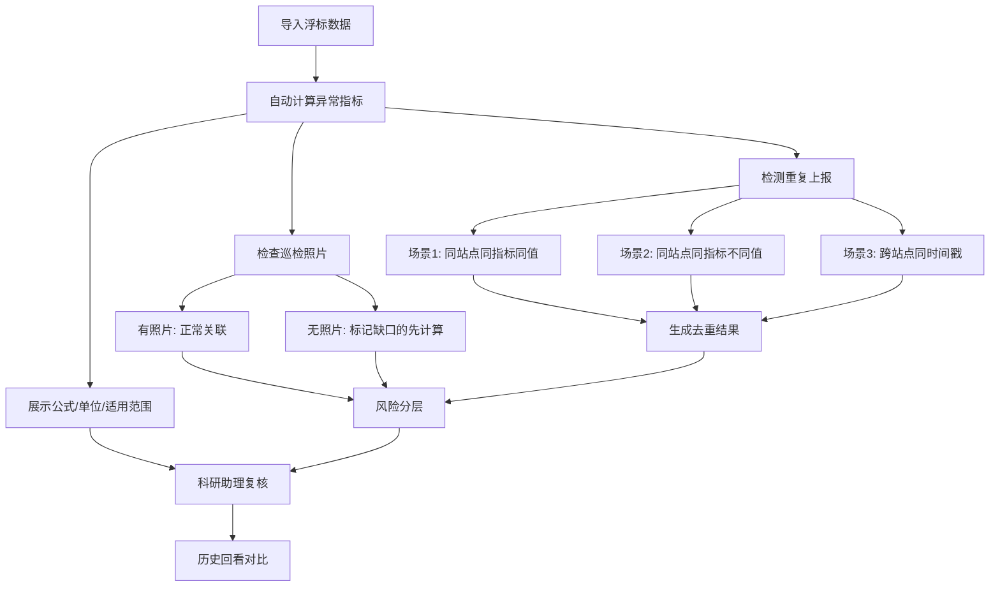

## 1. 产品概述

近岸水质异常看板是一款面向课题组科研助理的计算工具，围绕浮标监测数据，实现水质异常判定、风险分层、重复上报处理和巡检照片补缺的完整工作流。工具将公式、单位、适用范围和失败原因以人可读的方式呈现，让科研助理在不确定时敢于拍板。

- 核心用户：课题组科研助理
- 核心价值：将水质异常判定从"靠经验拍脑袋"变为"有公式可循、有入口可复核、有历史可回看"的标准化流程

## 2. 核心功能

### 2.1 用户角色

| 角色 | 使用方式 | 核心权限 |
|------|----------|----------|
| 科研助理 | 打开即用，无需注册 | 导入数据、查看计算结果、复核修正、历史回看 |

### 2.2 功能模块

1. **看板主页**：全局概览——异常站点、风险分布、待处理事项
2. **浮标数据模块**：数据导入、展示、逐条复核入口、公式与适用范围说明
3. **风险分层模块**：当前风险等级判定 + 历史回看前后差异对比
4. **重复上报模块**：自动检测重复上报，展示2-3种典型场景及处理结果
5. **巡检照片模块**：缺失时优雅降级，先算能算的，再列补缺清单

### 2.3 页面详情

| 页面名称 | 模块名称 | 功能描述 |
|----------|----------|----------|
| 看板主页 | 异常概览卡片区 | 展示异常站点数、高风险数、待复核数、照片缺失数 |
| 看板主页 | 风险分布图 | 按站点/时间展示风险等级分布 |
| 看板主页 | 待处理事项列表 | 待复核条目、照片缺失条目、重复上报条目 |
| 浮标数据页 | 数据表格 | 展示所有浮标监测数据，支持排序筛选 |
| 浮标数据页 | 公式说明面板 | 每个计算指标旁展示公式、单位、适用范围、失败原因 |
| 浮标数据页 | 逐条复核入口 | 每行数据提供"复核"按钮，可直接修正数值或标记异常 |
| 风险分层页 | 当前风险矩阵 | 站点 × 指标的风险等级矩阵 |
| 风险分层页 | 历史回看对比 | 前后两次判定的差异高亮展示 |
| 重复上报页 | 重复检测列表 | 自动检测并展示重复上报的2-3种典型场景 |
| 重复上报页 | 处理结果 | 每种场景展示去重/合并后的真实结果变化 |
| 巡检照片页 | 照片状态总览 | 已关联/未关联照片的数据统计 |
| 巡检照片页 | 补缺清单 | 可计算部分正常计算，缺口单独列出供补录 |

## 3. 核心流程

科研助理导入浮标数据 → 系统自动计算各指标异常值 → 展示公式/单位/适用范围 → 检测重复上报并处理 → 巡检照片缺失时优雅降级 → 生成风险分层结果 → 科研助理通过复核入口修正 → 历史回看展示前后差异

## 4. 用户界面设计

### 4.1 设计风格

- 主色调：深蓝(#0F2B46) — 海洋/水质主题，专业沉稳
- 辅助色：青绿(#00B4A0) — 代表正常/安全，警示橙(#FF8C42) — 代表异常/风险，危险红(#E63946) — 代表高风险
- 按钮风格：圆角(6px)，hover 时微上移+阴影
- 字体：思源黑体/Noto Sans SC 为主，数据用 JetBrains Mono 等宽字体
- 布局风格：左侧固定导航栏 + 右侧内容区，卡片式布局
- 图标：使用 lucide-react 图标库

### 4.2 页面设计概览

| 页面名称 | 模块名称 | UI元素 |
|----------|----------|--------|
| 看板主页 | 异常概览卡片 | 深蓝背景卡片，青绿/橙/红色圆角指标卡，数字用等宽字体 |
| 看板主页 | 风险分布图 | 热力图风格，横轴站点、纵轴指标，颜色映射风险等级 |
| 看板主页 | 待处理事项 | 左侧图标+标题，右侧数量badge，点击跳转 |
| 浮标数据页 | 数据表格 | 斑马纹表格，异常行橙底高亮，行尾复核按钮 |
| 浮标数据页 | 公式说明 | 可折叠面板，公式用等宽字体，适用范围和失败原因用标签样式 |
| 浮标数据页 | 复核弹窗 | 模态框，当前值→修正值输入，修正原因必填 |
| 风险分层页 | 风险矩阵 | 表格+色块，绿色=正常、黄色=关注、橙色=异常、红色=高风险 |
| 风险分层页 | 历史对比 | 左右分栏或行内diff，变更部分高亮闪烁 |
| 重复上报页 | 场景卡片 | 每种场景一张卡片，展示原始数据和去重后结果 |
| 巡检照片页 | 补缺清单 | 清单样式，每项显示站点+时间+缺失照片类型，可上传 |

### 4.3 响应式设计

- 桌面优先设计（科研助理主要在办公电脑使用）
- 最小支持1280px宽度
- 表格区域支持横向滚动

### 4.4 3D场景指导

不适用
