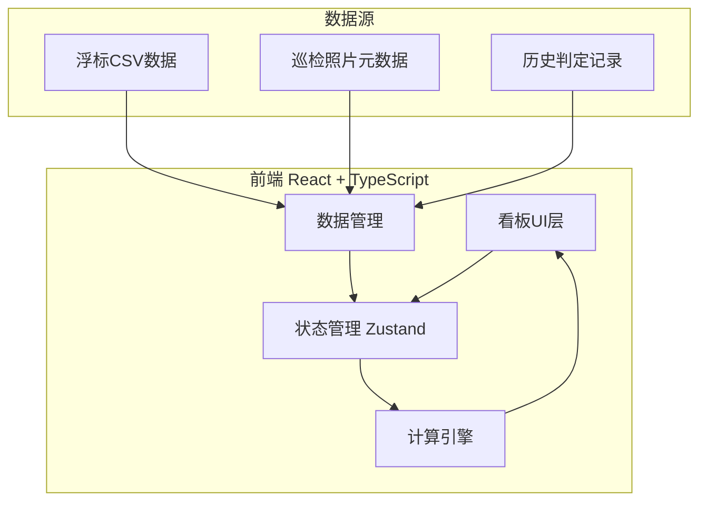
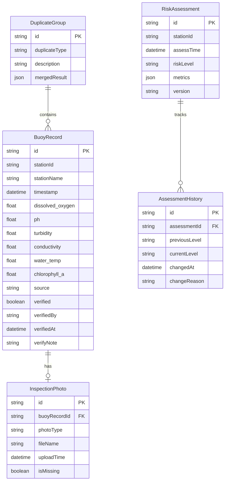

## 1. 架构设计

纯前端架构，所有计算在浏览器端完成，无需后端服务。数据通过文件导入或内置样例提供。

## 2. 技术说明

- 前端：React@18 + TypeScript + Tailwind CSS@3 + Vite
- 初始化工具：vite-init (react-ts 模板)
- 后端：无（纯前端计算工具）
- 数据库：无（使用 Zustand 管理内存状态，localStorage 持久化历史记录）
- 图表：recharts（轻量级 React 图表库）
- 状态管理：Zustand

## 3. 路由定义

| 路由 | 用途 |
|------|------|
| / | 看板主页，异常概览与待处理事项 |
| /buoy-data | 浮标数据管理，公式说明与复核入口 |
| /risk-layer | 风险分层与历史回看对比 |
| /duplicate | 重复上报检测与处理 |
| /inspection | 巡检照片管理与补缺清单 |

## 4. API定义

无后端API。所有数据操作通过 Zustand store 完成：

- `addBuoyData(records)`: 导入浮标数据
- `updateBuoyRecord(id, patch)`: 复核修正单条记录
- `addInspectionPhoto(recordId, photoMeta)`: 关联巡检照片
- `getRiskAssessment(stationId)`: 获取风险分层结果
- `getHistoryDiff(stationId)`: 获取历史判定差异

## 5. 服务器架构图

不适用（纯前端项目）

## 6. 数据模型

### 6.1 数据模型定义

### 6.2 核心计算逻辑

#### 水质异常指标计算

| 指标 | 公式 | 单位 | 适用范围 | 失败原因 |
|------|------|------|----------|----------|
| 溶解氧异常 | 当 DO < 5.0 mg/L 标记异常，异常度 = (5.0 - DO) / 5.0 × 100% | mg/L | 0~20 mg/L | DO ≤ 0 或 DO > 20 传感器故障 |
| pH异常 | 当 pH < 6.5 或 pH > 8.5 标记异常，异常度 = max((6.5-pH)/6.5, (pH-8.5)/8.5) × 100% | 无量纲 | 0~14 | pH < 0 或 pH > 14 传感器故障 |
| 浊度异常 | 当 turbidity > 25 NTU 标记异常，异常度 = (turbidity - 25) / 25 × 100% | NTU | 0~1000 NTU | turbidity < 0 或 > 1000 传感器故障 |
| 电导率异常 | 当 conductivity > 2500 μS/cm 标记异常，异常度 = (conductivity - 2500) / 2500 × 100% | μS/cm | 0~5000 μS/cm | conductivity < 0 传感器故障 |
| 水温异常 | 当 |ΔT| > 3°C（与24h均值比）标记异常，异常度 = |ΔT| / 3 × 100% | °C | 0~40°C | temp < -5 或 temp > 45 传感器故障 |
| 叶绿素a异常 | 当 chl_a > 10 μg/L 标记异常，异常度 = (chl_a - 10) / 10 × 100% | μg/L | 0~100 μg/L | chl_a < 0 传感器故障 |

#### 风险分层规则

| 等级 | 条件 | 颜色 |
|------|------|------|
| 正常 | 所有指标在阈值内 | 绿色 |
| 关注 | 1个指标轻度异常（异常度 < 50%） | 黄色 |
| 异常 | 2+指标异常 或 1个指标重度异常（异常度 ≥ 50%） | 橙色 |
| 高风险 | 3+指标异常 或 溶解氧+pH同时异常 | 红色 |

#### 重复上报场景

1. **同站点同指标同值**：同一站点、同一时间戳、所有指标值完全一致 → 自动去重，保留最新记录
2. **同站点同指标不同值**：同一站点、同一时间戳、指标值不同 → 标记为"待确认"，科研助理选择保留哪条
3. **跨站点同时间戳**：不同站点、同一时间戳、数据高度相似 → 标记为"疑似串站"，科研助理确认站点归属

#### 巡检照片缺失降级策略

- 有照片关联：正常计入风险分层
- 无照片关联：计算结果标注"待验证"，风险等级降一级（高风险→异常，异常→关注，关注→正常不降）
- 补缺清单：列出所有无照片关联的记录，按站点+时间分组
