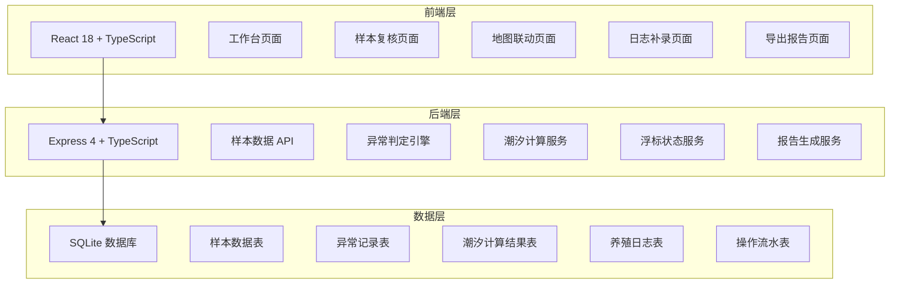
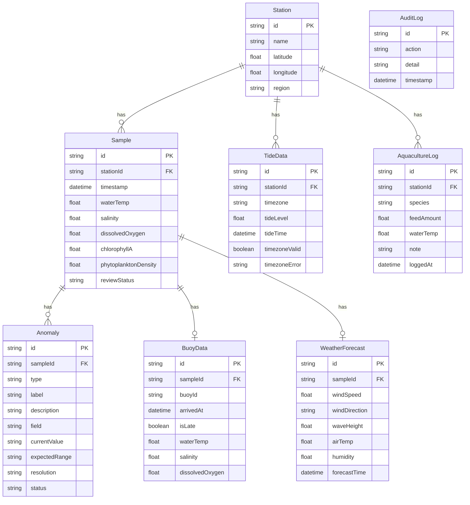

## 1. 架构设计



## 2. 技术说明

- 前端：React@18 + tailwindcss@3 + vite + zustand + recharts + leaflet
- 初始化工具：vite-init
- 后端：Express@4 + TypeScript (ESM)
- 数据库：SQLite (better-sqlite3)，含样例种子数据
- 地图：Leaflet + OpenStreetMap 瓦片
- 图表：Recharts（折线图、散点图）
- 报告导出：前端生成 HTML 报告，支持浏览器打印为 PDF

## 3. 路由定义

| 路由 | 用途 |
|------|------|
| / | 工作台：概览卡片、气象预报摘要、操作流水 |
| /review | 样本复核：三栏对齐视图、异常分类、浮标晚到提示 |
| /map | 地图联动：站位地图 + 数据联动面板 |
| /log | 日志补录：养殖日志补录表单 + 潮汐联动更新 |
| /export | 导出报告：报告预览 + 下载 |

## 4. API 定义

### 4.1 样本数据

```typescript
interface Sample {
  id: string
  stationId: string
  stationName: string
  timestamp: string
  latitude: number
  longitude: number
  waterTemp: number
  salinity: number
  dissolvedOxygen: number
  chlorophyllA: number
  phytoplanktonDensity: number
  weatherForecast: WeatherForecast
  buoyData: BuoyData | null
  tideData: TideData | null
  aquacultureLog: AquacultureLog | null
  anomalies: Anomaly[]
  reviewStatus: 'pending' | 'passed' | 'failed'
}

interface WeatherForecast {
  windSpeed: number
  windDirection: string
  waveHeight: number
  airTemp: number
  humidity: number
  forecastTime: string
}

interface BuoyData {
  buoyId: string
  arrivedAt: string | null
  isLate: boolean
  affectedConclusions: string[]
  waterTemp: number
  salinity: number
  dissolvedOxygen: number
}

interface TideData {
  stationId: string
  timezone: string
  tideLevel: number
  tideTime: string
  timezoneValid: boolean
  timezoneError: string | null
}

interface AquacultureLog {
  id: string
  stationId: string
  species: string
  feedAmount: number
  waterTemp: number
  note: string
  loggedAt: string
}

interface Anomaly {
  id: string
  sampleId: string
  type: 'supplement' | 'recalibrate'
  label: string
  description: string
  field: string
  currentValue: string
  expectedRange: string
  resolution: string
  status: 'open' | 'resolved'
}
```

### 4.2 API 端点

```typescript
// 样本
GET    /api/samples              // 获取样本列表（支持筛选）
GET    /api/samples/:id          // 获取单个样本详情
POST   /api/samples/import       // 导入样本数据

// 异常
GET    /api/anomalies            // 获取异常列表（支持按类型筛选）
PATCH  /api/anomalies/:id        // 更新异常状态（解决/关闭）

// 浮标
GET    /api/buoy/status          // 获取浮标数据到达状态
POST   /api/buoy/arrive          // 模拟浮标数据晚到

// 潮汐
GET    /api/tide/:stationId      // 获取站位潮汐数据
POST   /api/tide/recalculate     // 重新计算潮汐

// 养殖日志
POST   /api/aquaculture-log      // 补录养殖日志（触发潮汐联动更新）
GET    /api/aquaculture-log      // 获取养殖日志列表

// 报告
GET    /api/report               // 生成导出报告数据

// 站位
GET    /api/stations             // 获取监测站位列表（含坐标）

// 操作流水
GET    /api/audit-log            // 获取操作流水记录

// 概览
GET    /api/dashboard            // 获取工作台概览数据
```

## 5. 数据模型

### 5.1 数据模型定义



### 5.2 数据定义语言

```sql
CREATE TABLE station (
  id TEXT PRIMARY KEY,
  name TEXT NOT NULL,
  latitude REAL NOT NULL,
  longitude REAL NOT NULL,
  region TEXT NOT NULL
);

CREATE TABLE sample (
  id TEXT PRIMARY KEY,
  station_id TEXT NOT NULL REFERENCES station(id),
  timestamp TEXT NOT NULL,
  water_temp REAL,
  salinity REAL,
  dissolved_oxygen REAL,
  chlorophyll_a REAL,
  phytoplankton_density REAL,
  review_status TEXT NOT NULL DEFAULT 'pending'
);

CREATE TABLE weather_forecast (
  id TEXT PRIMARY KEY,
  sample_id TEXT NOT NULL REFERENCES sample(id),
  wind_speed REAL,
  wind_direction TEXT,
  wave_height REAL,
  air_temp REAL,
  humidity REAL,
  forecast_time TEXT NOT NULL
);

CREATE TABLE buoy_data (
  id TEXT PRIMARY KEY,
  sample_id TEXT NOT NULL REFERENCES sample(id),
  buoy_id TEXT NOT NULL,
  arrived_at TEXT,
  is_late INTEGER NOT NULL DEFAULT 0,
  water_temp REAL,
  salinity REAL,
  dissolved_oxygen REAL
);

CREATE TABLE tide_data (
  id TEXT PRIMARY KEY,
  station_id TEXT NOT NULL REFERENCES station(id),
  timezone TEXT NOT NULL,
  tide_level REAL,
  tide_time TEXT NOT NULL,
  timezone_valid INTEGER NOT NULL DEFAULT 1,
  timezone_error TEXT
);

CREATE TABLE anomaly (
  id TEXT PRIMARY KEY,
  sample_id TEXT NOT NULL REFERENCES sample(id),
  type TEXT NOT NULL,
  label TEXT NOT NULL,
  description TEXT NOT NULL,
  field TEXT NOT NULL,
  current_value TEXT NOT NULL,
  expected_range TEXT NOT NULL,
  resolution TEXT,
  status TEXT NOT NULL DEFAULT 'open'
);

CREATE TABLE aquaculture_log (
  id TEXT PRIMARY KEY,
  station_id TEXT NOT NULL REFERENCES station(id),
  species TEXT NOT NULL,
  feed_amount REAL,
  water_temp REAL,
  note TEXT,
  logged_at TEXT NOT NULL
);

CREATE TABLE audit_log (
  id TEXT PRIMARY KEY,
  action TEXT NOT NULL,
  detail TEXT,
  timestamp TEXT NOT NULL DEFAULT (datetime('now'))
);

CREATE INDEX idx_sample_station ON sample(station_id);
CREATE INDEX idx_sample_status ON sample(review_status);
CREATE INDEX idx_anomaly_sample ON anomaly(sample_id);
CREATE INDEX idx_anomaly_type ON anomaly(type);
CREATE INDEX idx_buoy_sample ON buoy_data(sample_id);
CREATE INDEX idx_tide_station ON tide_data(station_id);
CREATE INDEX idx_log_station ON aquaculture_log(station_id);
```
