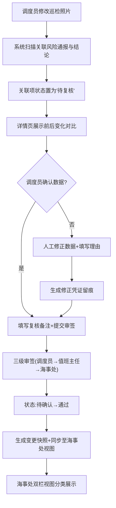

## 1. 产品概述

海洋牧场投喂日历是面向港口调度员与海事处的业务协同系统，解决「巡检照片修改后风险通报和结论联动混乱」、「轨迹漂移计算缺公式和失败原因」、「人工修正无留痕」、「结果可用性无法快速区分」四大核心痛点，构建从巡检数据采集→复核→通报→结论的全链路闭环。

- 目标用户：港口调度员（操作端）、海事处（审核/消费端）
- 核心价值：巡检-通报-结论的强一致性保障、计算过程全透明、人工修正全留痕、结果可用性分级一目了然

## 2. 核心功能

### 2.1 用户角色

| 角色 | 登录方式 | 核心权限 |
|------|----------|----------|
| 港口调度员 | 工号登录 | 上传/修改巡检照片、人工修正轨迹数据、执行复核操作、填写复核备注、申请重新采集 |
| 海事处审核员 | 工号登录 | 查看结果可用性分级、溯源来源材料、标记待复核项、确认结论、一键导出可用报告 |

### 2.2 功能模块

1. **投喂日历主页**：月度日历视图、巡检事件列表、结果可用性三色徽章（🟢可用/🟡暂缓/🔴重采）、海事处双栏视图切换
2. **巡检详情与联动面板**：照片预览、关联风险通报实时同步状态、关联结论待复核标记、前后变化对比组件
3. **轨迹漂移计算工具**：公式（Haversine 距离+航迹偏差率）展示区、单位标注、适用范围说明、可操作失败原因（如「缺 2026-06-12 06 时风场预报」）
4. **三大核心稳定模块**：复核备注审签流、轨迹清洗数据管道、水质预警（结论↔来源材料双向追溯）
5. **人工修正留痕中心**：修正凭证列表、操作人/时间戳、字段前后值对比、变更理由、待确认→通过的变更快照
6. **海事处视角视图**：双栏布局（直用栏 / 复核栏）、快速筛选、批量确认、来源材料一键跳转

### 2.3 页面细节

| 页面名称 | 模块名称 | 功能描述 |
|----------|----------|----------|
| 投喂日历主页 | 月度日历 | 按天展示巡检事件，单元格内显示可用性徽章数量，点击跳转当日详情 |
| 投喂日历主页 | 结果筛选器 | 角色切换（调度员/海事处）、可用性筛选、日期范围、所属牧场 |
| 投喂日历主页 | 海事处双栏 | 左栏「可直接使用」右栏「待调度员复核」，支持拖拽批量标记 |
| 巡检详情页 | 照片联动区 | 照片修改后自动标红关联风险通报与结论，显示「有 N 项待复核」 |
| 巡检详情页 | 前后变化对比 | 左右分栏展示修改前/后照片与数据，差异字段高亮 |
| 轨迹漂移计算页 | 公式展示卡 | Haversine 公式+航迹偏差率公式、单位（米/海里/%）、适用范围（距离 5-500 海里、时速<25节） |
| 轨迹漂移计算页 | 失败提示区 | 缺数据时给出具体可操作建议（如「请补传 6 月 12 日 02:00-08:00 AIS 原始报文」） |
| 复核备注模块 | 审签流 | 三级复核链（调度员→值班主任→海事处），每级留痕不可删除 |
| 轨迹清洗模块 | 管道面板 | 展示原始点→去重→插值→平滑→异常剔除 5 步，每步可点击查看数量变化 |
| 水质预警模块 | 来源追溯 | 结论卡片点击可展开对应原始监测记录、气象报告、照片缩略图 |
| 修正留痕中心 | 凭证列表 | 时间倒序展示修正凭证，含操作人、字段、前后值、理由、审批状态 |
| 修正留痕中心 | 变更快照 | 待确认→通过时自动生成快照，可 PDF 导出 |

## 3. 核心流程

### 主流程：巡检照片修改→联动复核→结论确认

港口调度员上传或修改巡检照片 → 系统自动检测与该巡检关联的风险通报和结论 → 将关联项状态置为「待复核」并计数提示 → 调度员进入详情页查看前后对比 → 确认或修正风险通报/结论 → 填写复核备注并提交审签 → 三级审签通过 → 状态从「待确认」→「通过」并生成变更快照 → 海事处视角同步更新为「🟢可用」

### 辅助流程：轨迹漂移计算失败

调度员输入轨迹数据 → 系统校验输入完整性 → 缺风场预报/气象数据时终止并提示「缺 X 月 X 日 X 时风场预报，请至气象数据平台补传」→ 补传后自动重试 → 计算成功展示公式代入过程与结果

## 4. 用户界面设计

### 4.1 设计风格

- **主色调**：深海蓝 `#0A2540`（信任/海事专业感）+ 钢青 `#1A5F7A`（辅助）+ 警示琥珀 `#F59E0B`
- **可用性分级色**：🟢可用 `#10B981` / 🟡暂缓 `#F59E0B` / 🔴重采 `#EF4444`
- **按钮风格**：圆角 6px、微阴影、hover 时轻微上浮（translateY -1px + shadow 加深）
- **字体**：标题用「思源宋体 CN SemiBold」体现文档感；正文用「JetBrains Mono + PingFang SC」等宽对齐数值，中文阅读友好
- **布局风格**：左侧导航栏固定 + 顶部面包屑 + 主内容卡片式分区；海事处视图采用严格左右双栏等宽
- **图标风格**：Lucide 线性图标，关键状态点用实心圆点徽章叠加；修正凭证用带时间戳的折角文件视觉

### 4.2 页面设计概览

| 页面名称 | 模块名称 | UI 元素 |
|----------|----------|---------|
| 投喂日历主页 | 月度日历 | 深海蓝底+白色日期格，可用性徽章按数量以小圆点堆叠在格内右下角；hover 展开当日事件浮层 |
| 投喂日历主页 | 海事处双栏 | 左右两栏顶部带醒目色条（🟢绿色条/🟡黄色条），卡片间细分割线，栏顶计数徽章 |
| 巡检详情页 | 前后对比 | 左右分割带 VS 徽章在中线；差异区域用虚线框 + 琥珀色描边高亮；差异字段以 Δ 前缀展示新旧值 |
| 轨迹漂移计算页 | 公式卡 | 米白卡面（#FAF7F2）+ 米色阴影；公式用 LaTeX 风格排版；失败原因用红色左侧边条 + 带图标的建议列表 |
| 轨迹清洗模块 | 管道面板 | 5 步横向箭头流程图；每步为胶囊状节点，显示数据量 N→M 变化；点击展开明细抽屉 |
| 修正留痕中心 | 凭证列表 | 时间轴纵向布局；每条凭证左侧色条（黄色=待确认/绿色=已通过/红色=已驳回）；展开时显示前后值对比表格 |

### 4.3 响应式

- **设计基准**：Desktop-first（1440px 主设计稿）
- **断点适配**：
  - ≥1280px：完整三栏布局（导航+筛选+主内容）
  - 1024-1280px：筛选器折叠为顶部抽屉，海事处双栏保留
  - 768-1024px：海事处双栏变上下堆叠；导航收起为汉堡菜单
  - <768px：仅保留日历+事件列表核心功能，卡片纵向堆叠

### 4.4 动效设计

- 页面加载：主内容区从下往上 24px 渐入（stagger 40ms 每张卡片）
- 状态变更：「待确认→通过」时卡片边框由琥珀色闪绿一次（border-color 过渡 400ms）
- 前后对比：鼠标悬停差异区时高亮边框脉冲 2 次
- 公式卡：失败提示从右侧滑入（translateX 40px → 0），带轻微弹性
