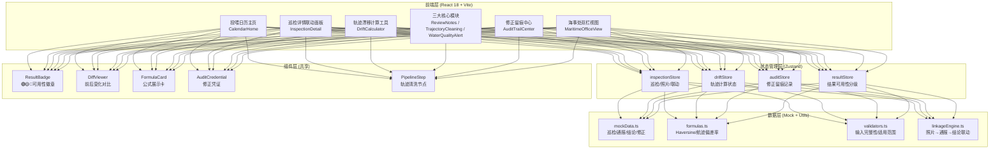
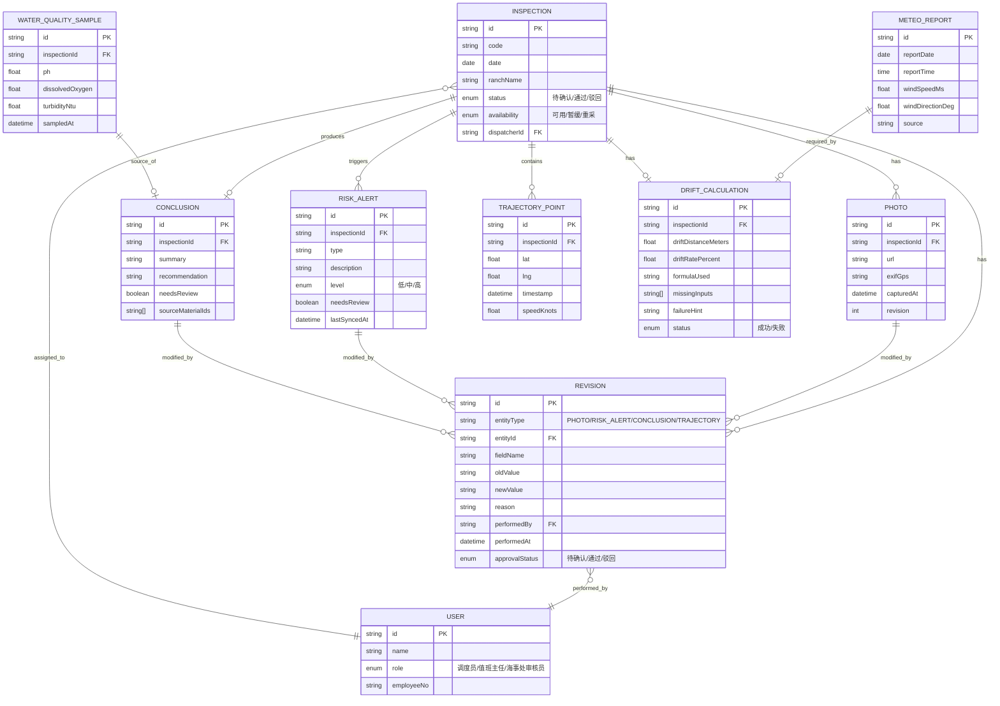

## 1. 架构设计



## 2. 技术说明

- **前端框架**：React@18 + TypeScript@5 + Vite@5
- **初始化工具**：vite-init（react-ts 模板，含 react-router-dom、tailwindcss@3、zustand）
- **后端方案**：无后端，全部使用 Mock 数据驱动，业务逻辑封装在 Utils 层
- **图标库**：lucide-react（严格遵循 skill 规范）
- **CSS 方案**：Tailwind CSS@3 + CSS 变量管理主题色 token
- **状态管理**：Zustand（4 个专项 store 分治）
- **路由方案**：react-router-dom v6，HashRouter

## 3. 路由定义

| 路由 | 页面 | 用途 |
|------|------|------|
| `/` | CalendarHome | 投喂日历主页：月度日历 + 事件列表 + 角色切换 + 海事处双栏视图 |
| `/inspection/:id` | InspectionDetail | 巡检详情：照片联动 + 前后对比 + 复核备注 + 关联结论/通报状态 |
| `/drift-calculator` | DriftCalculator | 轨迹漂移计算工具：公式展示 + 输入 + 结果 + 失败可操作提示 |
| `/trajectory-cleaning` | TrajectoryCleaning | 轨迹清洗：5 步数据管道可视化 + 清洗后结果 |
| `/water-quality` | WaterQualityAlert | 水质预警：结论列表 + 来源材料双向追溯 |
| `/audit-trail` | AuditTrailCenter | 修正留痕中心：修正凭证 + 变更快照 + 时间轴 |

## 4. 数据模型

### 4.1 ER 图



### 4.2 类型定义（TypeScript）

```typescript
// 枚举定义
export type Availability = 'AVAILABLE' | 'PENDING' | 'RECOLLECT';
export type EntityStatus = 'DRAFT' | 'PENDING_CONFIRM' | 'APPROVED' | 'REJECTED';
export type Role = 'DISPATCHER' | 'SUPERVISOR' | 'MARITIME_REVIEWER';
export type RiskLevel = 'LOW' | 'MEDIUM' | 'HIGH';
export type EntityType = 'PHOTO' | 'RISK_ALERT' | 'CONCLUSION' | 'TRAJECTORY';
export type CalcStatus = 'SUCCESS' | 'FAILED';
export type ReviewStage = 'DISPATCHER' | 'SUPERVISOR' | 'MARITIME';

// 核心实体
export interface User { id: string; name: string; role: Role; employeeNo: string; }

export interface Photo {
  id: string; inspectionId: string; url: string;
  exifGps?: { lat: number; lng: number };
  capturedAt: string; revision: number;
}

export interface RiskAlert {
  id: string; inspectionId: string; type: string;
  description: string; level: RiskLevel;
  needsReview: boolean; lastSyncedAt: string;
}

export interface Conclusion {
  id: string; inspectionId: string; summary: string;
  recommendation: string; needsReview: boolean;
  sourceMaterialIds: string[];
}

export interface TrajectoryPoint {
  id: string; inspectionId: string; lat: number;
  lng: number; timestamp: string; speedKnots: number;
}

export interface DriftCalculation {
  id: string; inspectionId: string;
  driftDistanceMeters?: number; driftRatePercent?: number;
  formulaUsed: string; missingInputs: string[];
  failureHint?: string; status: CalcStatus;
}

export interface Revision {
  id: string; entityType: EntityType; entityId: string;
  fieldName: string; oldValue: string; newValue: string;
  reason: string; performedBy: string; performedAt: string;
  approvalStatus: EntityStatus; snapshotId?: string;
}

export interface Inspection {
  id: string; code: string; date: string;
  ranchName: string; status: EntityStatus;
  availability: Availability; dispatcherId: string;
  photos: Photo[]; riskAlerts: RiskAlert[];
  conclusion?: Conclusion; trajectory: TrajectoryPoint[];
  driftCalculation?: DriftCalculation;
  revisions: Revision[];
}

// 联动引擎输入/输出
export interface LinkageDelta {
  inspectionId: string; modifiedEntityType: EntityType;
  modifiedEntityId: string; affectedAlerts: string[];
  affectedConclusion: boolean;
}

// 轨迹清洗管道输出
export interface CleaningPipelineResult {
  step: string; inputCount: number;
  outputCount: number; removedCount: number;
  sampleBefore: TrajectoryPoint[]; sampleAfter: TrajectoryPoint[];
}
```

## 5. 核心算法说明

### 5.1 Haversine 距离公式（封装在 `formulas.ts`）
- 用途：计算两点间大圆距离（航迹点 vs 计划点）
- 输入：lat1/lng1（实际）、lat2/lng2（计划）
- 输出：距离（米）
- 失败场景：任一坐标缺值、超出适用范围（>500 海里返回 FAILED + 提示）

### 5.2 航迹偏差率（封装在 `formulas.ts`）
- 公式：偏差率 = (∑漂移距离 ÷ 计划总航程) × 100%
- 单位：%
- 适用范围：计划航程 > 1 海里，否则结果标记「暂缓」

### 5.3 联动引擎（`linkageEngine.ts`）
- 触发：任何 PHOTO 实体发生 CREATE/UPDATE
- 规则：扫描同 inspectionId 下的 RISK_ALERT（全部 needsReview=true）+ CONCLUSION（needsReview=true）
- 输出：`LinkageDelta` + 写入 revision 记录（entityType=SYSTEM_LINKAGE）

### 5.4 结果可用性判定（`resultStore`）
- 规则矩阵：
  - 状态=通过 + 无待复核项 → 🟢可用
  - 状态=待确认 或 存在待复核项 → 🟡暂缓
  - 重采标志位=true（照片/轨迹/水质任一缺失）→ 🔴重采
- 海事处双栏分类：🟢→左栏「可直接使用」；🟡🔴→右栏「待复核」
