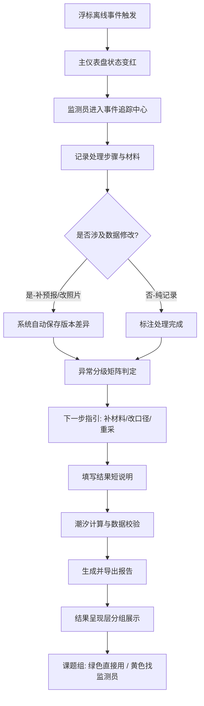

## 1. 产品概述
面向海洋监测员与课题组的浮标传感器离线状态追踪与数据质量管理平台，解决传统便签记录导致的处理过程丢失、评审沟通低效、异常处理口径模糊等痛点。
- 核心价值：完整记录浮标离线事件的处理轨迹、数据变更与版本差异，提供潮汐计算、报告导出、风险分层的一站式工作流
- 目标用户：一线海洋监测员（日常操作）、海洋课题组（结果复核与使用）、评审专家（过程审阅）

## 2. 核心特性

### 2.1 用户角色
| 角色 | 使用场景 | 核心权限 |
|------|----------|----------|
| 海洋监测员 | 日常浮标状态追踪、异常处理、报告导出 | 全功能操作、数据编辑、版本提交、视角保存 |
| 课题组用户 | 结果查阅、数据可用性判断、复核标记 | 只读、复核标记、导出数据、筛选可用数据 |
| 评审/讲解 | 过程审阅、截图沟通、差异展示 | 只读、历史回溯、视角切换、对比视图 |

### 2.2 功能模块
1. **主仪表盘**：浮标状态总览、实时离线监控、视角切换与保存、颜色图例
2. **事件追踪中心**：离线事件时间线、处理过程记录、版本差异对比、变更溯源
3. **异常分级处理**：风险分层矩阵、异常分类指引、下一步操作建议（补材料/改口径）
4. **潮汐计算与报告**：潮汐曲线计算、预报数据校验、报告模板导出
5. **数据质量检查**：船舶轨迹清洗（空值/重复/备注混写）、数据可用性标识
6. **结果呈现层**：可用/暂缓/重采三色标记、直接使用/需复核分组、结果说明卡片

### 2.3 页面详情
| 页面名称 | 模块名称 | 功能描述 |
|----------|----------|----------|
| 主仪表盘 | 浮标状态矩阵 | 网格化展示所有浮标实时状态，颜色区分正常/离线/异常，悬停显示详细信息，支持越界闪烁提示 |
| 主仪表盘 | 视角保存面板 | 保存当前筛选条件、缩放级别、聚焦浮标为命名视角，支持快速切换，便于评审截图 |
| 主仪表盘 | 颜色图例面板 | 固定位置图例，说明颜色、图标、闪烁样式的含义，可折叠不遮挡内容 |
| 事件追踪中心 | 事件时间线 | 单浮标维度的离线事件时间轴，每条记录包含状态、处理人、时间、操作类型 |
| 事件追踪中心 | 版本差异对比 | 并排展示气象预报补版前后、巡检照片修改前后的字段级差异，高亮增删改 |
| 事件追踪中心 | 来源材料锚点 | 每条结论可回溯到原始材料（预报文件、照片EXIF、巡检记录），点击跳转 |
| 异常分级处理 | 风险分层矩阵 | 按异常类型×影响程度二维分级，不同层级对应不同颜色与处理路径 |
| 异常分级处理 | 下一步指引 | 针对风浪预报晚到等场景，区分"需补材料"/"需改口径"/"需重新采集"三类动作 |
| 异常分级处理 | 说明编辑器 | 内置短说明模板，自动填入可用数据范围、暂缓数据清单、重采建议 |
| 潮汐计算与报告 | 潮汐曲线计算 | 基于港口基准数据计算指定时段潮高、涨落潮时段，可视化曲线叠加预报数据 |
| 潮汐计算与报告 | 数据校验标记 | 标记预报数据是否晚到、是否越界，校验结果嵌入潮汐曲线 |
| 潮汐计算与报告 | 报告导出中心 | 支持PDF/Word导出，内含处理轨迹摘要、潮汐图、风险结论、来源清单 |
| 数据质量检查 | 轨迹清洗面板 | 展示船舶轨迹中的空值位置、重复点、备注混写字段，支持一键清洗与人工确认 |
| 数据质量检查 | 可用性标注 | 每条数据自动标注"直接可用"/"需清洗"/"不可用"，支持批量调整 |
| 结果呈现层 | 交付分组视图 | 顶部双栏："可直接使用"（绿色背景）与"需监测员复核"（黄色边框）清晰分块 |
| 结果呈现层 | 结果说明卡片 | 每条记录附带短说明：哪些数据可用、哪些暂缓、哪些重采，支持展开查看详情 |

## 3. 核心流程

### 3.1 海洋监测员日常处理流程
监测员登录→查看主仪表盘离线浮标→进入事件追踪中心→记录处理操作→补录气象预报/修改巡检记录→系统自动记录版本差异→异常分级判断→系统建议下一步动作→填写短说明→潮汐计算校验→导出报告

### 3.2 课题组查阅流程
课题组进入结果呈现层→顶部双栏区分"可直接使用"/"需复核"→点击绿色卡片直接取用数据→点击黄色卡片联系监测员或查看原因→查看结果说明卡片中的可用性说明→筛选特定浮标或时段→按需导出

### 3.3 评审/讲解流程
选择已保存的评审视角→截图沟通状态分布→展开颜色图例说明含义→进入事件时间线查看处理过程→对比版本差异高亮→查看来源材料锚点→导出包含完整轨迹的报告

## 4. 用户界面设计

### 4.1 设计风格
- **主色调**：深海蓝（#0A2342）作为背景基调，搭配海沫青（#2CA6A4）作为主色点缀，数据异常使用珊瑚红（#E84855），可用状态使用海藻绿（#3CB371），待复核使用沙金黄（#F4B942）
- **按钮风格**：航海仪表风格，微立体边框，圆角6px，主按钮用海沫青渐变，危险按钮用珊瑚红描边
- **字体方案**：标题使用"ZCOOL XiaoWei"（中文航海感衬线体），正文数据使用"JetBrains Mono"等宽字体便于数字对齐，说明文字使用"PingFang SC"
- **布局风格**：固定左侧导航（深海军蓝），顶部视角/面包屑栏，主内容区采用卡片式模块化布局，关键指标使用仪表盘圆形组件
- **图标风格**：线性海洋主题图标（浮标、海浪、锚、指南针），状态图标配合颜色编码，异常状态带脉冲动画

### 4.2 页面设计总览
| 页面名称 | 模块名称 | UI元素 |
|----------|----------|--------|
| 主仪表盘 | 浮标状态矩阵 | 深蓝色背景网格卡片，每个浮标一个状态块，颜色编码+脉冲动画，悬停弹出详情卡，右上角视角切换下拉 |
| 主仪表盘 | 视角与图例面板 | 顶部半透明浮层，左侧视角名称与保存按钮，右侧可折叠图例说明，图例每项带颜色块+文字说明 |
| 事件追踪中心 | 时间线与差异对比 | 左侧垂直时间线（带锚点图标），右侧双栏差异对比，差异文本用绿色删除线/红色下划线标记 |
| 异常分级处理 | 风险矩阵与指引 | 5×5网格矩阵，单元格颜色深浅对应风险等级，选中单元格后下方显示对应下一步指引与快捷操作按钮 |
| 潮汐计算与报告 | 曲线与导出 | SVG绘制潮汐曲线，叠加预报数据点（晚到数据用虚线圆圈标记），右侧导出面板含模板选择与预览缩略图 |
| 数据质量检查 | 轨迹清洗面板 | 表格视图，异常行带背景色标记，空值用灰色占位，重复点用连线标识，顶部一键清洗按钮 |
| 结果呈现层 | 交付分组视图 | 顶部大标题分区：海藻绿背景"可直接使用"区与沙金黄边框"需监测员复核"区，每张卡片底部含短说明标签行 |

### 4.3 响应式设计
- 桌面端（≥1280px）：固定侧栏+多栏卡片布局，浮标矩阵最多8列
- 平板端（768-1279px）：侧栏可收起为图标，矩阵降为4-5列，差异对比改为上下堆叠
- 移动端（<768px）：顶部汉堡菜单，矩阵单列列表，潮汐曲线简化为数据摘要

### 4.4 视觉动效与截图友好性
- 越界提示：浮标越界时边框2秒脉冲闪烁1次+红点呼吸灯，不持续闪烁避免截图时过曝
- 视角切换：保存视角时显示指南针旋转动画，切换时200ms淡入淡出
- 加载动效：数据加载时显示海浪波动进度条，非旋转加载器，契合海洋主题
- 悬停微交互：卡片悬停时上浮2px+阴影加深，按钮悬停时锚图标轻微摆动
- 截图优化：提供"截图模式"开关，关闭所有动效、折叠侧栏、显示完整图例，保证评审截图清晰度
