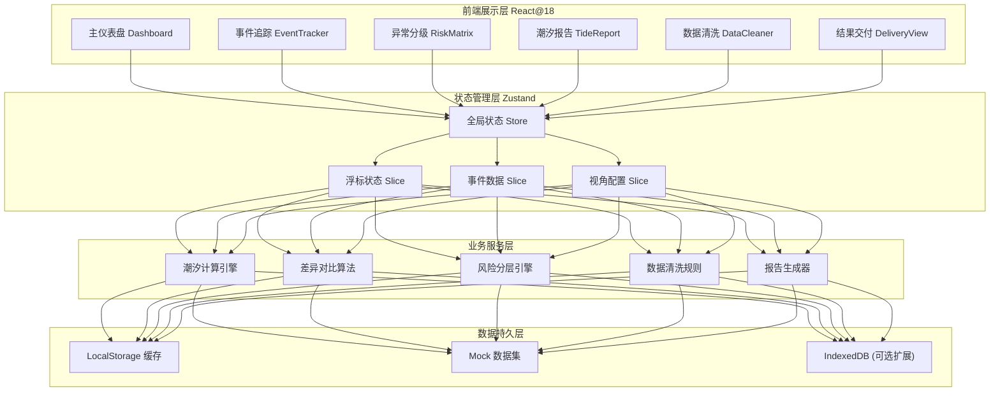
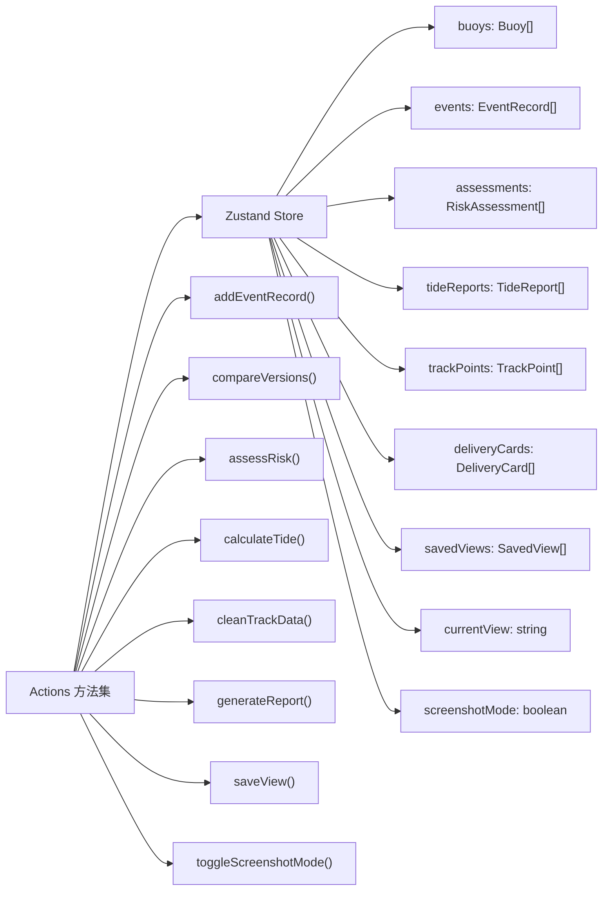
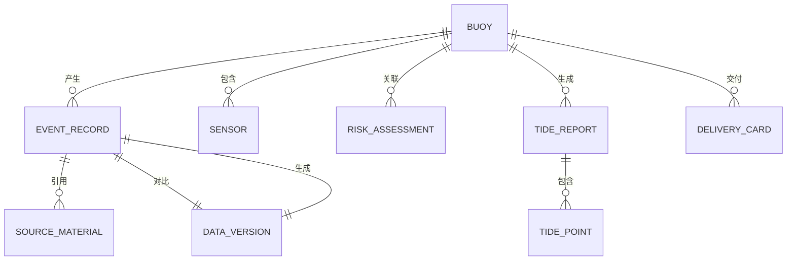

## 1. 架构设计



## 2. 技术说明
- **前端框架**: React@18 + TypeScript@5
- **构建工具**: Vite@5
- **样式方案**: TailwindCSS@3 + CSS变量主题系统
- **状态管理**: Zustand@4 (轻量级状态管理，适合多层级组件共享)
- **路由方案**: React Router@6 (多视图SPA路由)
- **图表组件**: Recharts@2 (潮汐曲线、状态趋势图)
- **图标方案**: 自定义SVG图标组（航海主题）+ Lucide React（通用图标）
- **日期处理**: dayjs@1 (潮汐计算、时间格式化)
- **工具库**: uuid (唯一标识生成), diff-match-patch (文本差异对比算法)
- **后端**: 无后端，使用Mock数据 + LocalStorage持久化，便于离线演示
- **数据库**: LocalStorage (主) + IndexedDB (大数据量扩展预留)

## 3. 路由定义
| 路由路径 | 页面名称 | 主要功能 |
|----------|----------|----------|
| `/` | 重定向到主仪表盘 | 入口跳转 |
| `/dashboard` | 浮标追踪主仪表盘 | 状态矩阵、视角管理、颜色图例、统计概览 |
| `/events/:buoyId` | 事件追踪中心 | 时间线、处理记录、版本差异对比、来源材料锚点 |
| `/risk-matrix` | 异常分级处理 | 风险分层矩阵、下一步指引、说明编辑器 |
| `/tide-report` | 潮汐计算与报告 | 潮汐曲线、预报校验、PDF/Word报告导出 |
| `/data-cleaner` | 数据质量检查 | 轨迹清洗、空值/重复检测、可用性标注 |
| `/delivery` | 结果呈现层 | 可直接使用/需复核双栏分组、结果说明卡片 |

## 4. 核心数据类型定义

```typescript
// 浮标状态枚举
type BuoyStatus = 'normal' | 'offline' | 'anomaly' | 'out_of_range' | 'pending';

// 浮标传感器
interface Buoy {
  id: string;
  name: string;
  code: string;
  location: { lat: number; lng: number };
  status: BuoyStatus;
  lastOnline: string;
  offlineDuration: number;
  sensors: Sensor[];
}

// 传感器
interface Sensor {
  id: string;
  type: 'temperature' | 'salinity' | 'pressure' | 'wave' | 'wind';
  value: number;
  threshold: { min: number; max: number };
  isOutOfRange: boolean;
}

// 事件追踪记录
interface EventRecord {
  id: string;
  buoyId: string;
  timestamp: string;
  operator: string;
  operationType: 'offline_detected' | 'forecast_updated' | 'photo_modified' | 'status_checked' | 'note_added';
  content: string;
  sourceMaterial?: SourceMaterial;
  versionBefore?: DataVersion;
  versionAfter?: DataVersion;
}

// 数据版本（用于差异对比）
interface DataVersion {
  id: string;
  timestamp: string;
  fields: Record<string, any>;
}

// 差异项
interface DiffItem {
  field: string;
  oldValue: any;
  newValue: any;
  type: 'added' | 'modified' | 'deleted';
}

// 来源材料
interface SourceMaterial {
  id: string;
  type: 'forecast_file' | 'inspection_photo' | 'ship_track' | 'manual_note';
  name: string;
  uploadedAt: string;
  uploader: string;
  exifInfo?: Record<string, any>;
}

// 风险等级
type RiskLevel = 'low' | 'medium' | 'high' | 'critical';
type AnomalyType = 'late_forecast' | 'sensor_drift' | 'data_gap' | 'track_anomaly' | 'out_of_range';
type NextAction = 'supplement_material' | 'adjust_caliber' | 'recollect';

// 风险矩阵项
interface RiskAssessment {
  id: string;
  buoyId: string;
  anomalyType: AnomalyType;
  impactLevel: 1 | 2 | 3 | 4 | 5;
  likelihoodLevel: 1 | 2 | 3 | 4 | 5;
  riskLevel: RiskLevel;
  nextAction: NextAction;
  shortDescription: string;
  availableData: string[];
  pendingData: string[];
  recollectData: string[];
}

// 潮汐数据点
interface TidePoint {
  time: string;
  height: number;
  isForecast: boolean;
  isLate: boolean;
  isOutOfRange: boolean;
}

// 潮汐报告
interface TideReport {
  id: string;
  buoyId: string;
  portName: string;
  startDate: string;
  endDate: string;
  tideData: TidePoint[];
  highTides: TidePoint[];
  lowTides: TidePoint[];
  forecastQuality: {
    onTimeRate: number;
    outOfRangeCount: number;
  };
}

// 船舶轨迹点
interface TrackPoint {
  id: string;
  timestamp: string;
  lat: number | null;
  lng: number | null;
  speed: number | null;
  remark: string;
  qualityFlags: ('null_value' | 'duplicate' | 'mixed_remark')[];
  availability: 'available' | 'need_clean' | 'unavailable';
}

// 交付结果卡片
interface DeliveryCard {
  id: string;
  buoyId: string;
  buoyName: string;
  dataPeriod: { start: string; end: string };
  status: 'direct_use' | 'need_review';
  shortDescription: string;
  availableItems: string[];
  pendingItems: string[];
  recollectItems: string[];
  reviewer?: string;
  reviewNote?: string;
}

// 保存视角
interface SavedView {
  id: string;
  name: string;
  description: string;
  createdAt: string;
  filter: {
    statuses: BuoyStatus[];
    buoyIds: string[];
    dateRange?: { start: string; end: string };
  };
  zoomLevel: number;
  focusBuoyId?: string;
}
```

## 5. 状态管理架构



## 6. 数据模型与初始化策略

### 6.1 实体关系



### 6.2 Mock 数据初始化说明
- **浮标数据**: 初始化12个浮标（4个正常、3个离线、2个异常、2个越界、1个待复核），覆盖全部状态类型
- **事件数据**: 每个离线浮标生成5-8条追踪记录，包含至少1次气象预报补版与1次巡检照片修改场景
- **风险评估**: 生成8个典型案例，覆盖风浪预报晚到、传感器漂移、数据断档等场景
- **潮汐数据**: 生成3个港口的7天潮汐数据，包含至少2个晚到预报点与1个越界点
- **轨迹数据**: 生成1条船舶100个轨迹点，故意植入10%空值、5%重复点、3处备注混写
- **交付卡片**: 生成6张交付卡片（4张可直接使用、2张需监测员复核）
- **保存视角**: 预置3个常用视角："全部浮标总览"、"离线浮标聚焦"、"评审截图视角"

### 6.3 本地持久化策略
- 首次加载：检查 localStorage 键 `buoy_tracker_init_v1`，不存在则写入完整Mock数据
- 每次状态变更：自动 debounce（300ms）持久化到 localStorage
- 数据版本管理：存储结构变更时通过版本号触发迁移，防止旧数据崩溃
- 导出/导入：支持JSON格式完整导出数据库文件，便于演示环境迁移
