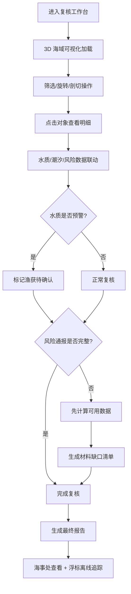

## 1. 产品概述

海钓比赛渔获台账交互式复核系统，面向海事安全员提供 3D 可视化复核工具，整合渔获记录、水质监测、潮汐表、风险通报等多口径材料，支持旋转、剖切、筛选、对象明细联动操作，解决人工复核效率低、数据口径不统一的问题。

- 目标用户：海事安全员、海事处审核人员
- 核心价值：多源数据一体化复核、3D 可视化交互、智能容错与缺口追踪

## 2. 核心功能

### 2.1 用户角色

| 角色 | 登录方式 | 核心权限 |
|------|----------|----------|
| 海事安全员 | 账号登录 | 数据复核、3D 交互操作、标记问题、提交复核意见 |
| 海事处审核员 | 账号登录 | 查看最终报告、追踪材料缺口、导出复核结果 |

### 2.2 功能模块

1. **3D 海域可视化**：海域地形、渔点分布、浮标位置、水质热图
2. **渔获台账管理**：渔获列表、筛选过滤、详情查看、数据校验
3. **水质监测面板**：水质指标展示、预警标记、历史趋势
4. **潮汐计算模块**：潮汐表展示、潮高曲线、前后潮汐对比
5. **风险通报中心**：风险通报列表、缺失告警、容错处理
6. **复核工作台**：复核入口、问题标记、复核意见、复核进度
7. **报告与追踪**：最终报告生成、浮标离线追踪、材料缺口清单

### 2.3 页面详情

| 页面名称 | 模块名称 | 功能描述 |
|----------|----------|----------|
| 复核工作台 | 3D 海域场景 | Three.js 渲染海域地形、渔点、浮标，支持旋转缩放 |
| 复核工作台 | 剖切控制面板 | 支持水平/垂直剖切，查看水下地形和数据剖面 |
| 复核工作台 | 筛选工具栏 | 按鱼种、日期、渔点、水质等级筛选 |
| 复核工作台 | 对象详情面板 | 点击 3D 对象显示详细数据，与列表联动 |
| 复核工作台 | 复核入口按钮 | 侧边栏常驻复核入口，一键进入复核模式 |
| 水质监测 | 水质预警联动 | 水质预警时自动影响渔获有效性判断 |
| 潮汐计算 | 潮汐对比视图 | 显示潮汐前后数据差异，支持时间轴拖动 |
| 风险通报 | 容错处理 | 风险通报缺失时先计算可用数据，再列出缺口 |
| 报告页面 | 浮标离线追踪 | 展示浮标离线时间、关联材料、卡点位置 |
| 报告页面 | 材料缺口清单 | 列出缺失的风险通报和其他材料 |

## 3. 核心流程

海事安全员从复核入口进入系统，在 3D 海域视图中通过旋转、剖切、筛选定位待复核数据。点击对象查看明细时，水质、潮汐、风险数据联动展示。若水质预警触发，则自动标记相关渔获记录为待确认。风险通报缺失时系统先完成可计算部分，并生成缺口清单供补充。海事处查看最终报告时，可追溯每处数据的材料来源和浮标离线卡点。

## 4. 用户界面设计

### 4.1 设计风格

- **主色调**：深海蓝 (#0A1628) 为主背景，科技青 (#00D4AA) 为强调色
- **辅助色**：警戒橙 (#FF6B35) 用于预警，柔和蓝 (#3B82F6) 用于数据
- **整体风格**：海事科技仪表盘风格，深色主题，数据发光效果，海洋氛围感
- **字体**：标题使用 Orbitron（科技感），正文使用 JetBrains Mono（数据可读性）
- **布局**：左侧导航 + 中央 3D 场景 + 右侧详情面板的三栏布局
- **动效**：数据点脉冲发光、水面波纹、面板滑入滑出过渡

### 4.2 页面设计概览

| 页面名称 | 模块名称 | UI 元素 |
|----------|----------|---------|
| 复核工作台 | 3D 场景 | 暗色海域、发光渔点、半透明水面、景深效果 |
| 复核工作台 | 侧边工具栏 | 图标按钮组、剖切切换、筛选下拉、模式开关 |
| 复核工作台 | 详情面板 | 毛玻璃背景、数据卡片、标签页切换、联动高亮 |
| 复核工作台 | 复核入口 | 右侧悬浮按钮、脉冲动画、数字角标 |
| 水质监测 | 预警面板 | 红色渐变边框、闪烁图标、时间线展示 |
| 潮汐计算 | 曲线图 | 平滑曲线、潮高填充、前后对比双色叠加 |
| 报告页面 | 缺口清单 | 列表卡片、缺失标记、补充按钮、优先级标签 |

### 4.3 响应式

- 桌面端优先设计（核心用户为桌面办公）
- 右侧详情面板可折叠，适配中等屏幕
- 工具栏在小屏转为底部抽屉式
- 3D 场景始终自适应容器大小

### 4.4 3D 场景指引

- **环境**：深海环境雾效，深蓝色渐变背景，水面半透明折射
- **光照**：主光源模拟日光，环境光偏蓝，点光源标记浮标
- **相机**：透视相机，初始俯视角，支持轨道控制旋转缩放
- **构图**：海域居中，渔点分布有疏有密，浮标沿航线排列
- **交互**：点击选中对象高亮发光，hover 显示名称标签
- **后处理**：Bloom 发光效果、轻微色彩映射、FXAA 抗锯齿
- **性能**：实例化渲染渔点，LOD 地形，目标 60fps
