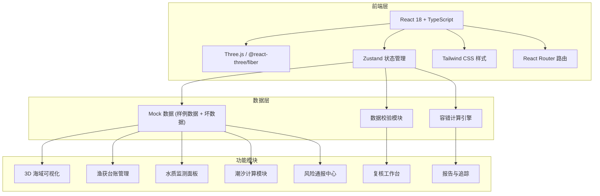
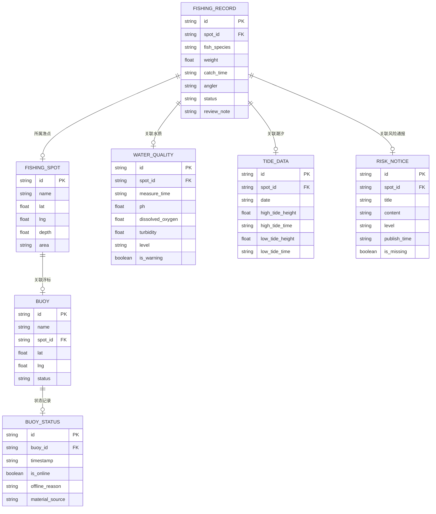

## 1. 架构设计

## 2. 技术描述

- **前端框架**：React 18 + TypeScript + Vite
- **3D 渲染**：three + @react-three/fiber + @react-three/drei + @react-three/postprocessing
- **状态管理**：zustand
- **路由**：react-router-dom
- **样式**：tailwindcss@3
- **图表**：recharts（潮汐曲线图、水质趋势图）
- **图标**：lucide-react
- **后端**：无（纯前端 Mock 数据演示）
- **数据**：内置样例数据，包含真实感坏数据

## 3. 路由定义

| 路由 | 页面名称 | 用途 |
|------|----------|------|
| / | 复核工作台 | 主页面，3D 海域 + 工具栏 + 详情面板 |
| /report | 复核报告 | 最终报告、浮标离线追踪、材料缺口清单 |
| /review | 复核模式 | 专门的复核流程页面（从复核入口进入） |

## 4. 数据模型

### 4.1 数据模型定义

### 4.2 样例数据设计

#### 正常数据
- 5 个渔点，分布在不同海域
- 20+ 条渔获记录，涵盖不同鱼种
- 10+ 条水质记录，包含优良中差等级
- 7 天潮汐表数据
- 5 个浮标设备

#### 真实感坏数据
- 1 条渔获记录重量异常偏大（疑似录入错误）
- 1 条水质记录 pH 值超出正常范围
- 1 个浮标中途离线（有离线时间和原因）
- 2 条风险通报缺失（模拟材料不全）
- 1 条潮汐数据时间格式不统一（不同口径）
- 1 条渔获记录的鱼种名称有错别字
- 部分数据经纬度精度不一致

## 5. 核心模块说明

### 5.1 3D 可视化模块
- 基于 @react-three/fiber 构建
- 程序化生成海域地形
- 实例化渲染渔点和浮标
- 支持 ClippingPlane 剖切
- 后处理：Bloom、FXAA

### 5.2 数据联动机制
- Zustand store 统一管理选中状态
- 点击 3D 对象触发详情面板更新
- 筛选条件同步影响 3D 场景可见性
- 水质预警自动标记相关渔获

### 5.3 容错计算引擎
- 数据完整性检查
- 缺失数据降级处理
- 缺口清单自动生成
- 部分计算结果缓存

### 5.4 复核流程
- 侧边栏常驻复核入口
- 复核模式下问题标记功能
- 复核意见保存
- 复核进度追踪
