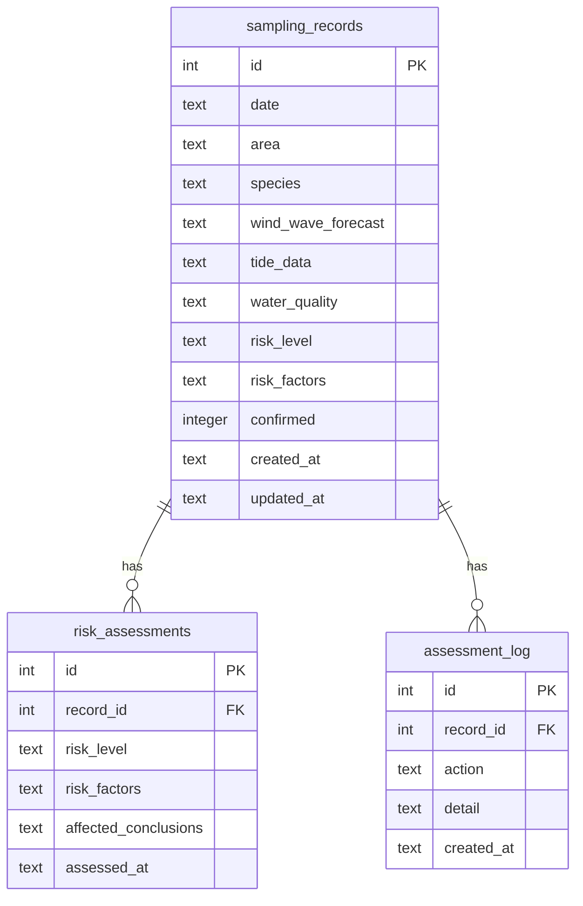

## 1. 架构设计

```mermaid
flowchart TD
    "浏览器（React 前端）" --> "Express API 层"
    "Express API 层" --> "业务逻辑层（风险评估/影响链）"
    "业务逻辑层（风险评估/影响链）" --> "SQLite 数据库（本地文件）"
    "Express API 层" --> "报告生成器"
    "报告生成器" --> "JSON/CSV 导出"
```

## 2. 技术说明

- 前端：React@18 + TailwindCSS@3 + Vite + Zustand
- 初始化工具：vite-init（react-express-ts 模板）
- 后端：Express@4 + TypeScript（ESM）
- 数据库：SQLite（better-sqlite3），本地文件存储

## 3. 路由定义

| 路由 | 用途 |
|------|------|
| / | 日程总览页，展示任务卡片和风险快照 |
| /records | 采样记录管理页，录入/补录/导入 |
| /anomalies | 异常追踪页，风险分层列表和影响链 |
| /export | 报告导出页，预览和导出报告 |

## 4. API 定义

### 4.1 采样记录

```typescript
interface SamplingRecord {
  id: number;
  date: string;           // 采样日期 YYYY-MM-DD
  area: string;           // 采样区域
  species: string;        // 贝类品种
  wind_wave_forecast: string | null;  // 风浪预报
  tide_data: string | null;           // 潮汐数据
  water_quality: string | null;       // 水质记录
  risk_level: 'normal' | 'pending' | 'anomaly';  // 风险等级
  risk_factors: string[];  // 风险因素列表
  confirmed: boolean;      // 是否已复核确认
  created_at: string;
  updated_at: string;
}

// POST /api/records          创建采样记录
// GET  /api/records          获取全部记录（支持 ?risk_level= 筛选）
// GET  /api/records/:id      获取单条记录
// PUT  /api/records/:id      更新记录（补录数据后自动触发风险重评）
// DELETE /api/records/:id    删除记录

// POST /api/records/import   批量导入记录
```

### 4.2 风险评估

```typescript
interface RiskAssessment {
  record_id: number;
  risk_level: 'normal' | 'pending' | 'anomaly';
  risk_factors: string[];
  affected_conclusions: AffectedConclusion[];
}

interface AffectedConclusion {
  conclusion: string;       // 受影响的结论描述
  missing_data: string;     // 缺失的数据项
  impact: string;           // 影响说明
}

// POST /api/records/:id/assess   手动触发风险评估（补录后自动调用）
// GET  /api/anomalies            获取异常/待确认列表
// GET  /api/anomalies/impact/:id 获取某条记录的影响链
```

### 4.3 报告导出

```typescript
interface ExportReport {
  generated_at: string;
  records: SamplingRecord[];
  risk_summary: {
    normal_count: number;
    pending_count: number;
    anomaly_count: number;
  };
  conclusions_with_sources: ConclusionWithSource[];
}

interface ConclusionWithSource {
  record_id: number;
  conclusion: string;
  data_sources: string[];
  risk_note: string;  // 如："风浪预报晚到，本结论暂按无风浪条件评估，待补录后更新"
}

// GET /api/export?format=json   导出 JSON 报告
// GET /api/export?format=csv    导出 CSV 报告
```

## 5. 服务端架构图

```mermaid
flowchart TD
    "Router（路由层）" --> "Controller（控制器层）"
    "Controller（控制器层）" --> "Service（业务逻辑层）"
    "Service（业务逻辑层）" --> "Repository（数据访问层）"
    "Repository（数据访问层）" --> "SQLite"
    "Service（业务逻辑层）" --> "RiskEngine（风险评估引擎）"
    "Service（业务逻辑层）" --> "ReportGenerator（报告生成器）"
```

## 6. 数据模型

### 6.1 数据模型定义



### 6.2 数据定义语言

```sql
CREATE TABLE IF NOT EXISTS sampling_records (
  id INTEGER PRIMARY KEY AUTOINCREMENT,
  date TEXT NOT NULL,
  area TEXT NOT NULL,
  species TEXT NOT NULL,
  wind_wave_forecast TEXT,
  tide_data TEXT,
  water_quality TEXT,
  risk_level TEXT NOT NULL DEFAULT 'pending',
  risk_factors TEXT NOT NULL DEFAULT '[]',
  confirmed INTEGER NOT NULL DEFAULT 0,
  created_at TEXT NOT NULL DEFAULT (datetime('now', 'localtime')),
  updated_at TEXT NOT NULL DEFAULT (datetime('now', 'localtime'))
);

CREATE TABLE IF NOT EXISTS risk_assessments (
  id INTEGER PRIMARY KEY AUTOINCREMENT,
  record_id INTEGER NOT NULL,
  risk_level TEXT NOT NULL,
  risk_factors TEXT NOT NULL DEFAULT '[]',
  affected_conclusions TEXT NOT NULL DEFAULT '[]',
  assessed_at TEXT NOT NULL DEFAULT (datetime('now', 'localtime')),
  FOREIGN KEY (record_id) REFERENCES sampling_records(id)
);

CREATE TABLE IF NOT EXISTS assessment_log (
  id INTEGER PRIMARY KEY AUTOINCREMENT,
  record_id INTEGER NOT NULL,
  action TEXT NOT NULL,
  detail TEXT NOT NULL DEFAULT '{}',
  created_at TEXT NOT NULL DEFAULT (datetime('now', 'localtime')),
  FOREIGN KEY (record_id) REFERENCES sampling_records(id)
);

-- 种子数据：顺利记录
INSERT INTO sampling_records (date, area, species, wind_wave_forecast, tide_data, water_quality, risk_level, risk_factors, confirmed)
VALUES ('2026-06-10', '东滩A区', '缢蛏', '东南风3级，浪高0.5m', '大潮汐，潮差4.2m', 'pH 8.1, DO 7.2mg/L', 'normal', '[]', 1);

-- 种子数据：待确认记录（风浪预报晚到+水质记录缺失）
INSERT INTO sampling_records (date, area, species, wind_wave_forecast, tide_data, water_quality, risk_level, risk_factors, confirmed)
VALUES ('2026-06-11', '西滩B区', '泥蚶', NULL, '中潮汐，潮差3.1m', NULL, 'pending', '["风浪预报晚到","水质记录缺失"]', 0);

-- 种子数据：异常记录（禁航区越界+风浪超标）
INSERT INTO sampling_records (date, area, species, wind_wave_forecast, tide_data, water_quality, risk_level, risk_factors, confirmed)
VALUES ('2026-06-12', '南滩C区', '文蛤', '东北风6级，浪高2.8m，禁航区越界', '小潮汐，潮差1.8m', 'pH 7.4, DO 4.1mg/L', 'anomaly', '["禁航区越界","风浪超标","水质异常"]', 0);
```
