# 深海探测任务回放 - 产品需求文档 (PRD)

## 1. 产品概述

"深海探测任务回放"是为潜水教练团队打造的专业水质探测数据复盘与复核平台。通过 3D 可视化方式呈现海底探测轨迹、水质采样点和风险区域，解决潜水教练从聊天记录中翻找多版本水质记录的痛点，实现数据来源可追溯、人工修正可留痕、风险等级一眼辨的高效作业闭环。

- 目标用户：潜水教练、船队管理人员
- 核心价值：数据溯源、复核留痕、风险分级可视化

## 2. 核心功能

### 2.1 用户角色

| 角色 | 说明 | 核心权限 |
|------|------|----------|
| 潜水教练 | 执行探测任务、数据修正与复核 | 查看历史回放、人工修正数据、提交复核备注、确认数据状态 |
| 船队管理人员 | 接收结果、风险决策 | 查看最终结果、风险通报、数据可用状态 |

### 2.2 功能模块

1. **3D 探测回放主界面**：海底场景、轨迹展示、采样点标注、剖切浏览
2. **历史任务列表**：任务时间线、版本管理、一键回放
3. **轨迹清洗与溯源**：原始轨迹 vs 清洗后轨迹对比、来源材料回溯
4. **数据复核与留痕**：人工修正记录、待确认/通过状态流转、变更前后对比
5. **采样点明细面板**：水质参数、原始行号、图片名、来源备注
6. **风险通报总览**：可用/暂缓/重采三色分级、一眼识别数据可信度

### 2.3 页面详情

| 页面名称 | 模块名称 | 功能描述 |
|----------|----------|----------|
| 3D 回放主界面 | 海底场景渲染 | Three.js 渲染深海水体、地形、光柱粒子效果 |
| 3D 回放主界面 | 轨迹可视化 | 探测船轨迹线、采样点气泡、动态时间轴播放 |
| 3D 回放主界面 | 剖切交互 | 任意深度截面剖切、水质分层热力图 |
| 3D 回放主界面 | 视角控制 | 自由旋转、缩放、预设视角切换 |
| 左侧面板 | 任务历史列表 | 按日期/任务编号筛选、版本切换 |
| 左侧面板 | 筛选器 | 按水质参数、风险等级、区域筛选联动 3D 场景 |
| 右侧面板 | 对象明细 | 选中采样点的完整数据、来源信息（行号/图片/备注） |
| 右侧面板 | 复核操作区 | 待确认→通过流转、人工修正输入、变更留痕 |
| 底部面板 | 轨迹清洗对比 | 原始轨迹 vs 清洗轨迹切换、来源材料跳转 |
| 顶部状态栏 | 风险通报条 | 三色标记：可用（绿）/暂缓（黄）/重采（红） |

## 3. 核心流程

```mermaid
flowchart LR
    A["潜水教练打开回放"] --> B["选择历史任务"]
    B --> C["3D 场景加载轨迹与采样点"]
    C --> D["旋转/剖切/筛选交互"]
    D --> E["点击采样点查看明细"]
    E --> F["追溯原始行号/图片/备注"]
    F --> G["人工修正水质数据"]
    G --> H["系统记录变更前后对比"]
    H --> I["状态从待确认改为通过"]
    I --> J["生成风险通报"]
    J --> K["船队查看三色分级结果"]
```

## 4. 用户界面设计

### 4.1 设计风格

- **主色调**：深海蓝 `#0A1628`（背景）、荧光青 `#00E5FF`（轨迹高亮）、珊瑚橙 `#FF6B35`（风险）、海藻绿 `#2ED573`（通过）、沙金 `#FFD166`（暂缓）
- **按钮风格**：玻璃拟态（Glassmorphism）、圆角 8px、发光边框悬停效果
- **字体**：标题用 JetBrains Mono（等宽科技感），正文用 Noto Sans SC（中文可读性）
- **布局**：三栏式主工作区（左列表 + 中 3D + 右明细），底部轨迹时间轴，顶部风险通报条
- **视觉元素**：扫描线、粒子光点、数据面板边框发光、深度刻度尺

### 4.2 页面设计概览

| 页面名称 | 模块名称 | UI 元素 |
|----------|----------|----------|
| 3D 主界面 | 海底场景 | 深蓝渐变水体、光柱粒子、地形网格、气泡上升动画 |
| 3D 主界面 | 轨迹线 | 荧光青色发光 TubeGeometry，带流向动态纹理 |
| 3D 主界面 | 采样点 | 球形气泡，按风险等级着色，脉冲发光动画 |
| 左侧面板 | 任务列表 | 卡片式列表，选中卡片发光边框，悬浮展开预览 |
| 右侧面板 | 明细区 | 玻璃拟态面板，数据键值对，来源信息带"跳转"按钮 |
| 右侧面板 | 复核区 | 状态切换开关，修正记录时间线，变更差异高亮 |
| 底部面板 | 时间轴 | 可拖动播放头，原始/清洗轨迹双色叠加 |
| 顶部状态栏 | 风险通报 | 三色标签计数器，点击筛选对应数据 |

### 4.3 响应式

- 桌面端优先设计（1440px 及以上），三栏布局
- 平板端：左右面板可折叠收起，3D 区域自适应
- 触屏优化：3D 场景支持双指缩放、单指旋转

### 4.4 3D 场景指引

- **环境/HDRI**：深海雾效（FogExp2），径向渐变从深蓝到近乎黑，无外部 HDRI
- **光照设置**：主光源 DirectionalLight 模拟水面光柱（青蓝色），点光源跟随采样点发光，AmbientLight 低强度补光
- **相机设置**：PerspectiveCamera fov=60，初始俯视角 45°，OrbitControls 限制最小/最大距离，启用阻尼
- **构图与焦点**：轨迹线居中呈 S 形或网格状分布，采样点沿轨迹散布，剖切平面默认在中部深度
- **交互与动画**：轨迹线加载时从起点渐进绘制，采样点逐个浮现带脉冲，剖切时截面渐显并显示热力图
- **后期处理**：Bloom 发光效果（轨迹、采样点、UI 面板边框），轻微 SSAO 增加深度感，色彩分级偏向冷色调
- **性能预算**：单场景面数控制在 10 万以内，粒子数 ≤ 500，LOD 策略处理远处采样点
