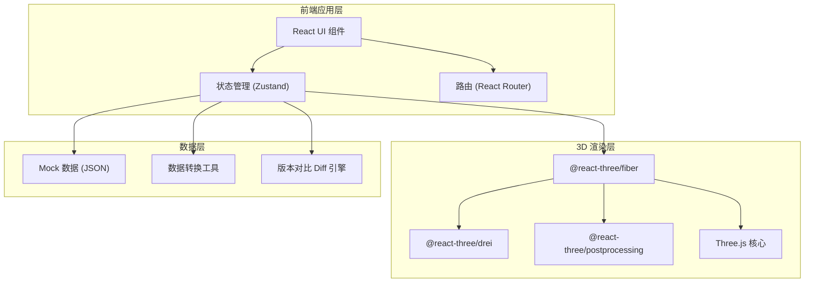
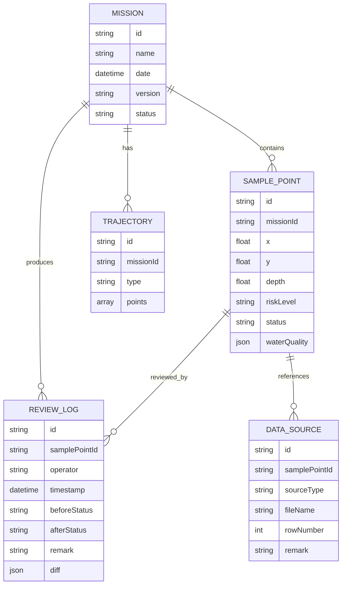

# 深海探测任务回放 - 技术架构文档

## 1. 架构设计



## 2. 技术栈说明

- **前端框架**：React@18 + TypeScript
- **构建工具**：Vite@5
- **样式方案**：TailwindCSS@3 + 自定义 CSS 变量（玻璃拟态、发光效果）
- **3D 引擎**：Three@0.160 + @react-three/fiber@8 + @react-three/drei@9 + @react-three/postprocessing@2
- **状态管理**：Zustand@4（轻量级，支持 3D 场景与 UI 联动）
- **图标**：Lucide React
- **后端**：无（纯前端 Mock 数据，内置 JSON 数据文件模拟探测任务、采样点、复核记录）

## 3. 路由定义

| 路由 | 用途 |
|------|------|
| `/` | 重定向至 `/mission/current` |
| `/mission/:missionId` | 主回放界面，包含 3D 场景、左右面板、底部时间轴 |

## 4. 数据模型

### 4.1 数据实体关系



### 4.2 核心数据类型定义

```typescript
type RiskLevel = 'safe' | 'warning' | 'danger';
type DataStatus = 'pending' | 'approved' | 'delayed' | 'recollect';

interface WaterQuality {
  temperature: number;
  salinity: number;
  ph: number;
  dissolvedOxygen: number;
  turbidity: number;
}

interface SamplePoint {
  id: string;
  missionId: string;
  position: { x: number; y: number; depth: number };
  riskLevel: RiskLevel;
  status: DataStatus;
  waterQuality: WaterQuality;
  sources: DataSource[];
  reviewLogs: ReviewLog[];
}

interface DataSource {
  id: string;
  type: 'excel' | 'image' | 'note';
  fileName: string;
  rowNumber?: number;
  remark?: string;
}

interface ReviewLog {
  id: string;
  timestamp: string;
  operator: string;
  beforeStatus: DataStatus;
  afterStatus: DataStatus;
  remark: string;
  diff?: Partial<WaterQuality>;
}

interface Mission {
  id: string;
  name: string;
  date: string;
  version: string;
  status: 'active' | 'archived';
  samplePoints: SamplePoint[];
  trajectories: {
    raw: { x: number; y: number; depth: number }[];
    cleaned: { x: number; y: number; depth: number }[];
  };
}
```

## 5. 前端组件结构

```
src/
├── components/
│   ├── layout/
│   │   ├── TopRiskBar.tsx          # 顶部风险通报条
│   │   ├── LeftPanel.tsx           # 左侧任务列表+筛选
│   │   ├── RightPanel.tsx          # 右侧明细+复核
│   │   └── BottomTimeline.tsx      # 底部轨迹时间轴
│   ├── three/
│   │   ├── Scene3D.tsx             # 3D 场景容器
│   │   ├── OceanEnvironment.tsx    # 海底环境（雾、光、粒子）
│   │   ├── TrajectoryLine.tsx      # 轨迹管（支持原始/清洗切换）
│   │   ├── SampleBubbles.tsx       # 采样点气泡（含脉冲发光）
│   │   ├── ClippingPlane.tsx       # 剖切平面+热力图
│   │   └── Controls.tsx            # 相机控制+预设视角
│   ├── mission/
│   │   ├── MissionCard.tsx         # 任务卡片
│   │   ├── FilterPanel.tsx         # 筛选器
│   │   ├── SampleDetail.tsx        # 采样点明细
│   │   ├── ReviewTimeline.tsx      # 复核记录时间线
│   │   └── RiskBadge.tsx           # 风险等级徽标
├── store/
│   ├── missionStore.ts             # 任务/采样点状态
│   ├── sceneStore.ts               # 3D 场景状态（剖切、视角、选中对象）
│   └── filterStore.ts              # 筛选条件状态
├── data/
│   └── mockMissions.ts             # Mock 数据
├── utils/
│   ├── color.ts                    # 颜色映射工具
│   ├── diff.ts                     # 数据差异对比
│   └── geo.ts                      # 坐标/几何计算
├── types/
│   └── index.ts                    # 全局类型定义
├── App.tsx
├── main.tsx
└── index.css
```

## 6. 状态联动设计

三个 Zustand Store 之间的联动机制：

```
filterStore (筛选条件变化)
    ↓ 订阅
missionStore (过滤采样点列表)
    ↓ 通知
sceneStore (更新 3D 场景中气泡可见性/高亮)
    ↓ 选中对象变化
missionStore (加载采样点明细 + 复核记录)
    ↓ 状态变更
RightPanel (渲染明细与复核区)
```

剖切、旋转、筛选均通过 sceneStore 与 missionStore 双向同步，确保 3D 视图与 UI 面板始终联动。
