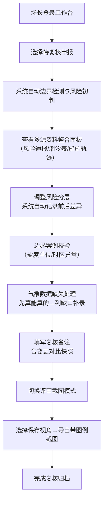

## 1. 产品概述

码头压载水申报复核系统，专为水产养殖场长设计，解决申报资料分散（风险通报/潮汐表/船舶轨迹）、评审截图沟通不清、边界数据判断缺失等痛点。核心价值是让场长在一张工作台完成多源资料整合、风险分层复核、边界案例推演，并留下清晰的前后变更痕迹。

## 2. 核心功能

### 2.1 用户角色

| 角色 | 说明 | 核心权限 |
|------|------|----------|
| 水产养殖场长 | 系统主要使用者，负责压载水申报资料的复核与评审 | 资料整合、风险判断、边界校验、评审输出、历史追溯 |

### 2.2 功能模块

1. **申报工作台首页**：资料来源总览、待复核申报列表、风险统计概览、快速入口
2. **申报复核详情页**：申报数据展示、多源资料整合面板、风险分层判定、边界案例校验、气象缺失处理、时区异常标记、复核备注（含前后对比）
3. **评审截图输出页**：固定视角快照、颜色图例说明、越界高亮提示、风险变更对比视图
4. **边界案例库**：盐度单位混用（2-3个真实影响结果的案例）、潮位时区错误样例、其他边界场景

### 2.3 页面详情

| 页面名称 | 模块名称 | 功能描述 |
|----------|----------|----------|
| 申报工作台 | 资料来源卡片 | 显示风险通报（共享盘）、潮汐表（旧表导入）、船舶轨迹（含人工备注）三大来源的接入状态与最新同步时间 |
| 申报工作台 | 待复核列表 | 按申报时间倒序，展示船舶名称、到港时间、风险等级标签、异常标记数量、复核状态 |
| 申报工作台 | 风险统计仪表盘 | 高/中/低风险数量分布、本周异常类型Top3、待补资料缺口清单 |
| 申报复核详情 | 申报基本信息区 | 固定在顶部，截图时始终可见：船舶信息、到港/离港、申报人、申报时间 |
| 申报复核详情 | 多源资料整合面板 | Tab切换：风险通报/潮汐曲线/船舶轨迹地图（含人工备注气泡） |
| 申报复核详情 | 风险分层判定区 | 显示初始判定结果 + 当前判定结果，风险分层调整需填写原因，自动记录前后差异 |
| 申报复核详情 | 边界案例校验区 | 自动检测并标注：盐度单位混用（附案例对比）、潮位时区异常（高亮坏数据） |
| 申报复核详情 | 气象缺口处理区 | 已计算项清单 + 缺失项列表（带补录入口），支持"先算能算的"渐进式计算 |
| 申报复核详情 | 复核备注面板 | 时间线式备注，风险分层变更时自动插入前后对比快照 |
| 评审截图输出 | 视角快照管理 | 保存3个常用评审视角：总览视角/风险详情视角/边界对比视角 |
| 评审截图输出 | 颜色图例说明卡 | 固定在截图右下角：各颜色对应风险等级/异常类型/越界状态的含义 |
| 评审截图输出 | 越界提示标注 | 超限数据自动加红色边框 + 越界箭头指示，数值旁标注阈值 |
| 边界案例库 | 盐度单位混用案例 | 案例1：PSU vs ppt导致盐度达标误判、案例2：‰ 与 % 混用改变排放标准判定、案例3：盐度单位缺失时的默认值修正演示 |
| 边界案例库 | 潮位时区错误样例 | 展示混入申报材料中的真实坏数据：UTC+8误写为UTC、日期跨时区导致潮位匹配错误 |

## 3. 核心流程

水产养殖场长登录系统后，首先在工作台查看待复核申报与资料同步状态。进入申报详情页，系统先自动执行边界检测与风险初判，场长依次检查多源资料整合面板、调整风险分层（系统记录前后对比）、处理气象缺口（先算能算的再补录）、查看边界案例校验结果、填写复核备注。最后切换到评审截图模式，选择保存好的视角，一键导出带图例与越界标注的截图用于会议沟通。

## 4. 用户界面设计

### 4.1 设计风格
- **主色**：深海蓝 `#0A3D6B`（专业海事感），搭配青绿 `#2DD4BF`（水产/生态关联）
- **辅色**：高对比风险色阶 - 红 `#EF4444` / 橙 `#F97316` / 黄 `#EAB308` / 绿 `#22C55E`
- **中性色**：雾灰 `#F8FAFC` 背景 / 石板灰 `#334155` 文字
- **按钮风格**：方中带圆（圆角8px），实心主按钮配细边框光效，次级按钮用描边
- **字体**：标题用「思源宋体」（权威稳重感），正文用「思源黑体」，数据表格用等宽字体「JetBrains Mono」
- **布局风格**：左右分栏工作台，左侧申报列表（窄）+右侧详情面板（宽），卡片化容器配1px深灰描边与2px底边高亮
- **视觉细节**：风险数据卡片加左侧彩色色条，异常数据右上角加折角标记，截图模式下自动隐藏导航栏只留核心内容区

### 4.2 页面设计概述

| 页面名称 | 模块名称 | UI元素 |
|----------|----------|--------|
| 申报工作台 | 资料来源卡片 | 三大来源卡片横向排列，图标+名称+同步时间+状态指示灯（绿/黄/红），点击跳转对应源数据 |
| 申报工作台 | 风险统计仪表盘 | 4个数字卡片（高/中/低/异常），数值下方配Mini趋势图，颜色对应风险等级 |
| 申报工作台 | 待复核列表 | 表格行 hover 背景变浅蓝，风险等级用彩色标签，异常数量用徽章显示在右侧 |
| 申报复核详情 | 基本信息顶栏 | 深色顶栏固定，船舶名加粗加大，到港时间用倒计时格式，右侧浮起评审模式开关 |
| 申报复核详情 | 多源资料Tab | 顶部Tab导航，激活Tab下方有3px主色下划线，潮汐曲线用SVG折线图叠加热点标记 |
| 申报复核详情 | 风险分层变更区 | 前后两个卡片横向对比，中间箭头连接，变更字段用黄色高亮闪烁动画 |
| 申报复核详情 | 边界案例卡片 | 白底+左侧橙色色条，标题下方附「影响结果：是/否」标签，展开后显示修正前后数值对比 |
| 申报复核详情 | 气象缺口处理 | 上下两区：上区绿色背景显示已完成计算项，下区浅红背景显示待补录清单，每项带快速补录按钮 |
| 评审截图模式 | 图例说明卡 | 右下角半透明白底卡片，圆角12px，每行含颜色方块+名称+说明文字 |
| 评审截图模式 | 越界标注 | 超限数值右上角红三角感叹号，旁边弹出浮层标注阈值与差值 |

### 4.3 响应式设计
- 桌面优先（>=1280px）：左右25%/75%分栏布局，详情内多列并排
- 平板（768-1279px）：上下堆叠，列表收为顶部横向滚动条
- 移动端（<768px）：单列，Tab改为底部导航，表格转卡片列表

### 4.4 动画与微交互
- 页面加载：内容卡片从上到下依次渐入（stagger 100ms）
- 风险变更：前后对比卡片翻转效果（3D rotateY）
- 越界提示：红色边框脉冲呼吸动画（1.6s循环）
- 资料同步：指示灯渐变过渡，同步完成时短震动动画
- 截图导出：画面先闪白0.2s再恢复，模拟拍照效果
