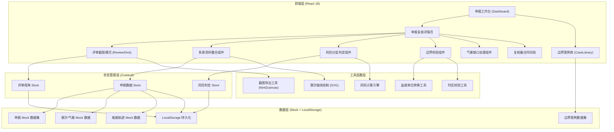
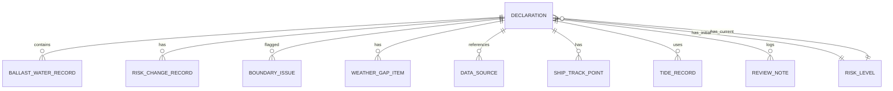

## 1. 架构设计



## 2. 技术描述

- **前端框架**: React 18 + TypeScript 5
- **构建工具**: Vite 5
- **样式方案**: Tailwind CSS 3.4（结合自定义主题色）+ CSS 变量
- **状态管理**: Zustand 4（轻量Store，支持持久化中间件）
- **路由管理**: React Router v6
- **图表绘制**: 原生 SVG（潮汐曲线、风险热力）+ Recharts（仪表盘趋势图）
- **地图模拟**: 静态 SVG 船舶轨迹示意图（含人工备注气泡标记）
- **截图导出**: html2canvas 1.4.1
- **后端/数据库**: 无后端，全部使用 Mock 数据 + LocalStorage 持久化
- **字体**: 通过 Google Fonts CDN 加载 Noto Serif SC / Noto Sans SC / JetBrains Mono

## 3. 路由定义

| 路由 | 页面组件 | 页面目的 |
|------|----------|----------|
| `/` | `<Dashboard />` | 申报工作台首页 - 资料总览、待办列表、风险统计 |
| `/declaration/:id` | `<DeclarationDetail />` | 申报复核详情 - 整合面板、风险判定、边界校验 |
| `/declaration/:id/review-shot` | `<ReviewShot />` | 评审截图模式 - 固定视角、图例、导出截图 |
| `/case-library` | `<CaseLibrary />` | 边界案例库 - 盐度单位混用、潮位时区错误样例 |

## 4. 核心数据类型定义

```typescript
// 申报单基础信息
interface Declaration {
  id: string;
  vesselName: string;
  vesselNo: string;
  arrivalTime: string;
  departureTime: string;
  applicant: string;
  applyTime: string;
  status: 'pending' | 'reviewing' | 'completed';
  
  // 压载水数据
  ballastWater: BallastWaterRecord[];
  
  // 风险判定
  initialRiskLevel: RiskLevel;
  currentRiskLevel: RiskLevel;
  riskChangeHistory: RiskChangeRecord[];
  
  // 异常标记
  boundaryIssues: BoundaryIssue[];
  weatherGaps: WeatherGapItem[];
  
  // 多源资料元数据
  sources: DataSource[];
  shipTrack: ShipTrackPoint[];
  riskNotices: RiskNotice[];
  tideRecords: TideRecord[];
  
  // 复核备注
  reviewNotes: ReviewNote[];
}

// 压载水记录（含盐度单位信息）
interface BallastWaterRecord {
  id: string;
  tankId: string;
  volume: number;
  salinity: number;
  salinityUnit: 'PSU' | 'ppt' | 'permil' | 'percent' | 'unknown';
  exchangeMethod: 'flow-through' | 'dilution' | 'none';
  exchangeRate: number;
}

// 风险等级
type RiskLevel = 'high' | 'medium' | 'low' | 'pending';

// 风险变更记录（用于前后对比）
interface RiskChangeRecord {
  id: string;
  timestamp: string;
  beforeLevel: RiskLevel;
  afterLevel: RiskLevel;
  changedBy: string;
  reason: string;
  affectedFields: string[];
}

// 边界问题
interface BoundaryIssue {
  id: string;
  type: 'salinity-unit-mix' | 'timezone-error' | 'other';
  severity: 'critical' | 'warning';
  description: string;
  originalValue: any;
  correctedValue: any;
  impactsResult: boolean;
  relatedRecordId?: string;
}

// 气象缺口项
interface WeatherGapItem {
  id: string;
  fieldName: string;
  displayName: string;
  requiredForCalculations: string[];
  alreadyCompleted: string[];
  status: 'missing' | 'filled' | 'not-needed';
}

// 资料来源
interface DataSource {
  id: 'risk-notice' | 'tide-table' | 'ship-track';
  name: string;
  sourcePath: string;
  lastSyncTime: string;
  status: 'online' | 'syncing' | 'offline';
  recordCount: number;
}

// 复核备注（时间线）
interface ReviewNote {
  id: string;
  timestamp: string;
  author: string;
  content: string;
  type: 'manual' | 'auto-risk-change' | 'auto-boundary-detect' | 'auto-weather-gap';
  snapshot?: RiskLevelSnapshot;
}
```

## 5. 核心数据模型与初始 Mock 数据

### 5.1 数据实体关系



### 5.2 Mock 数据设计要点

**申报单（2条真实场景样例）**：
1. **"闽渔养 88866"号** - 含盐度单位混用案例：压载舱A写 `28.5 PSU`、压载舱B写 `28.5‰`、压载舱C单位缺失
2. **"粤海运 31258"号** - 含潮位时区错误案例：到港时间填 `2026-06-12 03:00 UTC`（实为UTC+8），导致潮位匹配完全错位

**边界案例库（5条）**：
1. 盐度案例1：PSU vs ppt → 数值看似相同，判定标准不同导致从"达标"变"不达标"
2. 盐度案例2：‰ 与 % 混用 → 差1000倍，20%实际是20000‰，直接越界
3. 盐度案例3：单位缺失 → 默认按PSU处理，实际是ppt，风险从低变中
4. 时区案例1：UTC+8写为UTC → 潮位从高潮变为低潮，作业窗口误判
5. 时区案例2：跨日期时区偏移 → 6月12日 01:00实际是6月11日数据

### 5.3 工具函数关键逻辑

**盐度单位转换与判定**：
- `convertSalinity(value, fromUnit, toUnit)` → 统一转换到PSU标准
- `checkSalinityCompliance(salinityPSU, threshold)` → 判定是否达标
- **真实影响设计**：以 30 PSU 为排放阈值，28.5 ppt = 28.5 PSU 达标，28.5‰ 实际应=28.5，但如果被误读为%就是 28500 → 直接越界

**时区校验**：
- `detectTimezoneAnomaly(timeString, contextPort)` → 检测与港口时区不一致
- `correctTideByTimezone(tideRecords, reportedTime, actualTimezone)` → 自动修正匹配

**气象缺口渐进计算**：
- `calculateRiskWithGaps(declaration, availableData)` → 只使用可用数据计算
- 返回 `{ partialResult, missingFields, alreadyCalculated }` 三元组

## 6. 组件结构设计

```
src/
├── components/
│   ├── dashboard/
│   │   ├── DataSourceCard.tsx       # 资料来源卡片
│   │   ├── RiskStatsGauge.tsx       # 风险统计仪表盘
│   │   └── DeclarationList.tsx      # 待复核列表
│   ├── declaration-detail/
│   │   ├── TopInfoBar.tsx           # 基本信息顶栏
│   │   ├── MultiSourcePanel.tsx     # 多源资料整合Tab面板
│   │   ├── RiskLevelCompare.tsx     # 风险分层前后对比
│   │   ├── BoundaryIssueCard.tsx    # 边界案例校验卡片
│   │   ├── WeatherGapSection.tsx    # 气象缺口处理区
│   │   └── ReviewNoteTimeline.tsx   # 复核备注时间线
│   ├── review-shot/
│   │   ├── ViewPresetSelector.tsx   # 视角预设选择器
│   │   ├── ColorLegendCard.tsx      # 颜色图例卡
│   │   └── OutOfBoundsMarker.tsx    # 越界标注组件
│   ├── case-library/
│   │   ├── SalinityCaseCard.tsx     # 盐度案例卡片
│   │   ├── TimezoneCaseCard.tsx     # 时区案例卡片
│   │   └── CaseDiffViewer.tsx       # 前后差异对比器
│   └── common/
│       ├── TideChart.tsx            # SVG潮汐曲线图
│       ├── ShipTrackMap.tsx         # 船舶轨迹示意图
│       ├── RiskLevelBadge.tsx       # 风险等级标签
│       └── AnimatedStagger.tsx      # 渐入动画容器
├── stores/
│   ├── useDeclarationStore.ts
│   ├── useRiskStore.ts
│   └── useReviewViewStore.ts
├── utils/
│   ├── salinity.ts                  # 盐度单位转换
│   ├── timezone.ts                  # 时区校验修正
│   ├── riskEngine.ts                # 风险计算引擎
│   ├── screenshot.ts                # 截图导出
│   └── mockData.ts                  # Mock数据集
├── pages/
│   ├── Dashboard.tsx
│   ├── DeclarationDetail.tsx
│   ├── ReviewShot.tsx
│   └── CaseLibrary.tsx
└── App.tsx
```
