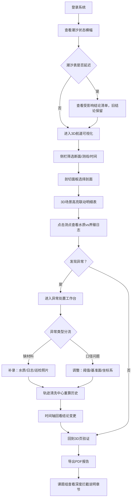

## 1. 产品概述
航道淤积测量报告复核系统是面向海事安全员的专业工具，解决科普课前报告复核中水质记录与养殖日志对账不一致、潮汐表延迟导致结论失真、异常展示不透明等痛点。通过 Three.js 交互式 3D 可视化、可追溯数据清洗、分级异常导航和透明化导出报告，让海事安全员从"手工补锅"转向"精准处置"。

- 目标用户：海事安全员、航道测量课题组
- 核心价值：数据对账自动化、异常处置透明化、历史追溯可回溯、结论依据可审计

## 2. 核心功能

### 2.1 用户角色
| 角色 | 登录方式 | 核心权限 |
|------|----------|----------|
| 海事安全员 | 系统账号登录 | 报告复核、3D 交互、异常处置、数据补录、报告导出 |
| 课题组成员 | 只读账号 | 查看报告、导出 PDF、查看深度拦截依据 |

### 2.2 功能模块
1. **3D 航道可视化页**：Three.js 航道模型、旋转/缩放/平移控制、剖切面板、断面筛选、测点明细联动
2. **轨迹清洗中心**：清洗规则面板、巡检照片补录、历史版本时间轴、清洗前后差异对比
3. **潮汐影响追踪**：潮汐表状态监控、受影响结论高亮、新旧结论并排对比、延迟提示横幅
4. **异常处置工作台**：分级异常卡片、操作导航（补材料/改口径）、处置进度跟踪
5. **报告导出页**：PDF 导出、深度为负拦截说明、异常依据标注、完整审计链

### 2.3 页面详情
| 页面名称 | 模块名称 | 功能描述 |
|----------|----------|----------|
| 3D 航道可视化页 | 航道模型渲染 | Three.js 加载河床地形、淤积层、水深点云，支持光照阴影 |
| 3D 航道可视化页 | 交互控制 | OrbitControls 旋转缩放、双指/鼠标拖拽、第一视角切换 |
| 3D 航道可视化页 | 剖切面板 | 沿航道纵向/横向任意平面剖切，实时显示断面轮廓、深度色标 |
| 3D 航道可视化页 | 对象筛选联动 | 侧栏按断面/测线/时间筛选，3D 场景同步高亮，明细表同步过滤 |
| 3D 航道可视化页 | 测点明细 | 点击任意测点弹出详情卡：深度、坐标、测量时间、水质快照、关联养殖日志 |
| 轨迹清洗中心 | 清洗规则链 | 可视化规则流：野值剔除→滑动窗口→卡尔曼滤波→人工复核，支持逐开关 |
| 轨迹清洗中心 | 照片补录 | 上传巡检照片关联 GPS 轨迹点，自动触发相关历史结论重算 |
| 轨迹清洗中心 | 历史时间轴 | 可拖动时间轴回看任意时刻清洗结果，标注照片补录节点与结论变更点 |
| 轨迹清洗中心 | 差异对比 | 清洗前后轨迹叠加显示，数值差异表格化，异常点用标记圈出 |
| 潮汐影响追踪 | 潮汐状态横幅 | 顶部实时显示潮汐表更新状态：已同步/延迟 X 小时/缺失，颜色分级 |
| 潮汐影响追踪 | 结论影响清单 | 逐条列出受潮汐延迟影响的结论：原结论→临时结论→影响程度→恢复条件 |
| 潮汐影响追踪 | 并排对比 | 旧结论（灰底保留）与临时结论（黄底标注）并排展示，不覆盖历史 |
| 潮汐影响追踪 | 恢复时间预估 | 基于历史潮汐到达规律给出预计恢复时间和倒计时 |
| 异常处置工作台 | 分级卡片 | 按严重程度（红/橙/黄/蓝）展示异常，每个异常独立卡片，非单一数字 |
| 异常处置工作台 | 操作导航 | 每个异常卡明确给出"下一步"：补材料（水质报告/养殖日志/照片）或改口径（阈值/坐标系/基准面） |
| 异常处置工作台 | 进度跟踪 | 处置状态：待处理→处理中→待复核→已闭环，支持流转记录 |
| 异常处置工作台 | 异常类型分流 | 自动识别异常类型：深度负值/水质对账不一致/轨迹漂移/潮汐缺失/日志缺口 |
| 报告导出页 | 报告预览 | 浏览器内完整预览，支持分页导航和目录跳转 |
| 报告导出页 | 深度拦截说明 | 专门章节解释深度为负被拦截原因：基准面换算→潮汐修正→测量误差→判别规则示例 |
| 报告导出页 | 异常依据标注 | 每个异常编号旁附处置说明和原始数据引用，附二维码链接原始测点 |
| 报告导出页 | 审计链附录 | 导出操作日志、数据版本号、潮汐表版本号、规则链快照 |

## 3. 核心流程

海事安全员复核报告主流程：登录系统→进入 3D 航道可视化页→查看顶部潮汐状态横幅（如延迟则先读受影响清单）→在侧栏筛选断面→剖切观察淤积分布→点击异常测点查看明细（含水质与养殖日志对账）→进入异常处置工作台→按卡片指引补材料或改口径→如补录巡检照片则进入轨迹清洗中心观察结论重算→回到 3D 页确认异常消除→导出报告（课题组成员仅查看导出页也能理解深度拦截逻辑）。

## 4. 用户界面设计

### 4.1 设计风格
- **主色调**：深海蓝 `#0A2540` 作为背景主色，代表航道水域专业感
- **辅色调**：航道绿 `#10B981`（正常）、警告橙 `#F59E0B`（潮汐延迟）、警戒红 `#EF4444`（深度负值/严重异常）、信息蓝 `#3B82F6`（提示）
- **中性色**：石板灰系列 `#0F172A #1E293B #334155 #64748B #CBD5E1 #F8FAFC`
- **按钮风格**：2px 圆角、1px 同色系边框、悬停 4px 阴影上浮、按下凹陷微效果
- **字体**：标题用 **Noto Serif SC**（宋体衬线，报告正式感）、正文用 **Noto Sans SC**（清晰可读）、代码/数值用 **JetBrains Mono**（等宽对齐）
- **字号层级**：H1 32px / H2 24px / H3 18px / 正文 14px / 辅助 12px / 数据 13px 等宽
- **布局风格**：左侧固定导航栏 + 顶部状态横幅 + 中央主工作区 + 右侧可收折明细面板的专业工作台布局，卡片化信息承载
- **图标风格**：Lucide 线性图标，1.5px 描边，配合场景使用水波纹/测深锤/船锚等航海元素装饰

### 4.2 页面设计概述
| 页面名称 | 模块名称 | UI 元素描述 |
|----------|----------|-------------|
| 3D 航道可视化页 | 布局框架 | 顶栏 56px 潮汐横幅，左栏 64px 图标导航，中央 3D Canvas，右侧 360px 筛选+明细双 Tab 面板 |
| 3D 航道可视化页 | 3D 场景 | 航道坐标系 X(桩号)Y(宽度)Z(深度)，底部半透明等高线河床，淤积层用暖色渐变云图，水深点用发光粒子 |
| 3D 航道可视化页 | 剖切控件 | 右下角悬浮剖切工具箱，纵切/横切/自定义三按钮，拖动平面箭头实时调整深度 |
| 3D 航道可视化页 | 侧栏筛选 | 树状结构：航道→标段→断面→测线→测点，多选复选框，选中项在 3D 中高亮描边 |
| 3D 航道可视化页 | 测点明细卡 | 悬浮卡片，头部桩号+深度大字+状态色标，中部四象限：坐标/时间/水质/养殖，底部操作按钮 |
| 轨迹清洗中心 | 规则链 | 横向流程图节点，每个节点为圆角卡片，含开关按钮、参数滑杆、效果缩略图 |
| 轨迹清洗中心 | 时间轴 | 底部全屏宽时间轴，柱状图标记补录点密度，拖动游标上方浮层显示该时刻快照 |
| 轨迹清洗中心 | 差异对比 | 左右分栏：左原始轨迹右清洗后轨迹，中间差异色带对照表 |
| 潮汐影响追踪 | 状态横幅 | 通栏渐变背景，左侧图标+状态文字，右侧进度条+倒计时，点击展开影响清单 |
| 潮汐影响追踪 | 影响清单表 | 表格行：结论编号+描述+旧值（灰底删除线）+临时值（黄底斜体）+影响范围+恢复条件 |
| 异常处置工作台 | 分级卡片墙 | 瀑布流布局，每卡左上角色块分级，标题行异常编号+类型，正文描述，底部"下一步"操作按钮组 |
| 异常处置工作台 | 操作按钮 | 主要操作用实色填充带图标，次要操作用描边，按钮旁微标签说明："需上传 3 张照片""调整潮汐基准 +0.3m" |
| 报告导出页 | 报告预览 | 白色 A4 纸质感，带细微纹理，章节首字下沉，页眉带航道局 Logo，页脚带页码水印 |
| 报告导出页 | 拦截说明章节 | 灰色信息框包裹，分步小标题，配合示意图说明负深度拦截链路，关键数字红圈标注 |

### 4.3 响应式
桌面端优先（最小 1440×900），主工作区 Canvas 按窗口缩放，侧栏面板在 1024 以下收折为抽屉，报告预览在移动端改为单列滚动。触屏设备支持双指缩放和单指拖拽 3D 场景。

### 4.4 3D 场景指引
- **环境氛围**：水下雾效 `#0A2540` 线性衰减，营造深水勘探感，水面半透明带动态波纹纹理
- **光照设置**：主光 HemisphereLight(天空 `#87CEEB` / 水底 `#0A2540`，强度 0.6)，方向光模拟阳光从 45° 斜射带阴影，点光源随鼠标照亮局部测点
- **相机设置**：PerspectiveCamera FOV 50，初始位置桩号中段上方 80m 俯瞰，OrbitControls 限制最小距离 10m、最大距离 500m、极角 10°-85°
- **构图焦点**：淤积最严重区域自动居中，初始帧带缓慢环视入场动画（2s），关键断面位置放置发光标识牌
- **交互动画**：剖切时断面边缘 0.3s 描边动画，筛选时目标对象渐入高亮+微放大 1.05，测点点击弹出卡 0.25s 缩放弹性动画
- **后处理效果**：Bloom（阈值 0.8，强度 0.4）让深度色标和异常点发光，SSAO 微弱增强地形起伏感，无过度炫光
- **性能预算**：河床三角面 ≤20 万，淤积层 ≤5 万，点云粒子 ≤2 万用 InstancedMesh，帧率 ≥45fps

## 5. 数据对账规则说明
| 对账类型 | 判定条件 | 异常等级 | 处置方向 |
|----------|----------|----------|----------|
| 水质 vs 养殖日志 | 同一测点同一时段，记录值偏差 > 阈值（可配置） | 橙色 | 补材料：核对原始采样单 |
| 深度负值 | 修正后深度 < 0 且超出测量不确定度 3σ | 红色 | 改口径：检查基准面/潮汐修正 |
| 轨迹漂移 | GPS 点与航道中心线偏差 > 2倍船宽 | 黄色 | 补材料：补录巡检照片锚定 |
| 潮汐延迟 | 潮汐表最新时间 < 当前 - 2h | 橙色 | 等待或改口径：用预报潮位临时替代 |
| 日志缺口 | 养殖日志连续缺失 > 4 小时时段 | 黄色 | 补材料：联系养殖场补录 |
