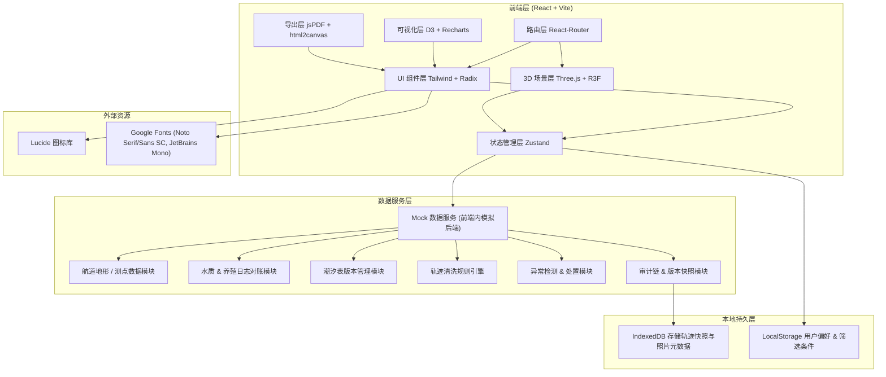
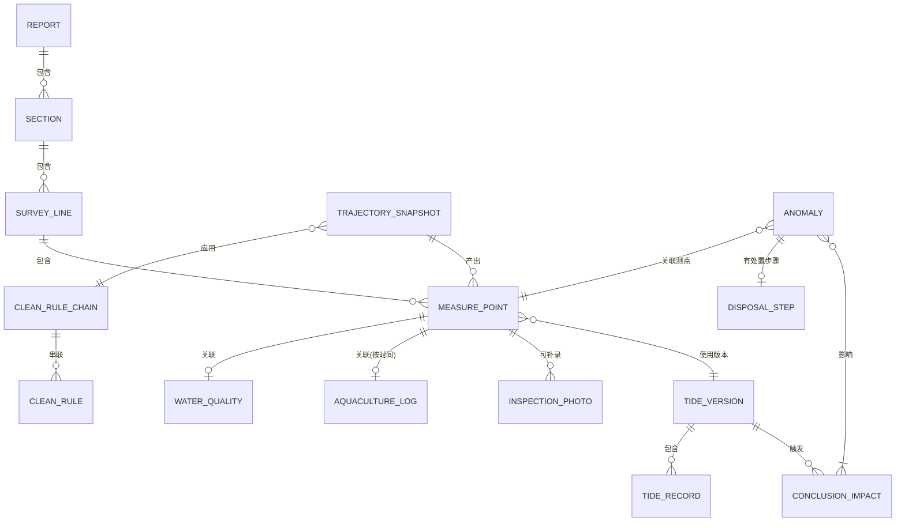

## 1. 架构设计



## 2. 技术描述
- **前端**：React@18 + TypeScript + Vite@5 + Tailwind CSS@3 + zustand@4
- **3D 可视化**：three@0.160 + @react-three/fiber@8 + @react-three/drei@9 + @react-three/postprocessing@2
- **图表**：recharts@2 + d3-scale@7
- **状态管理**：zustand@4（含 immer 中间件用于不可变状态更新）
- **导出**：jspdf@2 + html2canvas@1
- **UI 组件**：@radix-ui/react-dialog、@radix-ui/react-tabs、@radix-ui/react-slider、@radix-ui/react-dropdown-menu
- **图标**：lucide-react@0.312
- **后端**：无独立后端，所有业务逻辑通过前端 TypeScript 模块 + Mock 数据实现，数据持久化使用 IndexedDB（通过 idb-keyval 简化操作）
- **初始化工具**：vite-init 脚手架 react-ts 模板

## 3. 路由定义
| 路由 | 页面组件 | 用途 |
|------|----------|------|
| `/` | 重定向到 `/visualization` | 默认入口跳转到 3D 可视化 |
| `/visualization` | `Channel3DPage` | Three.js 3D 航道可视化主工作区，含剖切、筛选、明细联动 |
| `/trajectory` | `TrajectoryCleanPage` | 轨迹清洗中心，含规则链、照片补录、历史时间轴 |
| `/tide` | `TideImpactPage` | 潮汐影响追踪，含状态横幅、结论对比、恢复倒计时 |
| `/anomaly` | `AnomalyWorkbenchPage` | 异常处置工作台，含分级卡片、操作导航（补材料/改口径） |
| `/report` | `ReportExportPage` | 报告预览与导出，含深度拦截说明章节 |

## 4. 核心数据模型与 Mock 数据接口（前端服务层）

### 4.1 数据模型 ER 图



### 4.2 核心 TypeScript 类型定义

```typescript
// ========== 航道测量模型 ==========
export interface ChannelReport {
  reportId: string;
  reportName: string;
  reportDate: string;
  version: string;
  channelName: string;
  startMileage: number;
  endMileage: number;
  datumPlane: string;
  sections: Section[];
  summary: ReportSummary;
}

export interface Section {
  sectionId: string;
  sectionName: string;
  mileage: number;
  width: number;
  surveyLines: SurveyLine[];
  siltationVolume: number;
}

export interface SurveyLine {
  lineId: string;
  lineName: string;
  direction: 'longitudinal' | 'transverse';
  points: MeasurePoint[];
}

export interface MeasurePoint {
  pointId: string;
  mileage: number;
  offset: number;
  rawDepth: number;
  correctedDepth: number;
  tideCorrection: number;
  datumCorrection: number;
  gpsX: number;
  gpsY: number;
  measureTime: string;
  tideVersionId: string;
  waterQualityId?: string;
  aquacultureId?: string;
  photoIds: string[];
  isAnomaly: boolean;
  anomalyType?: AnomalyType;
  flags: string[];
}

// ========== 水质与养殖对账 ==========
export interface WaterQualityRecord {
  waterQualityId: string;
  sampleTime: string;
  stationId: string;
  turbidity: number;
  salinity: number;
  ph: number;
  do: number;
  source: 'sensor' | 'manual';
}

export interface AquacultureLog {
  aquacultureId: string;
  cageId: string;
  recordTime: string;
  feedingAmount: number;
  waterExchangeRate: number;
  oxygenLevel: number;
  remarks: string;
}

// ========== 潮汐版本管理 ==========
export interface TideVersion {
  tideVersionId: string;
  publishTime: string;
  effectiveTime: string;
  status: 'synchronized' | 'delayed' | 'missing';
  delayHours: number;
  records: TideRecord[];
}

export interface TideRecord {
  time: string;
  height: number;
  type: 'high' | 'low' | 'rising' | 'falling';
}

export interface ConclusionImpact {
  impactId: string;
  relatedAnomalyId?: string;
  conclusionId: string;
  conclusionDesc: string;
  originalValue: string;
  originalBasis: string;
  tempValue: string;
  tempBasis: string;
  impactLevel: 'critical' | 'major' | 'minor';
  recoverCondition: string;
  estRecoverTime?: string;
  tideVersionId: string;
}

// ========== 轨迹清洗 ==========
export type RuleType = 'outlier' | 'movingAvg' | 'kalman' | 'manualReview';

export interface CleanRule {
  ruleId: string;
  type: RuleType;
  name: string;
  enabled: boolean;
  params: Record<string, number>;
}

export interface CleanRuleChain {
  chainId: string;
  rules: CleanRule[];
  appliedAt: string;
}

export interface TrajectorySnapshot {
  snapshotId: string;
  timestamp: string;
  chainId: string;
  trigger: 'initial' | 'photoAdded' | 'ruleChanged' | 'manual';
  triggerPhotoIds?: string[];
  pointsBefore: MeasurePoint[];
  pointsAfter: MeasurePoint[];
  diffCount: number;
}

export interface InspectionPhoto {
  photoId: string;
  uploadedAt: string;
  gpsX: number;
  gpsY: number;
  photoTime: string;
  relatedPointId?: string;
  caption: string;
  dataUrl: string;
}

// ========== 异常处置 ==========
export type AnomalyType =
  | 'negative_depth'
  | 'water_quality_mismatch'
  | 'trajectory_drift'
  | 'tide_delayed'
  | 'log_gap'
  | 'other';

export type AnomalySeverity = 'red' | 'orange' | 'yellow' | 'blue';
export type DisposalDirection = 'supplement_material' | 'adjust_caliber';
export type AnomalyStatus = 'pending' | 'processing' | 'reviewing' | 'closed';

export interface Anomaly {
  anomalyId: string;
  type: AnomalyType;
  severity: AnomalySeverity;
  title: string;
  description: string;
  relatedPointIds: string[];
  relatedSectionIds: string[];
  status: AnomalyStatus;
  disposalDirection: DisposalDirection;
  disposalSteps: DisposalStep[];
  createdAt: string;
  updatedAt: string;
}

export interface DisposalStep {
  stepId: string;
  stepNumber: number;
  direction: DisposalDirection;
  instruction: string;
  required: boolean;
  completed: boolean;
  completedAt?: string;
  meta?: Record<string, unknown>;
}

export interface ReportSummary {
  totalSectionCount: number;
  totalPointCount: number;
  anomalyCount: Record<AnomalySeverity, number>;
  avgDepth: number;
  minDepth: number;
  maxDepth: number;
  negativeDepthCount: number;
  siltationTotal: number;
}
```

### 4.3 Mock 数据服务接口（前端模块导出函数）

| 模块函数 | 输入参数 | 返回值 | 说明 |
|----------|----------|--------|------|
| `getChannelReport()` | 无 | `ChannelReport` | 获取当前航道淤积测量报告（含断面、测线、测点） |
| `getMeasurePointDetail(pointId)` | `pointId: string` | `{ point: MeasurePoint, waterQuality?: WaterQualityRecord, aquacultureLog?: AquacultureLog, photos: InspectionPhoto[] }` | 获取测点明细及关联数据 |
| `compareWaterVsAquaculture(pointIds)` | `pointIds: string[]` | `Array<{pointId, waterValue, aquaValue, diff, mismatch: boolean}>` | 水质与养殖日志对账 |
| `getCurrentTideVersion()` | 无 | `TideVersion` | 获取当前潮汐表版本与状态 |
| `getConclusionImpacts()` | 无 | `ConclusionImpact[]` | 获取受潮汐延迟影响的结论清单 |
| `applyCleanRuleChain(chain, points)` | `chain: CleanRuleChain, points: MeasurePoint[]` | `MeasurePoint[]` | 执行轨迹清洗规则链 |
| `addInspectionPhoto(photo, reportId)` | `photo: InspectionPhoto, reportId: string` | `{ newSnapshot: TrajectorySnapshot, recalcImpacts: ConclusionImpact[] }` | 补录照片并触发历史重算 |
| `getTrajectorySnapshots(lineId)` | `lineId: string` | `TrajectorySnapshot[]` | 获取测线轨迹历史快照列表 |
| `getAnomalies(filters?)` | `filters?: {severity?, status?, type?}` | `Anomaly[]` | 获取异常列表（可筛选） |
| `advanceDisposalStep(anomalyId, stepId, payload?)` | `anomalyId, stepId, payload?` | `Anomaly` | 推进异常处置步骤 |
| `generateExportReport(reportId)` | `reportId: string` | `{ html: string, interceptExplain: string, auditTrail: AuditLog[] }` | 生成可导出的报告 HTML 内容 |
| `getNegativeDepthExplain()` | 无 | `{ steps: ExplainStep[], exampleCase: ExampleCase }` | 获取深度为负拦截说明内容 |

## 5. 状态管理切片（Zustand）

```typescript
// zustand store 切片设计
interface AppState {
  // 3D 场景状态
  scene: {
    selectedSectionIds: string[];
    selectedLineIds: string[];
    selectedPointId: string | null;
    clippingPlane: { orientation: 'x' | 'y' | 'z'; value: number; enabled: boolean } | null;
    cameraTarget: [number, number, number];
  };
  // 潮汐状态
  tide: {
    currentVersion: TideVersion | null;
    impacts: ConclusionImpact[];
    bannerVisible: boolean;
  };
  // 轨迹清洗
  cleaning: {
    ruleChain: CleanRuleChain;
    snapshots: TrajectorySnapshot[];
    currentSnapshotIndex: number;
  };
  // 异常处置
  anomaly: {
    list: Anomaly[];
    filters: { severity?: AnomalySeverity; status?: AnomalyStatus };
    activeAnomalyId: string | null;
  };
  // 报告
  report: {
    current: ChannelReport | null;
    loading: boolean;
  };
}
```

## 6. 前端组件架构

```
src/
├── components/
│   ├── channel3d/
│   │   ├── ChannelScene.tsx         # R3F 场景容器
│   │   ├── RiverbedTerrain.tsx      # 河床地形网格
│   │   ├── SiltationLayer.tsx       # 淤积层云图
│   │   ├── MeasurePoints.tsx        # 测点粒子 (InstancedMesh)
│   │   ├── ClippingPlaneControl.tsx # 剖切控制
│   │   ├── SceneLighting.tsx        # 灯光 + 雾效
│   │   └── PointDetailCard.tsx      # 测点明细悬浮卡
│   ├── layout/
│   │   ├── AppShell.tsx             # 整体布局（左导航+顶横幅+主区+右面板）
│   │   ├── TideStatusBanner.tsx     # 潮汐状态横幅
│   │   ├── SidebarNav.tsx           # 左侧图标导航
│   │   └── RightPanel.tsx           # 右侧筛选/明细双 Tab
│   ├── anomaly/
│   │   ├── AnomalyCard.tsx          # 单个异常卡片
│   │   ├── AnomalyGrid.tsx          # 分级瀑布流
│   │   ├── DisposalStepper.tsx      # 处置步骤器
│   │   └── NextActionChip.tsx       # "下一步"按钮组
│   ├── trajectory/
│   │   ├── RuleChainFlow.tsx        # 规则链流程图
│   │   ├── RuleCard.tsx             # 规则卡片
│   │   ├── TimelineSlider.tsx       # 历史时间轴
│   │   ├── SnapshotDiffView.tsx     # 快照差异对比
│   │   └── PhotoUploader.tsx        # 巡检照片上传
│   ├── tide/
│   │   ├── ImpactListTable.tsx      # 受影响结论表
│   │   ├── ConclusionCompare.tsx    # 新旧结论并排
│   │   └── RecoverCountdown.tsx     # 恢复倒计时
│   └── report/
│       ├── ReportPreview.tsx        # A4 报告预览
│       ├── DepthInterceptSection.tsx# 深度拦截说明章节
│       ├── AnnotationsLayer.tsx     # 异常依据标注
│       └── AuditTrailAppendix.tsx   # 审计链附录
├── hooks/
│   ├── use3DSceneSync.ts            # 筛选条件与 3D 场景联动
│   ├── useTideWatcher.ts            # 潮汐状态轮询与影响追踪
│   ├── useCleanRuleExecutor.ts      # 规则链执行与快照
│   ├── useAnomalyDisposal.ts        # 异常处置步骤推进
│   └── useReportExport.ts           # 报告导出
├── pages/
│   ├── Channel3DPage.tsx
│   ├── TrajectoryCleanPage.tsx
│   ├── TideImpactPage.tsx
│   ├── AnomalyWorkbenchPage.tsx
│   └── ReportExportPage.tsx
├── services/
│   ├── mock/
│   │   ├── channelData.ts           # Mock 航道/断面/测点数据
│   │   ├── waterAquacultureData.ts  # Mock 水质&养殖日志
│   │   ├── tideData.ts              # Mock 潮汐版本与记录
│   │   ├── anomalyData.ts           # Mock 异常与处置
│   │   └── photoData.ts             # Mock 巡检照片
│   ├── channelService.ts
│   ├── tideService.ts
│   ├── cleanService.ts
│   ├── anomalyService.ts
│   └── reportService.ts
├── store/
│   └── useAppStore.ts
├── utils/
│   ├── terrainGenerator.ts          # 程序化生成河床地形
│   ├── colorScale.ts                # 深度色标
│   ├── datumCalculator.ts           # 基准面/潮汐修正计算
│   └── pdfExport.ts                 # PDF 导出工具
├── types/
│   └── index.ts
└── App.tsx
```

## 7. 性能与实现注意点

| 关注点 | 策略 |
|--------|------|
| 3D 性能 | 河床用 `PlaneGeometry` + 顶点位移 + `MeshStandardMaterial`；测点用 `InstancedMesh` 批量渲染；淤积层用 `CustomShaderMaterial` 做云图插值；开启 `frustumCulled` |
| 状态联动 | 3D 场景选中/高亮通过 zustand 订阅，`use3DSceneSync` hook 封装筛选→高亮→明细面板的单向联动，避免双向绑定 |
| 轨迹可追溯 | 每次规则变更或照片补录都生成 `TrajectorySnapshot` 并写入 IndexedDB，历史回看读取快照而非重算；快照存 `pointsBefore/After` 的差异补丁减少存储 |
| 潮汐延迟保护 | 结论字段分 `originalValue` 和 `tempValue`，UI 上旧结论保留灰底删除线显示，临时结论黄底斜体标注，绝不覆盖原字段；结论表行带 `impactLevel` 颜色标记 |
| 异常分级导航 | 每个 `Anomaly` 存储 `disposalSteps` 步骤链，步骤上区分 `direction: supplement_material / adjust_caliber`；步骤未完成时 "下一步" 按钮高亮 + 提示文字量化（如"还需 2 张照片"） |
| 深度拦截说明 | 导出报告章节 `DepthInterceptSection.tsx` 用可复用组件渲染，浏览器预览与 PDF 共用；拦截链路 5 步说明 + 1 个真实案例，案例数据直接从当前报告中 `negativeDepthCount` 关联的 `Anomaly` 取 |
| PDF 导出 | 使用 html2canvas 截取 A4 报告预览 DOM 转图片，再用 jsPDF 分页插入；二维码用 `qrcode` 库生成测点链接 PNG |
| Mock 数据量 | 航道 10km × 200m，10 个断面，每断面 5 条测线，每测线 50 测点 → 2500 测点；水体与养殖日志按时间对齐生成 10% 对账不一致；潮汐版本故意设置一版延迟 3 小时触发结论影响 |
