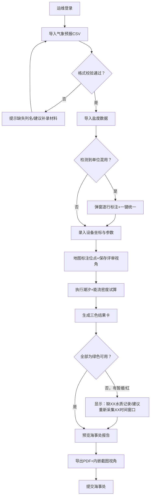

## 1. 产品概述

海岛运维海浪能设备试算系统，面向海岛运维人员与海事处审核人员，解决气象数据导入、盐度单位混用检测、地图联动展示、潮汐推算与结果分级报告的全流程问题。通过"可用/暂缓/需重新采集"三色状态体系，让评审截图沟通清晰，报告导出即具备海事处审核所需的状态标识。

---

## 2. 核心功能

### 2.1 用户角色

| 角色 | 典型场景 | 核心权限 |
|------|----------|----------|
| 海岛运维 | 日常数据录入、试算、复核、补充材料 | 数据导入、地图标注、试算执行、报告生成、异常处理、视角保存 |
| 海事处 | 接收报告、快速判定、标记需复核项 | 报告查阅、状态筛选、复核标记导出 |

### 2.2 功能模块

1. **数据导入中心**：气象预报上传（CSV/Excel）、盐度数据批量导入、设备位点坐标录入
2. **盐度单位校验器**：PSU/‰/ppt 自动识别、混用高亮标注、一键单位统一、换算公式溯源
3. **地图联动工作台**：设备位点标注、视角预设保存、越界区域标红、颜色编码图例、评审截图模式
4. **潮汐推算引擎**：调和常数输入、潮位时间序列计算、结论回链来源材料、偏差阈值告警
5. **结果分级看板**：可用（绿）/暂缓（黄）/需重新采集（红）状态卡、下一步操作建议、材料缺口清单
6. **海事处报告导出**：PDF报告生成、内嵌视角地图截图、状态标识醒目、复核意见栏预留

### 2.3 页面详情

| 页面名称 | 模块名称 | 功能描述 |
|----------|----------|----------|
| 试算工作台（主） | 左侧数据面板 | 气象预报导入进度、盐度数据列表（单位标签）、设备信息表单 |
| 试算工作台（主） | 中央地图区 | Leaflet海图、设备Marker、越界区域多边形、视角保存按钮、图例面板 |
| 试算工作台（主） | 右侧结果面板 | 潮汐曲线ECharts、三色状态卡、异常处理建议卡片 |
| 盐度校验弹窗 | 单位混用检测表 | 逐行标注单位、建议转换值、可批量确认 |
| 视角管理抽屉 | 已保存视角 | 视角缩略图、名称标签、一键恢复、删除 |
| 报告导出预览 | 报告预览 | PDF即时预览、海事处专用状态标识栏、水印、下载按钮 |

---

## 3. 核心流程

---

## 4. 用户界面设计

### 4.1 设计风格

- **主色调**：深海蓝 `#0A2540`（海图专业感）+ 青绿 `#0E7C7B`（能流/可用）+ 琥珀黄 `#E9A23B`（暂缓/提醒）+ 赤红 `#D64045`（需重采/越界）
- **辅色**：薄雾灰蓝 `#C9DAEA` 作背景，雪白 `#FFFFFF` 卡片底，深海黑 `#0B132B` 正文
- **按钮**：4px 圆角、4px投影（`shadow-[0_4px_12px_rgba(10,37,64,0.15)]`）、hover 抬升 2px；次按钮为描边样式
- **字体**：标题使用 "Noto Serif SC"（宋体衬线，评审正式感），正文 "Noto Sans SC"，数字/表格 "JetBrains Mono" 等宽
- **布局**：顶部固定导航条 + 三栏工作区（左22% / 中56% / 右22%），卡片堆叠 + 细实线分割（`border border-slate-200`）
- **图标风格**：lucide-react 线性图标，统一 18px；状态色图标填充

### 4.2 页面设计概览

| 页面/模块 | UI 要素说明 |
|-----------|-------------|
| 顶部导航 | Logo「海浪能试算台」+ 当前项目名 + 评审截图模式开关（开启后隐藏多余控件、保留图例与视角名）+ 导出按钮 |
| 左数据面板 | 分组折叠卡：①气象预报（文件名/导入时间/记录条数+上传按钮）②盐度记录（每行带单位Tag+混用标红三角）③设备参数（坐标输入+地图取点按钮） |
| 中地图区 | 海图底图 + 设备Marker（按状态着色）+ 越界警告区红色半透明多边形 + 右上角图例浮层 + 左下角视角胶囊按钮（保存/切换）+ 右下角缩放 |
| 右结果面板 | 顶部三色总览条形（绿/黄/红块显示占比）→ 潮汐曲线图（ECharts，高低潮标圆点）→ 状态卡列表（每张卡带图标+标题+说明+下一步操作按钮） |
| 异常建议卡 | 红色=缺材料：标题「缺失：X月X-X日深水水质记录」+ 正文「影响：潮位置信度↓18%」+ 按钮「上传补充材料」；黄色=口径问题：标题「盐度口径混用」+ 按钮「统一为PSU」 |
| 报告预览页 | A4纵向模拟页，页眉海事处抬头 + 项目名 + 报告日期；首屏为地图视角截图（带状态色图例）+ 三色结果汇总表；正文潮汐表+结论；页脚复核签字栏 |

### 4.3 响应式

- **桌面优先**（≥1280px）：三栏并排固定
- **平板（768-1279px）**：左右面板可抽屉收起，地图居主
- **移动端（<768px）**：纵向堆叠，地图全屏可展开；导出与截图功能保留

### 4.4 评审截图模式

顶部开关开启后：隐藏非必要控件（上传按钮、参数编辑框等）；地图区放大至80%宽度；固定显示当前视角名称、颜色图例、数据时间范围水印；便于一键截图贴入评审文档。
