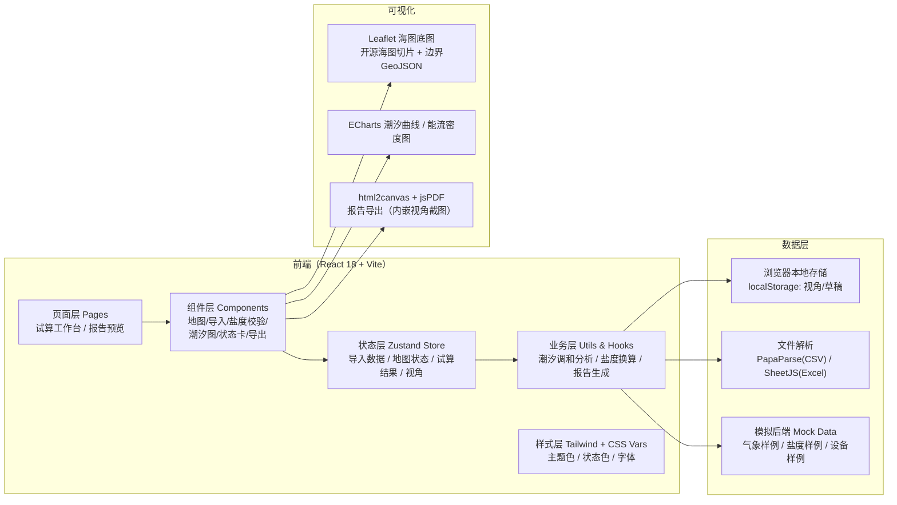

## 1. 架构设计



---

## 2. 技术选型说明

| 类别 | 选择 | 理由 |
|------|------|------|
| 前端框架 | React 18 + TypeScript 5 + Vite 5 | 组件化、类型安全、构建快，符合规范默认 |
| 状态管理 | zustand 4 | 轻量、API简洁，跨组件共享试算状态与视角 |
| 样式 | Tailwind CSS 3 + 自定义 CSS 变量 | 统一设计令牌（海洋主题色、间距、字体） |
| 路由 | react-router-dom 6 | 工作台(/) 与报告预览(/report) 两页 |
| 地图 | leaflet 1.9 + react-leaflet 4 + @types/leaflet | 开源海图底图免费、标注/多边形/越界区实现简单 |
| 图表 | echarts 5 + echarts-for-react | 潮汐曲线、高低潮标注、能流密度热力 |
| 数据解析 | papaparse（CSV）、xlsx（Excel/CSV通用） | 气象预报多为CSV，盐度数据常见Excel |
| 导出 | html2canvas + jspdf | 截取地图视角 + 组装海事处A4 PDF报告 |
| 图标 | lucide-react | 规范要求，线性风格符合专业海图气质 |
| 后端 | **纯前端，Mock数据内置** | 试算为离线场景，潮汐/盐度换算在前端完成 |

---

## 3. 路由定义

| Route | 页面 | 核心职责 |
|-------|------|----------|
| `/` | 试算工作台 `Workbench` | 三栏主工作区：数据导入+地图联动+结果看板 |
| `/report` | 海事处报告预览 `ReportPreview` | A4报告预览、一键导出PDF、状态筛选 |

---

## 4. 核心数据模型（TypeScript 类型定义）

```ts
/** 气象预报记录（来自CSV/Excel） */
interface WeatherForecast {
  timestamp: string;            // '2026-06-12 08:00'
  windSpeed: number;            // m/s
  windDirection: number;        // ° 0-360
  waveHeight: number;           // m 有效波高
  wavePeriod: number;           // s 波浪周期
  airPressure: number;          // hPa
  temperature?: number;         // ℃
  source: string;               // 来源文件名，用于回链
}

/** 盐度记录（带单位字段用于混用检测） */
type SalinityUnit = 'PSU' | '‰' | 'ppt' | 'mS/cm';
interface SalinityRecord {
  id: string;
  station: string;              // 站位编号
  timestamp: string;
  depth: number;                // m
  value: number;                // 原始值
  unit: SalinityUnit;           // 原始单位
  normalizedValue?: number;     // 统一换算为PSU后的值
  unitMismatch?: boolean;       // 与整体口径不一致标记
}

/** 海浪能设备 */
interface EnergyDevice {
  id: string;
  name: string;
  lat: number;                  // WGS84
  lng: number;
  ratedPower: number;           // kW 额定功率
  efficiency: number;           // 0-1 转换效率
  status: ResultStatus;         // 运行/暂缓/异常，决定Marker颜色
  notes?: string;
}

/** 潮汐调和常数（输入） */
interface TidalHarmonic {
  constituent: string;          // M2/S2/K1/O1 等分潮名
  amplitude: number;            // cm
  phase: number;                // ° 迟角
  sourceMaterial: string;       // 来源材料编号，用于回链
}

/** 试算结果-潮汐序列 */
interface TidalPoint {
  time: string;
  level: number;                // m
  type?: 'H' | 'L' | null;      // 高低潮标记
  confidence: number;           // 0-1 置信度
}

/** 三色结果状态 */
type ResultStatus = 'AVAILABLE' | 'DEFERRED' | 'RECOLLECT';
interface ResultItem {
  id: string;
  category: 'weather' | 'salinity' | 'tide' | 'device' | 'energy';
  label: string;                // 如："6月12日潮位序列"
  status: ResultStatus;
  description: string;          // 简述：如"置信度92%"
  /** 下一步操作建议：具体可操作文案，不是内部错误 */
  nextAction?: {
    type: 'upload_material' | 'unify_unit' | 'recalculate' | 'recollect' | 'verify';
    label: string;              // 按钮文案，如"上传X月X-X日深水水质记录"
    hint?: string;              // 详细说明
  };
  /** 关联材料回链 */
  sourceRefs?: string[];
}

/** 保存的地图视角（用于评审截图） */
interface MapViewPreset {
  id: string;
  name: string;                 // 如："总体布设"、"设备A放大"
  center: [number, number];     // lat,lng
  zoom: number;
  bounds?: [[number, number], [number, number]];
  createdAt: string;
}

/** 试算全局状态 */
interface CalcState {
  weather: WeatherForecast[];
  salinity: SalinityRecord[];
  devices: EnergyDevice[];
  harmonics: TidalHarmonic[];
  tidalSeries: TidalPoint[];
  results: ResultItem[];
  viewPresets: MapViewPreset[];
  activeViewId?: string;
  screenshotMode: boolean;
  missingMaterials: string[];   // 缺口清单
}
```

---

## 5. 目录结构

```
/
├── public/
│   └── mock/                  # 样例数据（气象CSV、盐度Excel、海图边界GeoJSON）
├── src/
│   ├── main.tsx
│   ├── App.tsx                # 路由
│   ├── index.css              # Tailwind + 主题CSS变量（海洋色/字体）
│   ├── store/
│   │   └── useCalcStore.ts    # zustand：CalcState 全量状态 + actions
│   ├── pages/
│   │   ├── Workbench.tsx      # 主工作台：三栏布局
│   │   └── ReportPreview.tsx  # 报告预览 + PDF导出
│   ├── components/
│   │   ├── layout/
│   │   │   └── TopNav.tsx     # 顶栏：Logo/项目/截图模式开关/导出
│   │   ├── import/
│   │   │   ├── WeatherUploader.tsx    # 气象预报CSV上传+格式校验
│   │   │   └── SalinityUploader.tsx   # 盐度上传+单位混用检测
│   │   ├── salinity/
│   │   │   ├── SalinityUnitModal.tsx  # 混用弹窗：逐行+一键统一
│   │   │   └── SalinityList.tsx       # 列表带单位Tag
│   │   ├── map/
│   │   │   ├── MapView.tsx            # Leaflet主图：Marker/越界/图例
│   │   │   ├── ViewPresetDrawer.tsx   # 视角抽屉：缩略图/恢复/删除
│   │   │   └── MapLegend.tsx          # 颜色含义图例
│   │   ├── tide/
│   │   │   ├── HarmonicsForm.tsx      # 调和常数输入
│   │   │   └── TideChart.tsx          # ECharts潮汐曲线+高低潮标注
│   │   ├── result/
│   │   │   ├── StatusSummaryBar.tsx   # 三色占比总览
│   │   │   ├── ResultCardList.tsx     # 结果卡：可用/暂缓/需重采
│   │   │   └── NextActionCard.tsx     # 可操作建议卡
│   │   ├── device/
│   │   │   └── DeviceForm.tsx         # 设备参数+取点坐标
│   │   └── report/
│   │       ├── ReportCanvas.tsx       # A4报告可打印区
│   │       └── ExportButton.tsx       # html2canvas+jsPDF 导出
│   ├── utils/
│   │   ├── tideCalculator.ts          # 潮汐调和分析/推算算法
│   │   ├── salinityConverter.ts       // 单位换算表（PSU↔‰↔ppt↔mS/cm）
│   │   ├── weatherValidator.ts        // 气象CSV列名校验+错误信息汉化
│   │   ├── energyCalculator.ts        # 能流密度（0.5ρgH²T/...）
│   │   ├── statusClassifier.ts        // 根据阈值判定三色状态
│   │   ├── sourceLinker.ts            // 结论↔来源材料回链
│   │   └── pdfExporter.ts             # PDF组装+视角截图嵌入
│   ├── hooks/
│   │   ├── useMapView.ts              # 视角保存/恢复/缩略图
│   │   ├── useImportProgress.ts       # 导入进度+格式异常捕获
│   │   └── useReviewScreenshot.ts     # 截图模式开关副作用
│   ├── types/
│   │   └── index.ts                   # 集中导出上述TS类型
│   └── mock/
│       ├── sampleWeather.csv
│       ├── sampleSalinity.xlsx
│       ├── sampleHarmonics.ts
│       ├── sampleDevices.ts
│       └── noGoZones.geojson          # 越界区（航道/保护区）
├── index.html                        # 中文字体预加载
├── tailwind.config.js                # 扩展海洋主题色 + 字体
├── vite.config.ts                    # 路径别名 @/ -> src/
└── tsconfig.json
```

---

## 6. 关键算法与阈值说明

| 模块 | 算法/规则 | 判定口径 |
|------|-----------|----------|
| **盐度换算** | 实用盐标1978（PSS-78）近似表：`1‰ ≈ 1 PSU ≈ 1.0043 ppt`；电导率 `mS/cm → PSU` 使用25℃标准查表插值 | 统一输出口径默认 **PSU**，可在设置切换；混用行高亮并提供"一键统一" |
| **潮汐推算** | 分潮叠加：`h(t) = A₀ + Σ f·H·cos(σ·t + (V₀+u) − g)`，内置 M2/S2/K1/O1/P1/K2/N2/Q1 八大分潮常数库 | 缺 ≥2 个主要分潮 → **红（需重新采集）**；缺1个 → **黄（暂缓）**；齐全 → **绿** |
| **置信度评定** | 输入完整度(0.4权重) + 历史偏差(0.3) + 调和常数可靠度(0.3) | ≥85% 绿；60-84% 黄；<60% 红 |
| **越界判定** | 设备坐标 `point-in-polygon` 与航道/保护区 GeoJSON 比对 | 在越界区内 → **红卡 + 地图红色多边形 + 建议重新选点** |
| **气象缺失** | CSV必含列：`timestamp,windSpeed,waveHeight,wavePeriod` | 缺列或 >10% 空值 → **红卡+建议：补X月X-X日XX站预报** |
| **三色卡文案** | `statusClassifier` 按类别输出**可操作下一步**，不是内部错误 | 例：红卡→"上传6月15-17日30m水深盐度记录（当前缺失3条）"；黄卡→"盐度混用2行，点击统一为PSU口径" |

---

## 7. 状态色与颜色令牌

在 `tailwind.config.js` 中扩展语义色，并在 `index.css` 暴露 CSS 变量供 Leaflet/ECharts 使用：

| 语义 | Tailwind 名 | HEX | 用途 |
|------|-------------|-----|------|
| 可用（绿） | `status-available` | `#0E7C7B` | 设备Marker、结果卡、报告通过章 |
| 暂缓（黄） | `status-deferred` | `#E9A23B` | 设备Marker、结果卡、待复核 |
| 需重采（红） | `status-recollect` | `#D64045` | 设备Marker、越界区、错误卡 |
| 深海主色 | `ocean-900` | `#0A2540` | 导航栏、标题、报告抬头 |
| 海图底 | `ocean-50` | `#F4F8FC` | 工作区背景 |
| 越界区填充 | `nogo-fill` | `rgba(214,64,69,0.18)` | Leaflet 多边形 |
