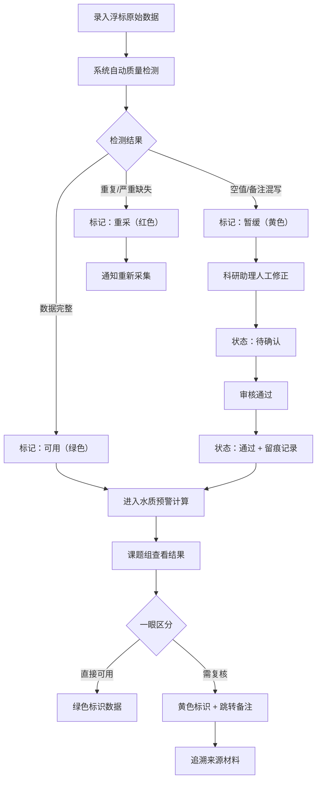

## 1. 产品概述

面向海洋环境科研课题组的塑料垃圾巡查计算工具，将巡检照片、潮汐表、浮标数据等多源材料进行标准化计算与质量分级，核心解决"材料到不齐、解释累、数据质量参差"的协作痛点。

- 目标用户：科研助理（录入/修正）、课题组成员（查阅/使用）
- 产品价值：数据质量一眼可知、计算过程透明可追溯、人工修正留痕可复核

## 2. 核心功能

### 2.1 用户角色

| 角色 | 权限说明 |
|------|----------|
| 科研助理 | 录入浮标数据、人工修正数据、变更审核状态、添加复核备注 |
| 课题组成员 | 查看水质预警、历史回看、数据质量分级、来源材料追溯 |

### 2.2 功能模块

1. **浮标数据工作台**：数据列表、质量检测、空值/重复标记、备注混写分离
2. **水质预警面板**：实时预警指标、阈值公式、单位说明、适用范围、失败原因
3. **历史回看模块**：时间轴检索、趋势曲线、同比环比
4. **复核备注中心**：审核状态流转（待确认→通过）、变更前后对比、来源材料关联
5. **数据质量分级看板**：可用/暂缓/重采三色标识、直接可用与待复核视觉区分

### 2.3 页面详情

| 页面名称 | 模块名称 | 功能描述 |
|-----------|-------------|---------------------|
| 首页仪表盘 | 质量总览卡 | 三色统计、预警数量、待复核数量 |
| 首页仪表盘 | 浮标快览表 | 最近浮标数据缩略、质量标签 |
| 浮标数据页 | 数据列表 | 分页表格、质量标签、空值高亮、重复标记、备注分离展示 |
| 浮标数据页 | 人工修正面板 | 修改数值、留痕记录、状态变更（待确认→通过）、前后对比 |
| 水质预警页 | 预警卡片 | 指标名称、当前值、阈值、公式、单位、适用范围、失败原因 |
| 水质预警页 | 计算公式区 | 展开式公式说明、变量释义 |
| 历史回看页 | 时间轴筛选 | 日期范围、站点选择 |
| 历史回看页 | 趋势图表 | 折线/面积图、异常点标注 |
| 复核备注页 | 审核流 | 待确认/已通过筛选、批量审核 |
| 复核备注页 | 变更详情 | 旧值→新值、操作人、时间、备注、来源材料链接 |

## 3. 核心流程

### 主流程描述
科研助理录入浮标原始数据 → 系统自动检测空值/重复/备注混写 → 标记数据质量等级（可用/暂缓/重采） → 科研助理人工修正并提交审核 → 状态从"待确认"变为"通过"并留痕 → 课题组成员查看预警、历史数据，一眼区分直接可用与待复核数据 → 点击复核备注追溯来源材料。

## 4. 用户界面设计

### 4.1 设计风格

**整体调性**：深海科研风格——冷静、专业、数据驱动，融入海洋元素但不过度装饰。

- **主色**：深海蓝 `#0A2540`（背景/标题），辅助青色 `#00B4D8`（高亮/激活）
- **强调色**：数据质量三色——可用绿 `#10B981`、暂缓黄 `#F59E0B`、重采红 `#EF4444`
- **背景**：渐变深海蓝到午夜蓝，带细微水波纹噪点纹理
- **按钮**：方中带圆（圆角 6px），按压下沉微立体效果，悬停时发光描边
- **字体**：标题使用「思源宋体」（学术感），正文使用「Inter」（数据可读性）
- **布局**：左侧导航栏 + 顶部状态栏 + 主内容卡片网格
- **图标**：Lucide 线性图标，统一 18px，数据质量使用实色圆点徽章
- **动效**：卡片入场渐入上浮、预警脉冲呼吸、状态切换平滑过渡

### 4.2 页面设计概述

| 页面名称 | 模块名称 | UI 要素 |
|-----------|-------------|-------------|
| 首页仪表盘 | 质量总览卡 | 三大圆形进度环（绿/黄/红）+ 数字 + 标签，卡片毛玻璃质感 |
| 首页仪表盘 | 浮标快览表 | 斑马纹表格行，质量圆点徽章居右，悬停行高亮 |
| 浮标数据页 | 数据列表 | 空值单元格斜纹背景，重复数据左侧竖红条，备注用气泡样式 |
| 浮标数据页 | 修正面板 | 左右分栏对比（旧值/新值），底部操作人+时间戳小字体 |
| 水质预警页 | 预警卡片 | 顶部指标名+当前值大字，中部公式块（等宽字体+浅灰底），底部适用范围/失败原因折叠面板 |
| 历史回看页 | 趋势图表 | 面积渐变填充曲线，异常点红圈标注，悬浮 tooltip 显示详细数据 |
| 复核备注页 | 审核流 | 标签页切换（待确认/通过），列表项可展开查看变更 diff |
| 复核备注页 | 变更详情 | diff 样式（删除线红色/新增绿色），来源材料用外链接图标 |

### 4.3 响应式

- 桌面端优先（≥1280px），三栏布局：导航（240px）+ 主内容 + 右侧详情抽屉
- 平板端（768-1279px）：导航折叠为图标栏，详情抽屉改为底部滑出
- 移动端（<768px）：顶部汉堡菜单 + 单列卡片堆叠，表格横向滚动

### 4.4 微交互细节

- 数据质量圆点悬停时显示 tooltip 说明分级依据
- 预警卡片触发预警时边框发光脉冲（每 3 秒一次）
- 状态从"待确认"切换到"通过"时，卡片从黄色→绿色有 0.4s 过渡动画
- 修正面板保存时出现勾号对号动画，留痕记录追加到时间轴
