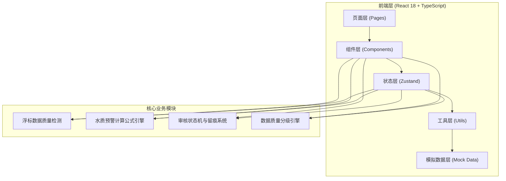

## 1. 架构设计



## 2. 技术描述

- **前端**：React@18 + TypeScript + Vite@5 + TailwindCSS@3 + Zustand@4
- **图表**：Recharts（轻量级 React 图表库，适合趋势曲线与异常标注）
- **图标**：lucide-react
- **后端**：纯前端项目，使用 Mock 数据模拟（含 50+ 条浮标历史数据、10+ 条审核留痕记录）
- **初始化工具**：vite-init（react-ts 模板）

## 3. 路由定义

| 路由 | 页面用途 |
|-------|---------|
| `/` | 首页仪表盘（质量总览 + 浮标快览） |
| `/buoy` | 浮标数据工作台（数据列表 + 人工修正） |
| `/warning` | 水质预警面板（预警卡片 + 公式说明） |
| `/history` | 历史回看模块（时间筛选 + 趋势图） |
| `/review` | 复核备注中心（审核流 + 变更追溯） |

## 4. 核心数据模型

### 4.1 类型定义

```typescript
// 数据质量等级
type DataQuality = 'available' | 'pending' | 'recollect';

// 审核状态
type ReviewStatus = 'pending' | 'approved';

// 浮标数据记录
interface BuoyRecord {
  id: string;
  buoyId: string;
  timestamp: string;
  location: string;
  plasticConcentration: number | null; // 塑料浓度 (个/m³)
  turbidity: number | null;             // 浊度 (NTU)
  salinity: number | null;              // 盐度 (PSU)
  temperature: number | null;           // 水温 (°C)
  rawRemark?: string;                   // 原始备注（可能与数值混写）
  extractedRemark?: string;             // 提取后的备注文本
  quality: DataQuality;
  qualityReasons: string[];             // 质量判定原因
  reviewStatus: ReviewStatus;
  isDuplicate: boolean;
  duplicateOf?: string;
  hasNullValue: boolean;
  nullFields: string[];
}

// 人工修正记录
interface CorrectionLog {
  id: string;
  buoyRecordId: string;
  fieldName: string;
  oldValue: number | string | null;
  newValue: number | string | null;
  operator: string;
  timestamp: string;
  remark: string;
  sourceMaterial?: string;               // 来源材料链接/说明
}

// 水质预警指标
interface WaterQualityWarning {
  id: string;
  indicatorName: string;
  currentValue: number;
  unit: string;
  threshold: number;
  formula: string;
  formulaDescription: string;
  applicableScope: string;
  failureReason: string;
  isTriggered: boolean;
  variables: { name: string; value: number; unit: string }[];
}
```

### 4.2 核心工具函数

| 函数 | 用途 |
|------|------|
| `detectDataQuality(record)` | 检测空值、重复、备注混写，返回质量等级与原因 |
| `calculateWarning(record, thresholds)` | 根据公式计算水质预警，返回是否触发及完整公式说明 |
| `separateRemarkAndValue(rawText)` | 将混写的备注与数值分离 |
| `createCorrectionLog(params)` | 创建人工修正留痕记录，包含前后对比 |
| `classifyForDisplay(records)` | 将数据按课题组视角分类：直接可用 / 需复核 |

## 5. 项目结构

```
src/
├── components/
│   ├── QualityBadge.tsx         # 数据质量徽章（绿/黄/红圆点）
│   ├── BuoyDataTable.tsx        # 浮标数据表（空值/重复高亮）
│   ├── CorrectionPanel.tsx      # 人工修正面板（前后对比）
│   ├── WarningCard.tsx          # 预警卡片（公式+单位+适用范围）
│   ├── TrendChart.tsx           # 历史趋势图（异常点标注）
│   ├── ReviewTimeline.tsx       # 审核留痕时间轴
│   ├── FormulaBlock.tsx         # 公式展示块
│   └── StatusCard.tsx           # 仪表盘统计卡
├── pages/
│   ├── Dashboard.tsx            # 首页仪表盘
│   ├── BuoyData.tsx             # 浮标数据工作台
│   ├── WaterWarning.tsx         # 水质预警面板
│   ├── HistoryView.tsx          # 历史回看
│   └── ReviewCenter.tsx         # 复核备注中心
├── store/
│   ├── useBuoyStore.ts          # 浮标数据状态管理
│   ├── useWarningStore.ts       # 预警状态管理
│   └── useReviewStore.ts        # 审核状态管理
├── utils/
│   ├── qualityDetector.ts       # 数据质量检测
│   ├── formulaEngine.ts         # 公式计算引擎
│   ├── remarkParser.ts          # 备注数值分离
│   └── correctionLogger.ts      # 修正留痕
├── data/
│   └── mockData.ts              # 模拟数据（50+历史记录）
├── types/
│   └── index.ts                 # 全局类型定义
├── App.tsx
├── main.tsx
└── index.css
```
