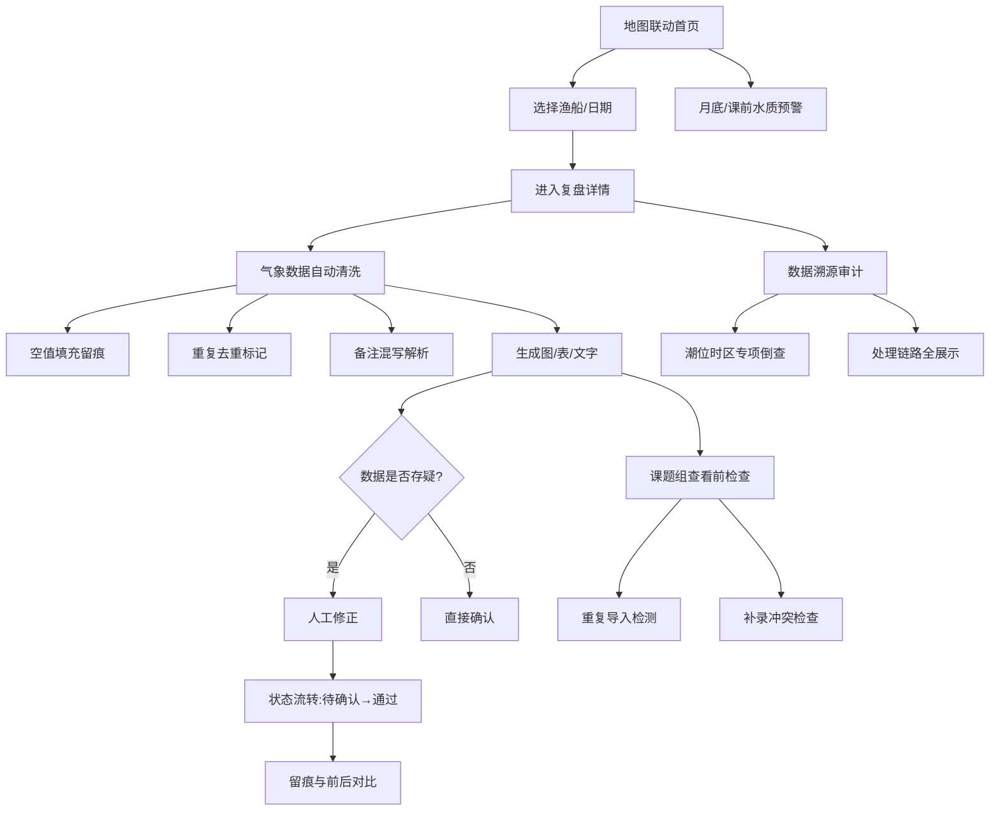

## 1. 产品概述

渔船油耗航线复盘系统是面向海岛运维人员的专业数据分析工具，用于复盘渔船航行过程中的油耗表现与航线选择，重点围绕气象预报数据进行全链路可追溯分析。系统解决了传统依赖经验判断、浮标数据补录后变更不可追溯、人工修正无留痕等核心痛点。

- 目标用户：海岛运维人员、海洋课题组研究人员
- 核心价值：提供数据可复现、过程可追溯、结论可审计的油耗航线复盘能力

## 2. 核心特性

### 2.1 用户角色

| 角色 | 注册方式 | 核心权限 |
|------|----------|----------|
| 海岛运维 | 系统分配账号 | 日常复盘、数据导入/补录、人工修正、审计追溯 |
| 课题组 | 系统分配账号 | 查看复盘报告、对比分析结论、导出数据 |

### 2.2 功能模块

1. **地图联动首页**：渔船位置总览、航线筛选、快速进入复盘详情、日常操作入口
2. **油耗航线复盘详情**：航线图、油耗趋势图、数据表格、文字说明四者联动校验
3. **气象预报数据处理**：空值填充、重复去重、备注混写解析、数据清洗留痕
4. **数据溯源审计**：从结果反查来源、处理日志、潮位时区错误专项倒查
5. **人工修正留痕**：状态流转（待确认→通过）、前后对比、操作人记录
6. **重复导入检测**：补录数据冲突检测、同事件多结论预警
7. **水质预警模块**：月底/课前专项查看、水质与油耗关联分析

### 2.3 页面详情

| 页面名称 | 模块名称 | 功能描述 |
|----------|----------|----------|
| 地图联动首页 | 海图区域 | 显示渔船实时位置、历史航线叠加、点击渔船进入复盘 |
| 地图联动首页 | 筛选工具栏 | 日期范围、渔船编号、油耗异常等级筛选 |
| 地图联动首页 | 快捷入口卡 | 待处理修正、重复导入预警、水质预警快速跳转 |
| 复盘详情页 | 航线地图 | 航行轨迹、气象节点标注、浮标补录点高亮 |
| 复盘详情页 | 油耗图表 | 小时油耗曲线、预计vs实际对比、气象因素叠加 |
| 复盘详情页 | 数据明细表 | 逐小时原始数据、清洗标记、修正记录、可展开溯源 |
| 复盘详情页 | 文字结论区 | 自动生成复盘说明、人工备注、版本对比 |
| 数据溯源面板 | 来源链展示 | 结果→处理步骤→原始数据→导入日志完整链路 |
| 数据溯源面板 | 潮位时区倒查 | 专门针对时区错误记录的专项追溯视图 |
| 人工修正页 | 修正对比 | 修正前后数值并列表、差异高亮、修正理由填写 |
| 人工修正页 | 状态流转 | 待确认/通过/驳回状态切换、操作历史时间线 |
| 导入检测页 | 重复检测结果 | 疑似重复记录列表、合并操作、冲突字段对比 |
| 水质预警页 | 预警列表 | 月度/课前水质异常记录、与航线油耗关联分析 |

## 3. 核心流程

海岛运维人员每日从地图联动首页进入，选择目标渔船查看航线油耗复盘。系统自动处理气象预报中的空值、重复和混写备注，生成可复现的图表与文字结论。运维人员可对存疑数据进行人工修正，修正过程全程留痕，状态从"待确认"流转至"通过"时可查看前后变化。月底或课前，运维人员进入水质预警模块查看专项分析。审计时，可从任意结果节点一路追溯到原始数据和处理记录，包括潮位时区错误的专项倒查。数据导入时系统自动检测重复和补录冲突，避免同一事件出现多份结论。

## 4. 用户界面设计

### 4.1 设计风格

- 主色调：深海蓝 `#0A2540` 作为基底，海洋青 `#00B8D4` 作为强调色，数据金 `#FFB300` 用于预警高亮
- 辅助色：浅海灰 `#E8F4F8` 用于背景层，珊瑚红 `#FF6B6B` 用于错误和严重警示
- 按钮风格：圆角 6px，主按钮实心深蓝配白色文字，悬停时微上浮 + 发光边
- 字体：标题使用 "Noto Serif SC" 衬线体营造专业海事感，正文使用 "Noto Sans SC" 无衬线体保证可读性
- 图标：Lucide 线性图标，数据相关使用填充变体
- 布局：卡片式栅格布局，海图区域占视觉主导，侧边栏放筛选与快速操作
- 视觉细节：航海图纹理背景、等高线装饰元素、数据卡片轻微毛玻璃效果

### 4.2 页面设计概览

| 页面名称 | 模块名称 | UI 元素 |
|----------|----------|----------|
| 地图联动首页 | 海图区域 | 深蓝色渐变底 + 航海纹理、渔船锚点带脉冲动画、航线轨迹贝塞尔曲线带流动光效 |
| 地图联动首页 | 顶部导航 | 深海蓝底、白色文字、系统名称配海锚图标、水质预警红点角标 |
| 地图联动首页 | 快捷卡片 | 半透明毛玻璃卡片、三色状态指示灯（待确认/通过/预警）、悬停上浮动画 |
| 复盘详情页 | 四宫格布局 | 上左航线图、上右油耗曲线图、下左数据表、下右文字说明、格线虚线仿海图风格 |
| 复盘详情页 | 数据行展开 | 点击展开溯源链路、时间轴竖线连接各处理节点、差异数据黄色斜纹高亮 |
| 数据溯源面板 | 链路视图 | 横向流程节点、节点间连接线带箭头、可点击节点展开详情、当前节点脉冲高亮 |
| 人工修正页 | 对比视图 | 左右双栏布局、中间差异对比列、改动处划线对比、修正理由富文本输入框 |
| 人工修正页 | 状态时间线 | 垂直时间轴、状态节点配不同图标和颜色、操作人/时间/备注完整展示 |
| 水质预警页 | 预警卡片 | 列表式卡片、严重程度色条、关联航线快速跳转、月度趋势缩略小图 |

### 4.3 响应式设计

- 桌面端优先设计，适配 1440px 及以上宽度
- 平板端（768-1024px）：四宫格改为上下双栏，海图高度自适应
- 移动端：单列纵向排布，海图支持全屏切换，表格横向滚动
- 触摸优化：所有可点击区域不小于 44×44px，滑动手势支持地图平移缩放

### 4.4 动画与交互细节

- 页面加载：海图区域先渲染底图，数据点错落延迟浮现（staggered reveal）
- 航线绘制：SVG 路径描边动画，从起点向终点流动
- 数据变更：修正确认后数字滚动过渡到新值，旧值淡出
- 悬停反馈：卡片轻微上浮 + 柔和阴影，按钮边框微光流动
- 溯源面板：节点点击时涟漪扩散，详情面板滑入展开
