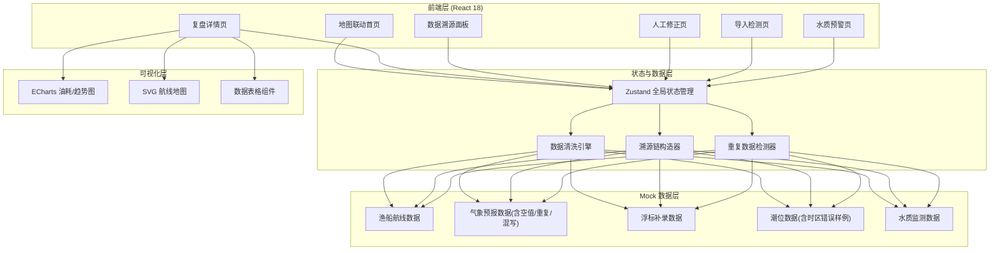
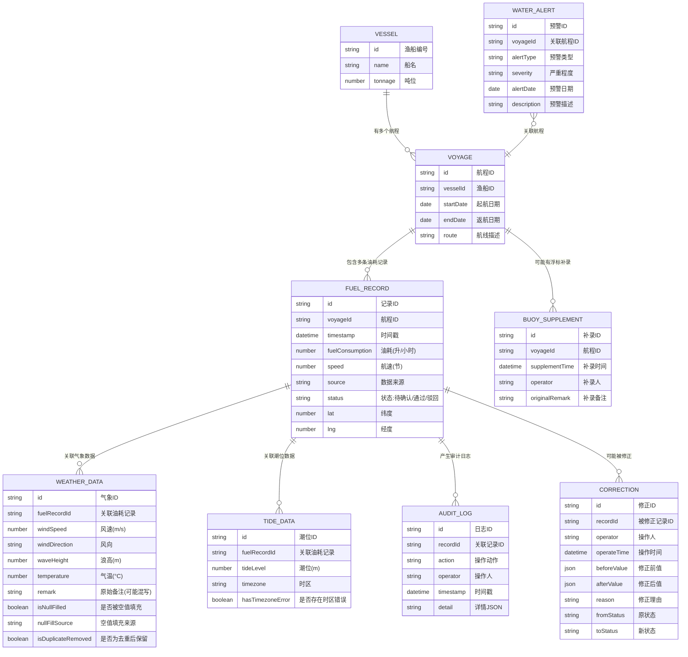

## 1. 架构设计



## 2. 技术说明

- 前端框架：React@18 + TypeScript@5 + Vite@5
- 样式方案：TailwindCSS@3 + CSS 变量主题系统
- 状态管理：Zustand@4（轻量级、支持时间旅行调试，适合审计场景）
- 图表库：ECharts@5（功能完善，适合油耗趋势、水质预警等复杂图表）
- 路由：React Router@6
- 图标：Lucide React
- 后端：使用前端 Mock 数据，暂不需要真实后端服务
- 数据持久化：LocalStorage 保存人工修正记录与操作日志

## 3. 路由定义

| 路由 | 用途 |
|------|------|
| `/` | 地图联动首页（日常入口） |
| `/review/:vesselId/:date` | 油耗航线复盘详情页 |
| `/trace/:recordId` | 数据溯源面板（含潮位时区倒查） |
| `/correction/:recordId` | 人工修正与状态流转页 |
| `/duplicate-check` | 重复导入与补录冲突检测页 |
| `/water-quality` | 水质预警专项查看页 |

## 4. 数据模型

### 4.1 数据模型定义



### 4.2 数据清洗引擎核心类型定义

```typescript
type WeatherRaw = {
  timestamp: string;
  windSpeed: number | null;
  windDirection: string | null;
  waveHeight: number | null;
  temperature: number | null;
  remark: string;
};

type CleanStep = {
  step: string;
  before: any;
  after: any;
  reason: string;
  operator: 'system' | 'user';
  timestamp: string;
};

type CleanResult<T> = {
  data: T;
  steps: CleanStep[];
  sourceFingerprint: string;
};

type DuplicateCheckResult = {
  isDuplicate: boolean;
  duplicateOf?: string;
  confidence: number;
  conflictingFields: string[];
};
```

## 5. 核心模块说明

### 5.1 气象数据清洗引擎

处理三类典型脏数据：
- **空值填充**：基于前后时间窗口线性插值，记录填充来源与算法
- **重复去重**：按时间戳+坐标指纹匹配，保留数据最完整的一条，标记其余为重复
- **备注混写解析**：正则提取备注中的结构化数据（如"风速8东北浪高1.2"→{windSpeed:8, waveHeight:1.2}）

### 5.2 溯源链构造器

每条油耗记录维护完整处理链路：
```
原始导入 → 空值填充 → 备注解析 → 重复去重 → 人工修正 → 最终结果
```
每个节点保存：操作类型、前后值、操作人、时间戳、理由

### 5.3 潮位时区专项倒查

针对验收场景：输入一条已知时区错误的潮位记录，系统展示：
1. 时区错误如何传导至油耗计算
2. 影响了哪些关联数据点
3. 修正时区后的数据差异对比
4. 整条处理链路的审计日志

### 5.4 人工修正留痕

使用 Zustand 的中间件记录每次状态变更：
- 修正前后 JSON 快照
- 状态流转：待确认 → 通过 / 驳回
- 操作人签名（模拟）
- 变更理由必填
- 支持一键回滚至任意历史版本

### 5.5 重复导入检测

基于复合主键（渔船ID + 日期 + 时间窗口）进行相似度匹配：
- 精确重复：所有字段完全一致 → 自动忽略
- 疑似重复：时间+坐标接近但数值有差异 → 人工裁决
- 冲突字段对比并列表，支持合并选择
