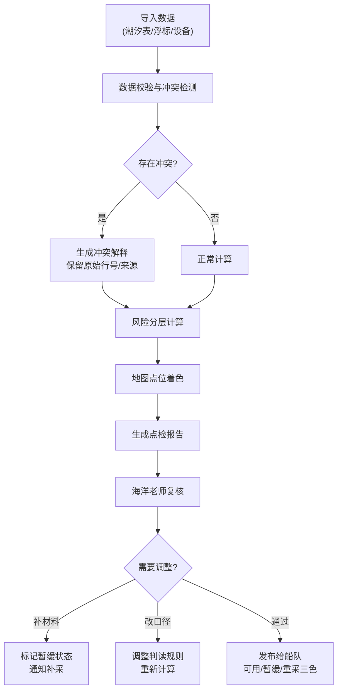

## 1. 产品概述

离岸平台设备点检系统，解决海洋工程设备巡检中潮汐表与浮标数据冲突、数据来源追溯困难、风险分层模糊等核心痛点。系统面向海洋老师（数据复核）、船队（现场执行）、运维同事（流程跑批）三类角色，提供数据冲突解释、风险分层地图、报告溯源导出三大核心能力。

- 核心价值：让异常不再是一个红色数字，而是可追溯、可解释、可行动的点检结论
- 目标场景：离岸风电、油气平台的日常设备点检与海况数据校验

## 2. 核心功能

### 2.1 用户角色

| 角色 | 使用方式 | 核心权限 |
|------|----------|----------|
| 海洋老师 | 浏览器复核 | 查看全部数据、调整判读口径、标记复核结论 |
| 船队 | 浏览器/移动端查看 | 查看点检结果、区分可用/暂缓/重采数据 |
| 运维同事 | 命令行脚本 | 导入数据、跑批计算、生成报告 |

### 2.2 功能模块

1. **总览仪表盘**：风险分层概览、数据状态统计、最近点检批次
2. **地图联动**：离岸平台分布、实时海况叠加、风险等级色阶、点击下钻详情
3. **数据冲突中心**：潮汐表 vs 浮标数据对比、冲突解释、原始来源追溯、行号/图片/备注保留
4. **风险分层**：设备风险等级计算、影响因素拆解、下一步行动建议（补材料/改口径/正常）
5. **报告导出**：带溯源链接的点检报告、结论回链原始记录、支持 PDF/Excel
6. **数据管理**：本地数据库、批量导入、脚本示例、curl 接口示例

### 2.3 页面详情

| 页面名称 | 模块名称 | 功能描述 |
|----------|----------|----------|
| 总览仪表盘 | 风险统计卡片 | 按风险等级（高/中/低）统计设备数量，点击跳转对应列表 |
| 总览仪表盘 | 数据状态条 | 三色标识：可用（绿）/暂缓（黄）/重采（红），附简要说明 |
| 总览仪表盘 | 最近批次 | 最近5次点检批次，含批次号、时间、数据完整度 |
| 地图联动页 | 平台地图 | 离岸平台点位分布，按风险等级着色，支持缩放平移 |
| 地图联动页 | 海况叠加层 | 潮汐、浪高、风速等海况数据图层切换 |
| 地图联动页 | 点位详情面板 | 点击平台弹出设备清单、风险摘要、数据来源 |
| 数据冲突中心 | 冲突列表 | 所有存在数据冲突的记录，按严重程度排序 |
| 数据冲突中心 | 冲突对比 | 潮汐表数据 vs 浮标数据并排对比，标注差值和偏差率 |
| 数据冲突中心 | 冲突解释 | 自动生成冲突原因说明（时段差/校准差/设备异常等） |
| 数据冲突中心 | 来源追溯 | 原始行号、图片名、来源备注，一键跳转原始记录 |
| 风险分层页 | 风险列表 | 设备风险分级列表，支持筛选和排序 |
| 风险分层页 | 风险拆解 | 每个风险等级的构成因素权重和数值 |
| 风险分层页 | 行动建议 | 明确下一步：补材料 / 改口径 / 正常流转 |
| 报告导出页 | 报告生成 | 选择批次和范围，生成点检报告 |
| 报告导出页 | 溯源链接 | 报告中每条结论可点击回链到原始数据行 |
| 数据管理页 | 数据导入 | 上传潮汐表、浮标数据、设备清单 |
| 数据管理页 | 脚本示例 | curl 命令和 shell 脚本示例，可复制运行 |
| 数据管理页 | 数据库状态 | 本地 SQLite 数据表和记录数概览 |

## 3. 核心流程

### 3.1 点检主流程

### 3.2 船队查看流程

1. 船队打开系统 → 看到总览仪表盘
2. 绿色（可用）：直接用于作业决策
3. 黄色（暂缓）：需联系海洋老师确认
4. 红色（重采）：数据不可用，等待重新采集

## 4. 用户界面设计

### 4.1 设计风格

- **主色调**：深海蓝 `#0A2540` + 青绿 `#00D4AA`，营造海洋工程专业感
- **辅助色**：风险红 `#FF4D4D`、暂缓黄 `#FFB020`、可用绿 `#00D4AA`
- **背景**：深色渐变背景 + 细微网格纹理，类似航海雷达/声呐视觉
- **字体**：标题用尖锐现代无衬线，正文用清晰易读的等宽/无衬线
- **按钮**：直角硬边按钮，带细微边框和发光悬停效果
- **图标风格**：线性细线图标，科技感
- **整体调性**：工业科技风，类似海事监控系统，严肃、专业、可信赖

### 4.2 页面设计概览

| 页面名称 | 模块名称 | UI 元素 |
|----------|----------|---------|
| 总览仪表盘 | 风险统计卡片 | 深色卡片、风险色阶竖条、数字动画、悬停微抬升 |
| 总览仪表盘 | 数据状态条 | 三色进度条、悬浮 tooltip 说明各状态含义 |
| 地图联动页 | 平台地图 | 深色底图、发光点位、涟漪动效、点击扩散圈 |
| 地图联动页 | 海况图层 | 右侧图层切换面板、半透明叠加、渐变色阶图例 |
| 数据冲突中心 | 冲突对比 | 左右分栏对比、差值高亮、来源标签（行号/文件名） |
| 数据冲突中心 | 来源追溯 | 灰色小字原始信息、复制按钮、一键跳转 |
| 风险分层页 | 风险拆解 | 横向条形图、权重标注、行动建议标签（补材料/改口径） |
| 报告导出页 | 报告预览 | 模拟纸张效果、结论超链接样式、导出按钮组 |

### 4.3 响应式

- Desktop-first 设计，核心功能在桌面端完整呈现
- 移动端适配：地图缩成全宽、卡片纵向堆叠、侧边栏收起为底部 tab
- 船队场景支持平板横屏查看

### 4.4 动效设计

- 页面加载：元素从下往上淡入，错落 50ms 延迟
- 风险点位：呼吸灯效，高风险点脉动频率更快
- 地图点击：点击处扩散涟漪，详情面板从右侧滑入
- 数据更新：数字滚动动画，新数据行从上方滑入
