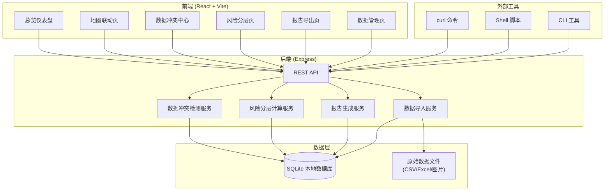
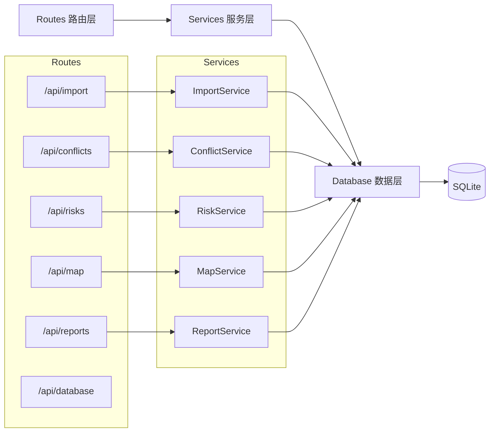
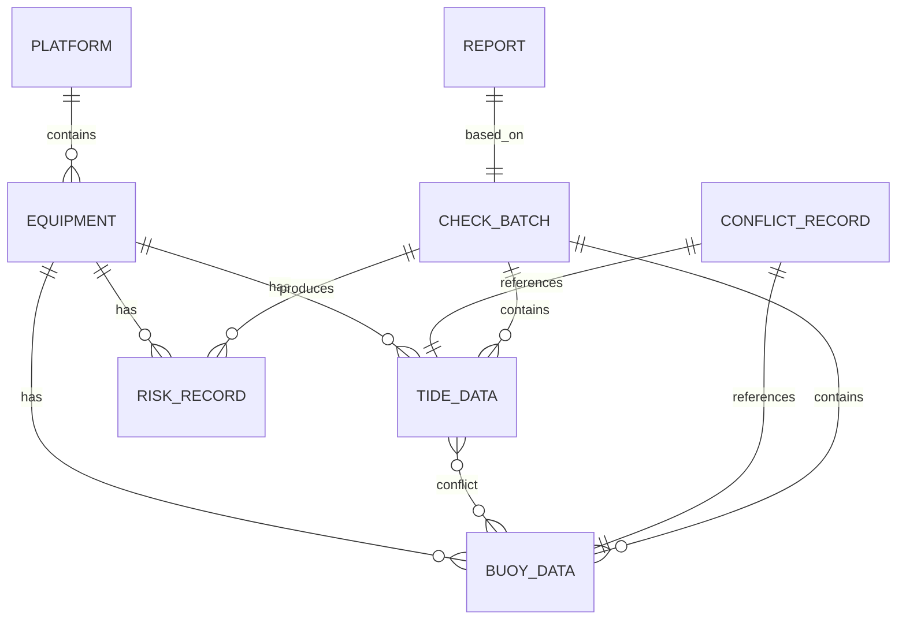

## 1. 架构设计



## 2. 技术说明

- **前端**：React@18 + React Router@6 + tailwindcss@3 + Vite@5
- **UI 组件**：自研组件（不依赖 UI 库），配合 tailwindcss
- **地图**：Leaflet@1.9 + 自定义深色底图样式（离线可用）
- **图表**：recharts@2 用于风险拆解和趋势图
- **后端**：Express@4 + better-sqlite3（同步 SQLite，本地使用简单高效）
- **数据库**：SQLite（本地文件数据库，零配置，适合单机/小团队）
- **报告导出**：前端 html2canvas + jspdf（PDF），xlsx（Excel）
- **初始化工具**：vite-init 脚手架
- **脚本**：提供 shell 脚本和 curl 示例，支持命令行批量操作

## 3. 路由定义

| 路由 | 页面 | 说明 |
|------|------|------|
| /dashboard | 总览仪表盘 | 风险统计、数据状态、最近批次 |
| /map | 地图联动 | 平台分布、海况叠加、点位详情 |
| /conflicts | 数据冲突中心 | 冲突列表、对比、解释、溯源 |
| /risks | 风险分层 | 风险列表、拆解、行动建议 |
| /reports | 报告导出 | 报告生成、预览、导出 |
| /data | 数据管理 | 导入、脚本示例、数据库状态 |

## 4. API 定义

### 4.1 数据导入

```typescript
// POST /api/import/tide
// 导入潮汐表数据
Request: FormData { file: File, source: string, remark?: string }
Response: { success: true, count: number, batchId: string }

// POST /api/import/buoy
// 导入浮标数据
Request: FormData { file: File, source: string, remark?: string }
Response: { success: true, count: number, batchId: string }

// POST /api/import/equipment
// 导入设备清单
Request: FormData { file: File }
Response: { success: true, count: number }
```

### 4.2 冲突检测

```typescript
// GET /api/conflicts
// 获取冲突列表
Request Query: { page?: number, pageSize?: number, severity?: 'high'|'medium'|'low' }
Response: {
  total: number,
  items: Array<{
    id: string,
    equipmentId: string,
    equipmentName: string,
    timestamp: string,
    tideValue: number,
    buoyValue: number,
    diffValue: number,
    diffRate: number,
    severity: 'high'|'medium'|'low',
    explanation: string,
    sourceTide: { file: string, line: number, remark?: string },
    sourceBuoy: { file: string, line: number, image?: string, remark?: string },
    status: 'pending'|'resolved'
  }>
}

// POST /api/conflicts/:id/resolve
// 标记冲突已解决
Request: { resolution: 'supplement'|'adjust'|'accept', remark: string }
Response: { success: true }
```

### 4.3 风险分层

```typescript
// GET /api/risks
// 获取风险分层列表
Request Query: { level?: 'high'|'medium'|'low', platformId?: string }
Response: {
  items: Array<{
    id: string,
    equipmentId: string,
    equipmentName: string,
    platformId: string,
    platformName: string,
    riskLevel: 'high'|'medium'|'low',
    riskScore: number,
    factors: Array<{ name: string, weight: number, value: number }>,
    action: 'supplement'|'adjust'|'normal',
    dataStatus: 'available'|'pending'|'recollect',
    lastCheck: string
  }>
}

// GET /api/risks/overview
// 风险概览统计
Response: {
  high: number,
  medium: number,
  low: number,
  available: number,
  pending: number,
  recollect: number
}
```

### 4.4 地图数据

```typescript
// GET /api/map/platforms
// 获取所有平台点位
Response: {
  items: Array<{
    id: string,
    name: string,
    lng: number,
    lat: number,
    riskLevel: 'high'|'medium'|'low',
    equipmentCount: number
  }>
}

// GET /api/map/sealayer
// 获取海况图层数据
Request Query: { type: 'tide'|'wave'|'wind', time?: string }
Response: {
  type: string,
  timestamp: string,
  dataPoints: Array<{ lng: number, lat: number, value: number }>
}
```

### 4.5 报告

```typescript
// POST /api/reports/generate
// 生成点检报告
Request: { batchId?: string, platformId?: string, format: 'pdf'|'xlsx' }
Response: { success: true, reportId: string, downloadUrl: string }

// GET /api/reports/:id
// 获取报告详情
Response: {
  id: string,
  title: string,
  generatedAt: string,
  sections: Array<{
    title: string,
    items: Array<{
      id: string,
      content: string,
      sourceRef?: string
    }>
  }>
}
```

### 4.6 数据库状态

```typescript
// GET /api/database/status
// 获取数据库状态
Response: {
  tables: Array<{ name: string, count: number }>,
  latestBatch: string,
  totalRecords: number
}
```

## 5. 服务端架构图



## 6. 数据模型

### 6.1 数据模型定义



### 6.2 数据定义语言

```sql
-- 平台表
CREATE TABLE platforms (
  id TEXT PRIMARY KEY,
  name TEXT NOT NULL,
  lng REAL NOT NULL,
  lat REAL NOT NULL,
  description TEXT,
  created_at TEXT DEFAULT (datetime('now'))
);

-- 设备表
CREATE TABLE equipment (
  id TEXT PRIMARY KEY,
  name TEXT NOT NULL,
  platform_id TEXT NOT NULL,
  type TEXT NOT NULL,
  status TEXT DEFAULT 'active',
  created_at TEXT DEFAULT (datetime('now')),
  FOREIGN KEY (platform_id) REFERENCES platforms(id)
);

-- 潮汐数据表
CREATE TABLE tide_data (
  id TEXT PRIMARY KEY,
  equipment_id TEXT NOT NULL,
  batch_id TEXT NOT NULL,
  timestamp TEXT NOT NULL,
  tide_level REAL NOT NULL,
  source_file TEXT NOT NULL,
  source_line INTEGER NOT NULL,
  source_remark TEXT,
  created_at TEXT DEFAULT (datetime('now')),
  FOREIGN KEY (equipment_id) REFERENCES equipment(id),
  FOREIGN KEY (batch_id) REFERENCES check_batches(id)
);

-- 浮标数据表
CREATE TABLE buoy_data (
  id TEXT PRIMARY KEY,
  equipment_id TEXT NOT NULL,
  batch_id TEXT NOT NULL,
  timestamp TEXT NOT NULL,
  tide_level REAL,
  wave_height REAL,
  wind_speed REAL,
  source_file TEXT NOT NULL,
  source_line INTEGER NOT NULL,
  source_image TEXT,
  source_remark TEXT,
  created_at TEXT DEFAULT (datetime('now')),
  FOREIGN KEY (equipment_id) REFERENCES equipment(id),
  FOREIGN KEY (batch_id) REFERENCES check_batches(id)
);

-- 点检批次表
CREATE TABLE check_batches (
  id TEXT PRIMARY KEY,
  name TEXT NOT NULL,
  status TEXT DEFAULT 'processing',
  data_completeness REAL DEFAULT 0,
  created_at TEXT DEFAULT (datetime('now')),
  completed_at TEXT
);

-- 冲突记录表
CREATE TABLE conflict_records (
  id TEXT PRIMARY KEY,
  equipment_id TEXT NOT NULL,
  tide_data_id TEXT NOT NULL,
  buoy_data_id TEXT NOT NULL,
  batch_id TEXT NOT NULL,
  timestamp TEXT NOT NULL,
  tide_value REAL NOT NULL,
  buoy_value REAL NOT NULL,
  diff_value REAL NOT NULL,
  diff_rate REAL NOT NULL,
  severity TEXT NOT NULL,
  explanation TEXT NOT NULL,
  status TEXT DEFAULT 'pending',
  resolution TEXT,
  resolution_remark TEXT,
  resolved_at TEXT,
  created_at TEXT DEFAULT (datetime('now')),
  FOREIGN KEY (equipment_id) REFERENCES equipment(id),
  FOREIGN KEY (tide_data_id) REFERENCES tide_data(id),
  FOREIGN KEY (buoy_data_id) REFERENCES buoy_data(id),
  FOREIGN KEY (batch_id) REFERENCES check_batches(id)
);

-- 风险记录表
CREATE TABLE risk_records (
  id TEXT PRIMARY KEY,
  equipment_id TEXT NOT NULL,
  batch_id TEXT NOT NULL,
  risk_level TEXT NOT NULL,
  risk_score REAL NOT NULL,
  factors_json TEXT NOT NULL,
  action TEXT NOT NULL,
  data_status TEXT NOT NULL,
  created_at TEXT DEFAULT (datetime('now')),
  FOREIGN KEY (equipment_id) REFERENCES equipment(id),
  FOREIGN KEY (batch_id) REFERENCES check_batches(id)
);

-- 报告表
CREATE TABLE reports (
  id TEXT PRIMARY KEY,
  batch_id TEXT NOT NULL,
  title TEXT NOT NULL,
  format TEXT NOT NULL,
  file_path TEXT,
  generated_at TEXT DEFAULT (datetime('now')),
  FOREIGN KEY (batch_id) REFERENCES check_batches(id)
);

-- 索引
CREATE INDEX idx_tide_equipment ON tide_data(equipment_id, timestamp);
CREATE INDEX idx_buoy_equipment ON buoy_data(equipment_id, timestamp);
CREATE INDEX idx_conflict_severity ON conflict_records(severity);
CREATE INDEX idx_risk_level ON risk_records(risk_level);
```

### 6.3 初始数据（示例）

```sql
-- 示例平台
INSERT INTO platforms (id, name, lng, lat, description) VALUES
('plat_001', '东海一号平台', 123.456, 30.123, '离岸风电平台A区'),
('plat_002', '东海二号平台', 123.789, 30.456, '离岸风电平台B区'),
('plat_003', '南海一号平台', 114.567, 22.345, '油气平台');

-- 示例设备
INSERT INTO equipment (id, name, platform_id, type) VALUES
('eq_001', '风机A1', 'plat_001', 'wind_turbine'),
('eq_002', '风机A2', 'plat_001', 'wind_turbine'),
('eq_003', '升压站B', 'plat_001', 'substation'),
('eq_004', '风机B1', 'plat_002', 'wind_turbine'),
('eq_005', '钻机C1', 'plat_003', 'drilling_rig');
```
