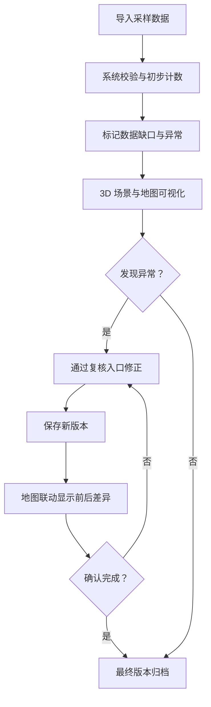

## 1. 产品概述

海洋浮游生物计数系统是面向潜水教练和海洋科研人员的专业工具，用于台风季前海洋浮游生物数据的导入、计数、复核与修正。系统通过 Three.js 3D 可视化交互，支持数据旋转、剖切、筛选与对象明细联动，并完整记录每次导入、修正和确认操作的历史轨迹。

### 1.1 产品价值
- 解决台风季前浮游生物数据反复修正但缺乏版本追溯的痛点
- 通过 3D 可视化降低复杂海洋数据的理解门槛
- 提供灵活的复核修正入口，避免重新导入的繁琐流程
- 智能处理数据缺失场景，保证业务连续性

## 2. 核心功能

### 2.1 用户角色
| 角色 | 注册方式 | 核心权限 |
|------|---------|---------|
| 潜水教练 | 本地登录 | 数据导入、计数查看、复核修正、风险通报确认 |
| 科研观察员 | 本地登录 | 数据查看、复核备注、历史版本对比 |

### 2.2 功能模块
1. **3D 可视化主页面**：Three.js 海洋场景、浮游生物分布、旋转/剖切/筛选交互、对象明细面板
2. **数据导入与管理**：CSV/JSON 批量导入、导入预览、数据校验报告
3. **复核与修正中心**：待复核列表、修正编辑、复核备注、历史版本对比
4. **风险通报面板**：异常数据标记、风险等级、通报记录、地图联动差异对比
5. **历史版本追溯**：操作时间线、版本回滚、变更前后对比

### 2.3 页面详情
| 页面名称 | 模块名称 | 功能描述 |
|---------|---------|----------|
| 3D 可视化主页面 | Three.js 海洋场景 | 渲染浮游生物 3D 分布、支持鼠标拖拽旋转、滚轮缩放 |
| 3D 可视化主页面 | 剖切控制 | 通过滑块/拖拽对水体进行横纵剖切，查看不同水层分布 |
| 3D 可视化主页面 | 筛选面板 | 按物种、数量级、水层、风险等级筛选浮游生物对象 |
| 3D 可视化主页面 | 对象明细 | 点击 3D 对象显示详细信息（坐标、计数、水质、复核状态、备注） |
| 3D 可视化主页面 | 地图联动 | 二维俯视图同步高亮当前选区，对比修正前后差异 |
| 复核与修正中心 | 待复核列表 | 展示所有待确认/待修正的数据记录，支持快速跳转定位 |
| 复核与修正中心 | 修正编辑器 | 修改计数值、添加复核备注、调整判定结果 |
| 复核与修正中心 | 差异对比 | 修正前后数据并排对比，地图联动显示变化 |
| 历史版本追溯 | 操作时间线 | 按时间轴展示每次导入/修正/确认操作 |
| 历史版本追溯 | 版本详情 | 查看某一版本的完整数据快照与变更内容 |
| 风险通报面板 | 风险列表 | 异常数据条目（浮标离线、水质缺失、计数异常等） |
| 风险通报面板 | 风险详情 | 具体风险信息、影响范围、建议处理方式 |
| 数据导入页面 | 导入向导 | 文件上传、字段映射、数据预览、校验结果展示 |

## 3. 核心流程

### 3.1 数据导入与计数流程
潜水教练导入浮游生物采样数据 → 系统自动校验（标记缺失/异常）→ 计算可完成的计数结果 → 生成待复核清单（含数据缺口列表）→ 3D 可视化展示 → 潜水教练进行复核修正 → 确认最终版本

### 3.2 复核修正流程
发现数据异常 → 进入复核中心（界面右侧面板或终端日志入口）→ 选择待修正记录 → 修改计数/添加备注/调整判定 → 保存后自动生成新版本 → 地图与 3D 场景联动更新，显示前后差异 → 确认或继续修正

## 4. 用户界面设计

### 4.1 设计风格
- **主色调**：深海蓝 (#0A1628) 为基底，辅以青绿色 (#00D4AA) 高亮、琥珀橙 (#FF9F1C) 风险提示
- **辅色**：水层渐变蓝（表层 #1B4965 → 深层 #0A1628）、数据白 (#E8F4F8)
- **按钮风格**：圆角矩形、微发光边框、悬浮上浮效果
- **字体**：标题使用 Space Grotesk，正文使用 Inter（海洋科技感）
- **布局风格**：三栏式布局（左侧筛选/时间线、中间 3D 主场景、右侧明细/复核面板），顶部导航条
- **视觉效果**：粒子背景模拟浮游生物漂浮、玻璃拟态面板、数据光晕

### 4.2 页面设计概述
| 页面名称 | 模块名称 | UI 元素 |
|---------|---------|----------|
| 3D 可视化主页面 | Three.js 海洋场景 | 深蓝色水体渐变、半透明水层面、浮游生物发光粒子、网格辅助线 |
| 3D 可视化主页面 | 剖切控制 | 垂直/水平剖切滑块、切面高亮、剖切平面半透明指示 |
| 3D 可视化主页面 | 筛选面板 | 玻璃拟态卡片、物种多选标签、数量级滑块、风险等级徽章 |
| 3D 可视化主页面 | 对象明细 | 右侧抽屉面板、信息网格、复核状态指示灯、备注编辑框 |
| 3D 可视化主页面 | 地图联动 | 左上角 2D 俯视图、修正前（红色虚线）/后（绿色实线）叠加对比 |
| 复核与修正中心 | 待复核列表 | 卡片列表、状态徽章（待确认/待修正/已完成）、快速定位按钮 |
| 复核与修正中心 | 差异对比 | 左右分栏对比视图、数值差异高亮、地图差异叠加 |
| 历史版本追溯 | 操作时间线 | 垂直时间轴、节点图标区分操作类型、点击展开详情 |
| 风险通报面板 | 风险列表 | 风险等级色卡（红/橙/黄）、影响范围标记、处理建议展开 |
| 数据导入页面 | 导入向导 | 拖拽上传区、字段映射表格、校验结果统计卡片 |

### 4.3 响应式
- 桌面优先（核心工作场景）
- 平板：折叠左侧筛选面板，保留 3D 主场景和右侧明细
- 移动端：列表模式优先，3D 场景降级为缩略图查看

### 4.4 3D 场景指导
- **环境**：深海氛围，体积雾效模拟深水散射，HDRI 模拟水下光线
- **光照**：顶部方向光模拟阳光穿透、点光源标记浮游生物个体、环境光提供基础照明
- **相机**：透视相机，支持 OrbitControls 自由旋转，默认俯视 45°
- **构图**：中心区域为浮游生物密集分布区，水层面沿 Y 轴分层，底部网格为海底参考面
- **交互**：点击选中（光晕高亮）、鼠标悬停（信息气泡）、剖切滑块联动、筛选结果实时更新粒子颜色/可见性
- **后处理**：Bloom 发光、SSAO 环境光遮蔽、轻微色差模拟水下视觉
- **性能**：使用 InstancedMesh 渲染浮游生物群体，目标 60fps
