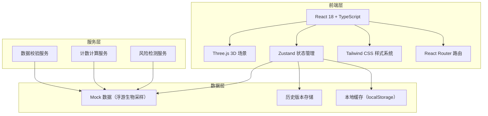
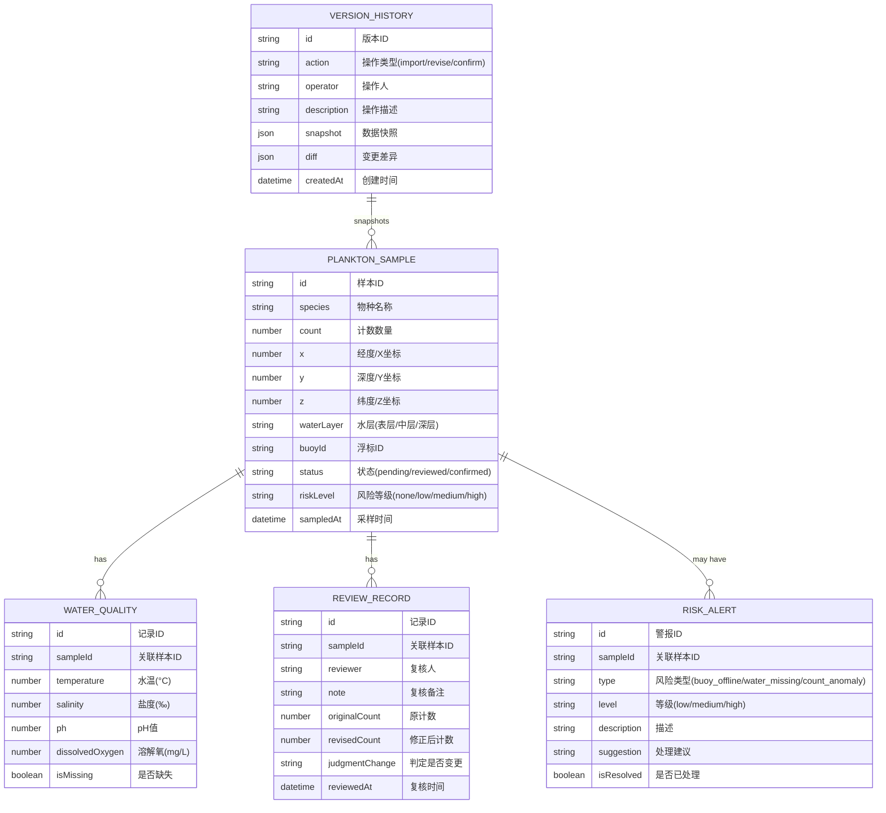

## 1. 架构设计



## 2. 技术描述
- **前端**：React@18 + TypeScript + Vite@5
- **3D 渲染**：three@^0.160.0 + @react-three/fiber@^8.15.0 + @react-three/drei@^9.92.0 + @react-three/postprocessing@^2.15.0
- **状态管理**：zustand@^4.4.0
- **样式**：tailwindcss@^3.4.0 + postcss + autoprefixer
- **图标**：lucide-react@^0.294.0
- **初始化工具**：vite-init（react-ts 模板）
- **后端**：无后端，纯前端 Mock 数据
- **数据持久化**：localStorage 存储历史版本与复核状态

## 3. 路由定义
| 路由 | 用途 |
|-----|------|
| / | 3D 可视化主页面（含筛选、剖切、对象明细、地图联动） |
| /review | 复核与修正中心（待复核列表、差异对比、修正编辑） |
| /history | 历史版本追溯（操作时间线、版本对比） |
| /risks | 风险通报面板（异常数据列表、风险详情） |
| /import | 数据导入页面（文件上传、校验预览） |

## 4. 数据模型

### 4.1 数据模型定义



### 4.2 TypeScript 类型定义

```typescript
type WaterLayer = 'surface' | 'middle' | 'deep';
type SampleStatus = 'pending' | 'reviewed' | 'confirmed';
type RiskLevel = 'none' | 'low' | 'medium' | 'high';
type RiskType = 'buoy_offline' | 'water_missing' | 'count_anomaly';
type ActionType = 'import' | 'revise' | 'confirm';

interface PlanktonSample {
  id: string;
  species: string;
  count: number;
  x: number;
  y: number;
  z: number;
  waterLayer: WaterLayer;
  buoyId: string;
  status: SampleStatus;
  riskLevel: RiskLevel;
  sampledAt: Date;
}

interface WaterQuality {
  id: string;
  sampleId: string;
  temperature?: number;
  salinity?: number;
  ph?: number;
  dissolvedOxygen?: number;
  isMissing: boolean;
}

interface ReviewRecord {
  id: string;
  sampleId: string;
  reviewer: string;
  note: string;
  originalCount: number;
  revisedCount: number;
  judgmentChange: boolean;
  reviewedAt: Date;
}

interface RiskAlert {
  id: string;
  sampleId: string;
  type: RiskType;
  level: RiskLevel;
  description: string;
  suggestion: string;
  isResolved: boolean;
}

interface VersionHistory {
  id: string;
  action: ActionType;
  operator: string;
  description: string;
  snapshot: PlanktonSample[];
  diff: Record<string, { before: any; after: any }>;
  createdAt: Date;
}

interface FilterState {
  species: string[];
  waterLayers: WaterLayer[];
  countRange: [number, number];
  riskLevels: RiskLevel[];
  statuses: SampleStatus[];
}

interface SectionState {
  horizontalY: number | null;
  verticalX: number | null;
  verticalZ: number | null;
}
```

## 5. 核心模块结构

```
src/
├── components/
│   ├── ThreeScene/           # Three.js 3D 场景组件
│   │   ├── OceanScene.tsx    # 主场景容器
│   │   ├── PlanktonCloud.tsx # 浮游生物粒子群(InstancedMesh)
│   │   ├── SectionPlane.tsx  # 剖切平面
│   │   ├── WaterLayers.tsx   # 水层面
│   │   └── SelectedGlow.tsx  # 选中对象光晕
│   ├── MapOverview/          # 2D 地图联动
│   │   ├── Map2D.tsx
│   │   └── DiffOverlay.tsx
│   ├── FilterPanel/          # 筛选面板
│   │   ├── SpeciesFilter.tsx
│   │   ├── LayerFilter.tsx
│   │   └── RiskFilter.tsx
│   ├── DetailPanel/          # 对象明细面板
│   │   ├── SampleDetail.tsx
│   │   └── ReviewEditor.tsx
│   ├── ReviewCenter/         # 复核中心
│   │   ├── ReviewList.tsx
│   │   └── DiffCompare.tsx
│   ├── Timeline/             # 历史时间线
│   │   ├── VersionTimeline.tsx
│   │   └── VersionDiff.tsx
│   ├── RiskPanel/            # 风险通报
│   │   ├── RiskList.tsx
│   │   └── RiskCard.tsx
│   ├── ImportWizard/         # 数据导入
│   │   └── ImportWizard.tsx
│   └── UI/                   # 通用UI组件
│       ├── GlassCard.tsx
│       ├── StatusBadge.tsx
│       └── GlowButton.tsx
├── store/
│   ├── useSampleStore.ts     # 样本数据与筛选状态
│   ├── useReviewStore.ts     # 复核流程状态
│   ├── useVersionStore.ts    # 版本历史状态
│   └── useUISTore.ts         # UI交互状态
├── hooks/
│   ├── usePlanktonRenderer.ts # Three.js渲染逻辑
│   ├── useSectionControl.ts   # 剖切控制逻辑
│   ├── useDiffCalculator.ts   # 差异计算逻辑
│   └── useReviewFlow.ts       # 复核流程逻辑
├── utils/
│   ├── dataValidator.ts      # 数据校验（含边界情况处理）
│   ├── counter.ts            # 计数计算（支持缺失数据不整批失败）
│   ├── riskDetector.ts       # 风险检测
│   ├── mockData.ts           # Mock 数据生成
│   └── colorUtils.ts         # 颜色映射工具
├── pages/
│   ├── HomePage.tsx
│   ├── ReviewPage.tsx
│   ├── HistoryPage.tsx
│   ├── RisksPage.tsx
│   └── ImportPage.tsx
├── types/
│   └── index.ts              # 全局类型定义
├── App.tsx
├── main.tsx
└── index.css
```

## 6. 关键服务逻辑

### 6.1 计数计算服务（支持数据缺失不整批失败）
```typescript
function calculateCounts(samples: PlanktonSample[], waterQualities: WaterQuality[]) {
  const results: CalculationResult[] = [];
  const gaps: DataGap[] = [];
  
  for (const sample of samples) {
    const waterQuality = waterQualities.find(w => w.sampleId === sample.id);
    
    if (waterQuality?.isMissing) {
      gaps.push({
        sampleId: sample.id,
        missingFields: getMissingFields(waterQuality),
        impact: '水质参数缺失，计数参考权重降低30%'
      });
      results.push({
        sampleId: sample.id,
        adjustedCount: Math.round(sample.count * 0.7),
        confidence: 'low',
        note: '基于估算值'
      });
    } else {
      results.push({
        sampleId: sample.id,
        adjustedCount: sample.count,
        confidence: 'high',
        note: '正常计算'
      });
    }
  }
  
  return { results, gaps, totalCount: results.reduce((s, r) => s + r.adjustedCount, 0) };
}
```

### 6.2 风险检测服务（真实边界样例）
- **浮标离线**：连续 3 个采样点同一浮标 ID 无更新，标记 high 风险，计数结果整体调低置信度
- **水质记录缺失**：温度/盐度/PH/溶解氧任一缺失，标记 medium 风险，在明细面板显示补录入口
- **计数异常**：同一水层同一物种计数超过历史均值 3 倍标准差，标记 low 风险，标注需人工复核
